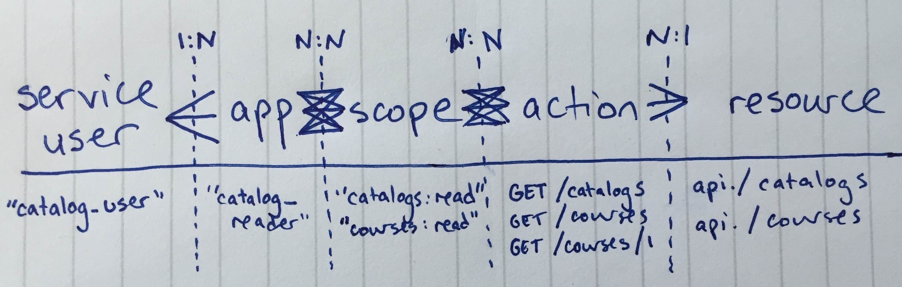

.. _OEP-4 Application Authorization (Scopes):

OEP-4: Application Authorization (Scopes)
#########################################

.. list-table::
   :widths: 25 75

   * - OEP
     - :ref:`OEP-4 Application Authorization (Scopes)`
   * - Title
     - Application Authorization (Scopes)
   * - Last Modified
     - 2020-05-13
   * - Author
     - Eddie Fagin (eddie@edx.org)
   * - Arbiter
     - Dave Ormsbee (dave@edx.org)
   * - Status
     - Approved
   * - Type
     - Architecture
   * - Created
     - 2016-06-20

Abstract
********

Open edX application authorization guidelines.

The Open edX platform currently has the capability to act as an OAuth2 [#rfc6749]_ provider (which is distinctly different from its OAuth2 client capability i.e. the "login with Social Network X" feature).

Site admins can create long-lived OAuth2 client application keys that can in turn be exchanged for shorter-lived access and refresh tokens. These keys can optionally be scoped down to a custom list of available authorizations.

We did not have a cohesive strategy for creating or managing scopes across the Open edX platform and had reached a point where further maturity was required in this area.

This proposal puts forward a strategy that is is straightforward for both application developers (those who need to know about the available scopes) and Open edX platform admins and service teams (those who need to implement the restrictions).

The goals of the proposed strategy are to:

* restrict the behavior of external applications that need to integrate with an Open edX deployment, in line with the principle of "least privilege"

* enable more of those applications with low friction (optimize for ease of integration over ease of development)

* centralize legislation of authorization platform-wide, but federate and decentralize enforcement

* avoid dictating technology and protocol choices, but have clear guidance for implementation practices

See `Scope and Filter Implementation`_ for additional decisions around the implementation in Open edX.

Motivation
**********

The Open edX platform, in its current state, has a very limited mechanism for restricting the authorization of third-party applications to access user data. This limitation has dampened the ability of the platform to enable an ecosystem of third party applications.

Application developers have a harder time convincing their users that those users should grant these applications "access to everything the user can see and do", especially for special purpose applications that only need a small slice of the user's data to operate.

Instead of needing to trust both the platform and all applications built on the platform, our architecture should allow users to simply trust the platform's ability to delegate very specific data sets to third-parties at the user's request.

Rationale
*********

The discussion of scopes and application authorization has come up many times, but only recently have we (at edx.org) started to see a meaningful number of requests from external application developers that want to build on our platform.

For example, certain applications would like access to our edx.org course catalog for use cases like affiliate marketing and content repurposing. In this case, we want to be able to grant applications read-only access to our catalog, but not write access, and not access to any other resources (such as enrollments or user profiles).

Specification
*************

Data model
==========

.. list-table::
   :widths: 25 75
   :header-rows: 1

   * - Object
     - Description
   * - service user
     - an Open edX account created solely for server-to-server integrations; can have multiple associated applications
   * - application
     - an autonomous system that needs to integrate with an Open edX platform, owned by a single service user
   * - resource
     - named grouping of related capabilities. Will generally (not always) be a noun like "catalog"
   * - action
     - describes a high-level behavior and will generally be "read" or "write", but resources may use non-standard definitions where absolutely necessary (should be the exception)
   * - scope
     - a single authorization (naming convention: ``resource:action``) for an application relative to an Open edX instance; should only describe broad application authorization (as opposed to, say, fine-grained user authorizations)
   * - access token
     - a temporary credential that grants a set of scopes to an application

I sketched these relationships out in the diagram below. Note that instead of using "read/write" as actions, I noted the HTTP verbs instead, just to give a sense for the implementation details we've got in mind at this point. Same ideas though.

        resources through applications, scopes, and resource actions.

Governance
==========

* Centralize the complete list of scopes but decentralize the associated metadata and definitions

* The central documented list of scopes must be readily available to application developers and service owners, and kept up to date

* Centralize application and token management but decentralize token enforcement

* Centralize common implementation patterns as we encounter them (logging, enforcement, etc)

* Access tokens may have one or more scopes associated to them by the central authorization service; tokens should be functionally opaque to applications

* Scopes should cover all RESTful web API endpoints [#REST]_ within a service, and may also cover other endpoints as desired by the service team

* Resources should not leak implementation details or internal names, i.e., instead of ``otto_cart``, consider just ``cart`` or ``shopping_cart``

* Resources should not, on the other hand, be too broad to be useful, i.e., instead of ``courseware``, consider ``discussions`` or ``catalog`` or whatever specific resource is of interest

Open questions
==============

* How will we manage scope metadata, such as the human-readable "this is the permission you're authorizing" text for the OAuth pop-up (and localization considerations)?

* What is a good strategy for application lifecycle management, such as the recommended approval flow for key creation and revocation?

* What work is required to implement this proposal across the Open edX platform, including (but not limited to) the `edx-platform`_ codebase?

.. _`edx-platform`: https://github.com/openedx/edx-platform

Backward Compatibility
***********************

There are no backwards compatibility issues with rolling out a centralized scopes list in our OAuth2 provider, or linking scopes to existing client applications.

However, there *might* be issues once we start enforcing scopes on individual service endpoints, as existing client applications that once might have had broader access may get suddenly cut off from data sources that we didn't know were being used. We will need to spend time up front understanding current access patterns in order to estimate the impact of this potentially breaking change and in order to correctly retrofit scopes onto existing application keys.

Scope and Filter Implementation
*******************************

Additional decisions around scopes:

* `Use JWT as OAuth Tokens ADR`_: Details how scopes can add additional claims to the user's JWT OAuth Token.
* `ADR on Enforcing Scopes in LMS APIs`_: Details how scopes are enforced in the LMS and other IDAs.
* `Third-Party Auth Scope ADR`_

See ``OAUTH2_DEFAULT_SCOPES`` and ``OAUTH2_PROVIDER['SCOPES']`` for the `current default and additional scopes`_ defined in the LMS.

.. _Use JWT as OAuth Tokens ADR: https://github.com/openedx/edx-platform/blob/master/openedx/core/djangoapps/oauth_dispatch/docs/decisions/0003-use-jwt-as-oauth-tokens-remove-openid-connect.rst#jwt-token
.. _ADR on Enforcing Scopes in LMS APIs: https://github.com/openedx/edx-platform/blob/master/openedx/core/djangoapps/oauth_dispatch/docs/decisions/0006-enforce-scopes-in-LMS-APIs.rst

.. _current default and additional scopes: https://github.com/openedx/edx-platform/search?q=OAUTH2_DEFAULT_SCOPES&unscoped_q=OAUTH2_DEFAULT_SCOPES

Filters provide an additional layer of authorization. Here are some related decisions:

* `ADR on Organization and Users as Filters in OAuth Tokens`_: This section of the ADR explains filters.
* `ADR on More General Filter Support`_

.. _ADR on Organization and Users as Filters in OAuth Tokens: https://github.com/openedx/edx-platform/blob/master/openedx/core/djangoapps/oauth_dispatch/docs/decisions/0007-include-organizations-in-tokens.rst#2-organization-and-users-as-filters-in-oauth-tokens
.. _ADR on More General Filter Support: https://github.com/openedx/edx-platform/blob/master/openedx/core/djangoapps/oauth_dispatch/docs/decisions/0011-scope-filter-support.rst

.. list-table::
   :header-rows: 1
   :widths: 25 75

   * - Filter
     - ADR
   * - content_org:<org_id>
     - `Organization and User Filters in OAuth Tokens ADR Section`_
   * - tpa_provider:<provider_id>
     - `Third-Party Auth Scope ADR`_
   * - user:me
     - `Organization and User Filters in OAuth Tokens ADR Section`_

.. _Organization and User Filters in OAuth Tokens ADR Section: https://github.com/openedx/edx-platform/blob/master/openedx/core/djangoapps/oauth_dispatch/docs/decisions/0007-include-organizations-in-tokens.rst#2-organization-and-users-as-filters-in-oauth-tokens
.. _Third-Party Auth Scope ADR: https://github.com/openedx/edx-platform/blob/master/openedx/core/djangoapps/oauth_dispatch/docs/decisions/0012-scope-and-filter-for-third-party-auth.rst

Rejected Alternatives
*********************

.. todo

N/A

Change History
**************

2020-03-23: Add `Scope and Filter Implementation`_ section.

.. rubric:: Footnotes

.. [#rfc6749] For more information on OAuth2, please see the `OAuth2 specification <https://tools.ietf.org/html/rfc6749>`_.

.. [#REST] The Open edX REST API conventions currently live on the Wiki at `<https://openedx.atlassian.net/wiki/display/AC/edX+REST+API+Conventions>`_
