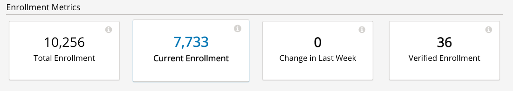
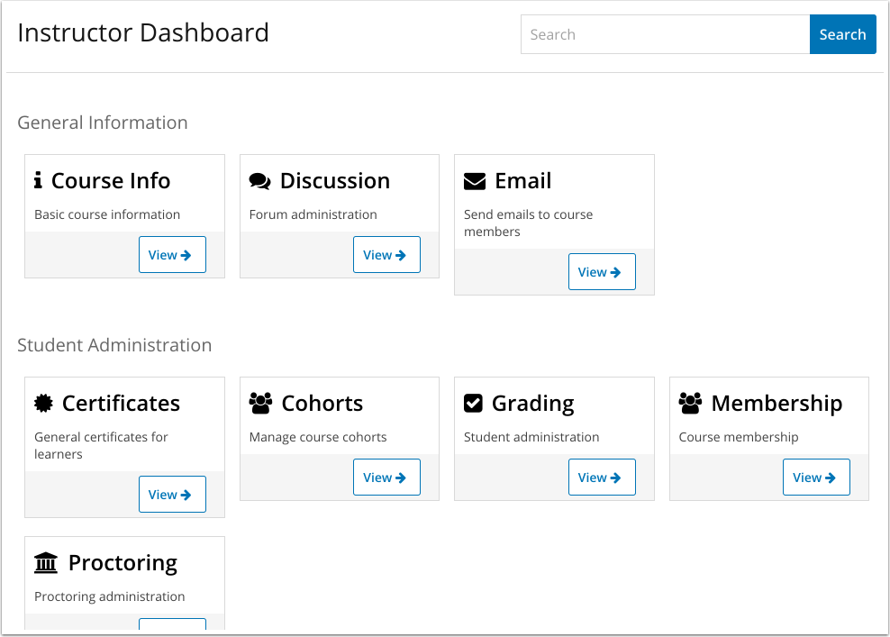

=================================
OEP-12: Pluggable User Interfaces
=================================

+---------------+----------------------------------------------------+
| OEP           | :doc:`OEP-12 <oep-0012-arch-fragment-views>`       |
+---------------+----------------------------------------------------+
| Title         | Pluggable User Interfaces                          |
+---------------+----------------------------------------------------+
| Last Modified | 2017-1-25                                          |
+---------------+----------------------------------------------------+
| Author        | Andy Armstrong <andya@edx.org>                     |
+---------------+----------------------------------------------------+
| Arbiter       | Clinton Blackburn <clinton@edx.org>                |
+---------------+----------------------------------------------------+
| Status        | Accepted                                           |
+---------------+----------------------------------------------------+
| Type          | Architecture                                       |
+---------------+----------------------------------------------------+
| Created       | 2016-12-06                                         |
+---------------+----------------------------------------------------+
| Resolution    | `open-edx-proposals#34`_                           |
+---------------+----------------------------------------------------+

.. _open-edx-proposals#34: https://github.com/edx/open-edx-proposals/pull/34#pullrequestreview-18294926

Abstract
========

There is a long standing desire to allow developers to extend Open edX
applications by providing plugins, rather than by modifying each application's
code directly. XBlocks provide this ability for new types of courseware
components, but courseware is only one of many aspects that a feature might need
to provide (see `Feature Plugins for edX Platform`_ for an enumeration of such
aspects for the edX platform).

This proposal recommends that the XBlock fragment functionality be separated out
into a new repository so that it can be used both by XBlocks and by Django apps.
Developers can then choose to implement their features either as XBlocks or
as Django apps, and in either case can provide pluggable user interfaces to
existing Open edX applications.

Motivation
==========

There are a number of driving use cases that act as motivation for supporting
pluggable user interfaces.

Use Case 1: LMS Course Tabs
---------------------------

A very common need for new features is to be able to add a new course tab for
the learner, for example Discussions, Student Notes, and Teams. There is a
supported pluggable entry point for course tabs (see `Adding a new course tab`_)
but this requires that the feature add a new URL for the feature, and render the
whole page at that URL using a Mako template. It would be preferable for a
course tab to be able to register a pluggable user interface that will be
presented as a tab, and for the implementor not to need to know how to implement
the full page.

There has been a long standing request to support rendering XBlocks as course
tabs (`Allow xblocks to be shown as course tabs`_), but there are conceptual
issues with this approach:

* XBlocks must be configured and saved into the modulestore, which means
  that replacing a built-in tab such as "Course" would require a data migration
  for every course if it was re-implemented as an XBlock.

* It seems confusing to define an XBlock that should never be added into the
  courseware, but which only exists to be shown as a tab.

Use Case 2: Insights Extensions
-------------------------------

EdX Insights is a course analytics application that could be extended in
a variety of different ways. Some examples include:

1. **New Charts**

   A plugin could provide new types of charts for existing data types, or it
   could extend the application to show charts for data that had not previously
   been visualized.

2. **New Data Reports**

   A plugin could provide new data reports so that an Insights installation
   could let users see and/or download data in a variety of custom formats.

3. **New Summary Cards**

   A common UX pattern in edX Insights is to provide summary cards with key
   metrics for a particular data set. A plugin could provide new card types
   to customize the metrics that a user can see.

Use Case 3: Instructor Dashboard
--------------------------------

The Instructor Dashboard provides a set of user interfaces to allow an
instructor to manage the features of their course. Currently these user
interfaces must be added directly to edx-platform, even if the feature
itself lives in a Python library that has been separately installed.

It would be preferable if any feature implemented as a Python library could
contribute new sections to the Instructor Dashboard through plugins. The
dashboard would show a list of the feature that can be managed, and then
clicking on a feature would present the user with the pluggable interface.
These interfaces could be made available for instructors in the LMS as
today, or a new instructor portal could be implemented reusing the same
blocks.

Specification
=============

Requirements
------------

What are the requirements for a pluggable user interface?

1. **It should render its content into a section of a page**

   A pluggable user interface should be able to return the HTML, CSS and custom
   JavaScript necessary to render its content. In addition, it should be able to
   declare the JavaScript libraries that it depends upon.

   Python and JavaScript APIs will be provided so that the consumer of a
   fragment can render it. These APIs will ensure that the necessary libraries
   have been loaded, and that the necessary CSS and JavaScript files have been
   added to the page (without duplication).

2. **It should be able to get the data that it needs to render its content**

   A pluggable user interface needs context, e.g. the course key for the course
   to be rendered. It also needs to be able to make requests for data that will
   be represented in the user interface. This data might come from the feature
   itself, or it might be requested through an API.

3. **It should be able to plug in seamlessly into an existing code base**

   A pluggable user interface needs to provide a unique identifier for itself,
   and it needs to conform to a contract so that it is clear when and how it can
   be used. It should not require any changes to the client that consumes it,
   and it should be possible to be uninstalled cleanly without breaking other
   parts of the code base.

Proposal
--------

Django apps provide a standard way to add new functionality to Django, allowing
new pages, models, and REST APIs to be defined. What is missing is the ability
to define a new user interface element that can be rendered into an existing
page, or that can be fetched over AJAX and dynamically inserted into a page.
XBlocks provides such functionality through its `Fragment` classes so this
will be moved into a new Python library that can be consumed both by XBlocks
and by Django apps.

For Django developers a new `DjangoFragmentView` class will be provided that
supports rendering a fragment from a Django context. These views can be declared
in `urls.py` but they do not themselves define user-visible pages. They instead
provide an implementation that can render a fragment into another page. These
views have full access to Django so they can use standard mechanisms to access
any data that they need to be able to render themselves.

A Django fragment view implements a new `render_fragment` method which is
passed the request object from the parent page as well as any keywords declared
by the URL such as a course key. This method will return an XBlock-style
`Fragment` object containing the HTML, JavaScript and CSS needed to render the
fragment. Note that this means that fragment views are not suitable for
building REST APIs.

There are three ways in which a Django fragment view can be consumed:

1. **Invoked directly from Python**

   The view class can be instantiated and the `render_fragment` method invoked
   directly. This is the simplest option for server-side rendering where a page
   wants to include a fragment. The returned fragment has methods which return
   the HTML to include in the head of the page, the body of the page, and the
   footer. The page template can then include these three HTML snippets when it
   renders itself.

2. **Full page**

   The view's URL will by default return an HTML rendering of the fragment. This
   rendering can be included within a page via an iFrame, or it can be shown by
   a mobile app using a web view. Both of these techniques are used for XBlocks
   today, and so this would extend the capabilities to Django apps.

3. **REST API**

   The view's URL can be invoked with a content type requesting a JSON rendering
   of the fragment (`application/web-fragment`, perhaps). This can be used by
   client-side logic to fetch a fragment and then dynamically render it into the
   current page. There are already many places where XBlock's are rendered in
   this way, such as in Studio when a new block is added to a unit, or with the
   `jQuery-XBlock`_ library.

A JQuery API will be provided that can receive this JSON payload and render it
into the current page appropriately. There are already multiple such
implementations both within edx-platform as well as in the `JQuery-XBlock`_
library, so these can be consolidated in one place. Future revisions will likely
include implementations for other JavaScript frameworks such as React.

Note: Django apps are very flexible and have access to a lot of internal
data models and configuration settings that may not be appropriate for
a plugin. It is out-of-scope of this OEP, but there will need to be best
practices defined for plugin authors as to how they can get access to the
data that they need.

Reference Implementation
========================

A proof-of-concept of Django Fragment Views (then called Django Component Views)
was implemented during the December 2016 hackathon. In addition to implementing
the new view class, the solution provides implementation to three of the use
cases described above. The work can be seen in the following two pull requests:

* Pluggable UI hackathon project: `Pluggable UI hackathon project`_
* Django Component Views prototype: `Django Component Views prototype`_

Prototype: Course Tabs
----------------------

The prototype provides a new `ComponentTabMixin` which allows any course
tab plugin to additionally provide the class of a component view to render
its content. By default, a course tab plugin has to render the full page
including the header, footer, and the course tabs themselves. This new
approach allows the plugin to ignore these aspects and just provide the
unique content to be shown.

Prototype: Discussions
----------------------

The prototype switched the "Discussion" tab to use the `ComponentTabMixin`,
and then provided a new `DiscussionBoardComponentView` class. Providing this
tab as a component allows the content to be rendered as AJAX or within an
iframe or mobile web view. In particular, this could allow new LMS front end
implementations to be provided that don't render with the same edX-style tab
interface. Such a front end could now include discussions anywhere that it
chooses.

Prototype: Instructor Dashboard
-------------------------------

The final piece of the prototype demonstrates a dynamically generated
instructor dashboard built purely using component views. The dashboard home
page makes a request to find all installed instructor component and then
displays them as a set of cards organized by category:

Each card has a "View" link that lets the user drill down and see the
component for the feature being represented. This component is shown full
screen but with a back button to allow the user to navigate back to the
dashboard home.

Rationale
=========

Why are we not using an industry framework?
-------------------------------------------

It seems that the requirements for pluggable user interfaces are not unique
to Open edX, and hence other solutions are likely to exist. Our research so
far has not found a solution that covers the full set of use cases, but that
might change in the future.

One approach that is similar is Pinterest's solution that can partially render a
page, and then asynchronously request the missing components and fill them in as
they become available. They use Mozilla's Nunjucks templating library in Django
and in particular their `Nunjucks Asynchronous Support`_. However, it appears
that this only supports the ability to asynchronously return HTML, and doesn't
allow for the ability to dynamically add CSS and JavaScript. See their blog
post `How we switched our template rendering engine to React`_ for more
details.

Another similar use case is HTML5 ads, but those are all implemented as
iframes. Using iframes is possible for some pluggable situations (such as LTI),
but it would provide a poor user experience if a complex page was constructed
from tens or even hundreds of iframes.

Could we use XBlocks instead of introducing Django Fragment Views?
------------------------------------------------------------------

Note that all of the requirements of pluggable user interfaces are supported by
XBlocks. XBlocks are reusable components that provide:

* composition
* data storage with a variety of field scopes
* serialization as OLX
* runtime services

However, there are several reasons why XBlocks are not always appropriate:

* XBlocks need to have a unique usage id so that instances can be referenced.

* XBlocks need to have storage scoped for different purposes (per learner, per
  course etc).

* XBlocks in the LMS are tied to a course, which doesn't make them great for
  general user interfaces (e.g. UIs that are global, organization-wide or
  program-wide).

* XBlocks are persisted while fragment views are ephemeral. This also means
  that converting an existing view into an XBlock requires a data migration
  so that each course is updated to contain a block instance.

* XBlocks need to support serialization to OLX while fragment views don't.

* XBlocks are designed to be platform-agnostic and so in a pure implementation
  should only fetch data through provided runtime services. This has been a
  stumbling block for adding new XBlocks as the data is usually only made
  available through REST APIs.

Will Django Fragment Views ever need to have their own storage?
---------------------------------------------------------------

The intention is that Django Fragment Views provide new user interfaces, and so
should not have any storage of their own. They will need to be provided with
context (e.g. the course that is being rendered) and they will need to be able
to fetch data (e.g. the children of an XBlock that they are rendering). If a new
feature needs storage of its own, then that should be implemented as a Django
model. Django views do not provide storage mechanisms, and Django fragment
views, as subclasses of Django views, should not either.

Should Django Fragment Views support nesting?
---------------------------------------------

Django Fragment Views should not be constructed as a tree of views as that is
introducing state that needs to be managed. However, fragment views can invoke
other fragment views to render portions of their content. For example, a Unit's
Student View could ask each of its children to render itself as a fragment, and
then could return a composite fragment containing all of them. This is
essentially how XBlocks render their children today, and fragment views should
work in the same way.

The instructor dashboard feature in the `Django Component Views prototype`_ is
another good example of how this can work. The dashboard renders itself, but
when the user clicks to view a card, the dashboard renders the feature's own
fragment.

Note: there is a downside to deep nesting of rendered fragments. One of the
biggest performance issue with XBlocks has always been the blocking behavior of
having to invoke arbitrary children and grandchildren, and not being able to
return until they've all executed. We recommend avoiding deep nesting of
fragments until an asynchronous framework is provided.

Should Django Fragment Views be side-effect free?
-------------------------------------------------

An interesting question is how Django fragment views should work within a post
request. The simplest answer is to say that they work just the same way as
regular Django views. However, there is the possibility of bad interactions if
multiple Django fragment views are rendered into the same page within a post
context, and they each perform updates.

Should Django Fragment Views have a classification scheme?
----------------------------------------------------------

If this proposed approach is successful, there could be a large number of
registered fragment views. It would be useful to be able to classify the views
so that it is clear what their purpose is, e.g. this is a course outline view,
this is an instructor dashboard view.

For now, the approach taken has been to keep Django Fragment Views as simple as
regular Django Views, which don't have a classification scheme. Developers can
use a different mechanism (probably Stevedore plugins) to declare the type of
each view.

For example, the Instructor Dashboard hackathon demo introduced a new
``InstructorFeature`` plugin type, which in turn had a field for the
component view used to render the feature. The Instructor Dashboard code
could then ask Stevedore to return the list of all such features, in order
to render them onto the page. For more details, see the implementation here:
`Pluggable user interfaces hackathon PR`_.

Backward Compatibility
======================

This proposed solution moves the fragment concept out of XBlocks into its
own repository, but it won't break the contract. The XBlock implementation
will be refactored to use the class from the new Web Fragments library.

Future Directions
=================

Convert XBlocks to render using Django fragment views
-----------------------------------------------------

There seem to be many benefits to XBlocks rendering themselves using fragment
views, but the challenge is that today XBlocks explicitly do not make use of
Django. A future rethinking of XBlocks based upon Django and utilizing fragment
views would allow the following:

* A runtime could allow the configuration of alternate UIs for certain blocks
  that could be installed as plugins. For example, an Open edX operator could
  choose to show a different UI for its "Course" tab. As another example,
  a mobile runtime could show native mobile versions of certain blocks,
  perhaps using `React Native`_.

* XBlocks could use pre-existing fragment views rather than rolling their
  own. A good example would be that a standard "Settings" fragment view could
  be provided that any XBlock could use as its authoring view. Another example
  would be rewriting the Inline Discussion XBlock to just render the same
  fragment view as is being used by the "Discussion" tab.

* Developers could subclass a fragment view to customize its behavior without
  having to subclass the XBlock itself.

There are some reasons why it may be better to keep XBlocks as they are:

* It requires XBlock authors to use and understand Django.

* It is more complex if even simple XBlocks must declare a separate Django
  fragment view.

Note that there is nothing stopping an XBlock author from including both
XBlock and Django in their project, and then calling out to the fragment
view from their XBlock's `student_view` method. For example, this is almost
certainly what we will do for discussions so that the same fragment can be
rendered for the XBlock, the discussion tab, and for team discussions.

Refactor XBlocks to be based upon Django
----------------------------------------

There were many good reasons why XBlocks was developed to be independent of
Django, but at this point all Open edX server-side development uses Django.
Django apps provide many of the same capabilities as XBlocks but within a much
larger ecosystem.

===========  ===============
Django       XBlocks
===========  ===============
Models       Scoped Fields
Serializers  N/A
Settings     OLX
Forms        Authoring Views
Views        Student Views
URLs         N/A
===========  ===============

There should be a separate OEP to propose how a Django-based version of XBlocks
should be implemented, but here are a few thoughts from early discussions:

* Moving fragments out of XBlocks into a dedicated library is a good first
  step toward building a new Django-based XBlock implementation. The same
  approach should be taken with other core aspects such as scoped fields
  and serialization through OLX.

* A Django XBlock implementation should be implemented as an alternative to
  the current library, so that existing XBlock authors do not need to adopt
  Django. As much as possible, common code should be shared by being refactored
  out into shared libraries.

* Django models provide a lot of flexibility to developers for data handling
  around querying and migrations. However, the additional flexibility comes at
  the expense of each developer needing to be aware of the performance
  characteristics of their data for large courses.

Provide isolation of Django Fragment Views
------------------------------------------

There are known challenges with supporting third-party XBlocks which will
also apply to Django Fragment Views:

* When a page is synchronously rendered, a poorly performing block/component
  will prevent the rest of the page from appearing.

* The CSS provided by the block/component is not scoped and so can affect
  the styling of other sections of the page.

* The JavaScript runs in a global context and so malicious and/or poorly
  written code can affect the behavior of the whole page.

Several approaches have been attempted to reduce these risks for XBlocks, and
there are promising possibilities with the use of web components. Web components
allow for the isolation of their CSS and HTML inside a shadow root, but their
JavaScript still runs in the main thread on the global execution context. This
is an area that edX will continue to explore, but in the meantime it should not
be a blocker for providing pluggable user interfaces.

Note that it is already a policy to only install trusted Django apps, because
there are so many ways in which they could be dangerous beyond those listed
here. The addition of fragment views to an otherwise trusted app should not add
much in the way of additional review required to be confident in the behavior
of the app.

Consider how web components and web fragments overlap
-----------------------------------------------------

There is a lot of interest in the `Web Components`_ specification and how the
capabilities could be used to provide reusable components. More exploration is
needed to determine whether web components are ready for use within Open edX,
and if so how they overlap with web fragments.

Note that web components are a purely client-side technology, while Django
Fragment Views provide a server-side solution for pluggable user interfaces. It
appears that they are complementary technologies, and that in the future many
Django Fragment Views may render themselves as web components.

Provide support for dependency management
-----------------------------------------

There is a long-standing challenge with XBlocks that there is no way for the
developer to declare which dependencies are required. This means that every
XBlock either assumes that a library it needs will be available (e.g. JQuery)
or loads its own copy. This is expensive for large frameworks like JQuery
or React, especially if multiple blocks are included into a single page.

This is a critical problem to solve, especially if larger scale user
interfaces are built as plugins. However, for the moment it does not appear
to be a blocker for starting to introduce Django Fragment Views, especially
if they are all trusted views that know which libraries are available to
be used.

Consider how to configure Django Fragment Views
-----------------------------------------------

The simplest answer here is once again to say that Django fragment views are
just Django views, so there is prior art for how Django apps are configured.
Each view can be passed context parameters through the URL, and in addition
the Django request is available through which most data can be reached.

However more thought may be needed about whether this story is complete. One
example is how should the root URL for the API Gateway be provided to views so
that they can make requests against it?

Change History
==============

A list of dated sections that describes a brief summary of each revision of the OEP.

.. _Adding a new course tab: https://openedx.atlassian.net/wiki/display/AC/Adding+a+new+course+tab
.. _Allow xblocks to be shown as course tabs: https://openedx.atlassian.net/browse/TNL-2319
.. _Django Component Views prototype: https://github.com/andy-armstrong/django-component-views/pull/1
.. _Feature Plugins for edX Platform: https://openedx.atlassian.net/wiki/display/AC/Feature+Plugins+for+edX+Platform
.. _Pluggable user interfaces hackathon PR: https://github.com/edx/edx-platform/pull/14122/files
.. _How we switched our template rendering engine to React: https://engineering.pinterest.com/blog/how-we-switched-our-template-rendering-engine-react
.. _Nunjucks Asynchronous Support: https://mozilla.github.io/nunjucks/api.html#asynchronous-support
.. _jQuery-XBlock: https://github.com/edx-solutions/jquery-xblock
.. _OEP-6 Context-scoped XBlock Fields: https://open-edx-proposals.readthedocs.io/en/latest/oep-0006.html
.. _Pluggable UI hackathon project: https://github.com/edx/edx-platform/pull/14122
.. _React Native: https://facebook.github.io/react-native/
.. _Web Components: http://webcomponents.org/
