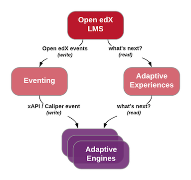
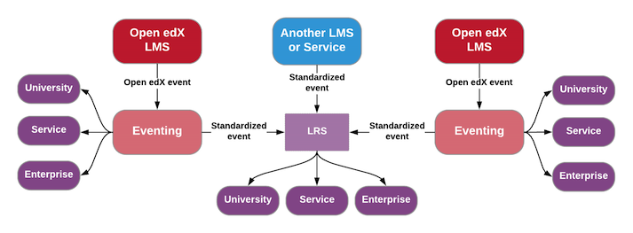
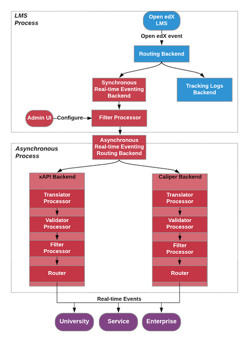

OEP-26: Real-time Events
##########################

+-----------------+--------------------------------------------------------+
| OEP             | :doc:`OEP-26 <oep-0026-arch-realtime-events>`          |
+-----------------+--------------------------------------------------------+
| Title           | Real-time Events                                       |
+-----------------+--------------------------------------------------------+
| Last Modified   | 2019-01-16                                             |
+-----------------+--------------------------------------------------------+
| Authors         | Nimisha Asthagiri <nimisha@edx.org>,                   |
|                 | Danial Malik <danial.malik@edly.io>,                   |
|                 | Ed Zarecor <ed@tcril.org>                              |
+-----------------+--------------------------------------------------------+
| Arbiter         | Brian Mesick <bmesick@tcril.org>                       |
+-----------------+--------------------------------------------------------+
| Status          | Provisional                                            |
+-----------------+--------------------------------------------------------+
| Type            | Architecture                                           |
+-----------------+--------------------------------------------------------+
| Created         | 2018-07-11                                             |
+-----------------+--------------------------------------------------------+
| `Review Period` | 2018-11-29 - 2018-12-20                                |
+-----------------+--------------------------------------------------------+

.. contents::
   :local:
   :depth: 3

Context
*******

Currently, the Open edX system captures LMS interactions in persisted event streams (tracking logs) of documented proprietary JSON structures, as specified in `Events in the Tracking Logs`_. The events are emitted by backend servers and frontend apps, including web and mobile apps. The logs are shared and used *asynchronously* for various data analyses and processing.

Of late, there are emerging use cases that require notifying external systems of these LMS events in real-time, preferably in industry standard formats (such as xAPI_ and Caliper_). By **real-time** events, we mean pushing data as fast as possible in an automated and synchronous communication at a speed within a few hundred milliseconds (to satisfy `human perception`_). Use cases, such as Adaptive Learning, do require this sub-second communication time. For other use cases, however, **near-real-time** communication (with a delay of multiple minutes) is sufficient. Unless explicitly called out in the document, near-real-time is included when we refer to real-time. Both are orders of magnitude faster than the current **batch processing** available via the tracking logs.

This OEP proposes an evolutionary change to Open edX's eventing system that will enable near realtime event-based feedback loops.  Events have the potential to connect users, organizations, and learning services in ways that enrich learning on the platform. 

This document describes a design proposal for supporting standard real-time events in the Open edX system.

.. _Events in the Tracking Logs: https://edx.readthedocs.io/projects/devdata/en/latest/internal_data_formats/tracking_logs/index.html
.. _xAPI: https://xapi.com/
.. _Caliper: https://www.imsglobal.org/activity/caliper
.. _human perception: https://www.pubnub.com/blog/how-fast-is-realtime-human-perception-and-technology/
.. _Gartner reports: https://hackernoon.com/by-2020-50-of-managed-apis-projected-to-be-event-driven-88f7041ea6d8

Use cases
=========

Although the remainder of this section enumerates some of the immediate use cases, for the time being we will focus our efforts on the needs for adaptive learning, while bearing in mind that the general framework for real-time events will be extended and reused.

Use Case: Adaptive Learning
---------------------------

**Requirement:** Real-time communications (*sub-second*)

As captured in `Open edX Adaptive Learning`_, adaptive learning in Open edX will enable the platform to respond to a learner's interactions in real-time,  automatically providing the learner with individualized support. Data analysis from earlier experimental attempts on edx.org and elsewhere show how adaptive learning mechanisms can significantly improve the learner's efficiency, engagement, and retention, while providing a more effective learning experience with metacognitive support for life-long learning.

.. _Open edX Adaptive Learning: https://openedx.atlassian.net/wiki/spaces/AC/pages/542343170/Adaptive+Learning

Integration with Adaptive Engines
~~~~~~~~~~~~~~~~~~~~~~~~~~~~~~~~~

As an iterative path to this future, the immediate goal is to enable integrations with external adaptive engines. Currently we are focused on establishing standard APIs that (1) adaptive engines can use to receive real-time events from the Open edX LMS, (2) the Open edX LMS can use to query adaptive engines on what to present to learners, and (3) train adaptive engines based on standard
events collected from multiple sources. This document focuses on #1 with the need to send scalable and real-time updates to adaptive engines. This is depicted by the left-hand flow in the diagram below. #3 is described in :ref:`oep-26-lrs`.

what's next" via an intermediary "Adaptive Experiences" component.

Use Case: Enterprise
--------------------

**Requirement:** Near-real-time communications (*minutes*)

As an `integration option for Enterprise clients`_, real-time events allow the Open edX system to immediately notify Enterprises of high-interest learning activities, such as course enrollments and completions, for learners in their organizations. Note that typically Enterprises favor xAPI_ as their standard of choice.

.. _integration option for Enterprise clients: https://openedx.atlassian.net/wiki/spaces/SOL/pages/532676633/Enterprise+xAPI+Implementation+Proposal

Use Case: University
--------------------

**Requirement:** Near-real-time communications (*minutes*)

Real-time events also allow the Open edX system to immediately notify Universities of their high-interest learning activities, such as unenrollments. Note that, in contrast to Enterprises, Universities typically favor Caliper_ as their standard of choice.

Use Case: Cross-LMS Integration
-------------------------------

**Requirement:** Near-real-time communications (*minutes*)

Another emerging use case is allowing unification of events across multiple LMS's. As a specific example, an organization that uses multiple Open edX instances (as multiple options for their learners or for distributing their reusable content) may want to accumulate all their LMS events in a single `Learning Record Store`_ that is then queried in real-time.

.. _Learning Record Store: https://xapi.com/learning-record-store/

Use Case: External Service
--------------------------

**Requirement:** Real-time (*sub-second*) or near-real-time (*minutes*) communications depending on integration type

As we move towards creating a more extensible platform for Open edX, we want to provide integration options between the Open edX platform and external services. External services that enhance the learning, authoring, or LMS administrative experiences will benefit greatly from a real-time eventing framework. Some examples include an external social learning service and a commercial learning analytics tool. *Theoretically, the other use cases are specific cases of this* *use case*.

Technical Specification
***********************

This section provides some of the technical details of the design proposal.

Standards
=========

In order to enable a plug-n-play ecosystem with various external services (adaptive engines or otherwise), we will support both the ADL_'s `Experience API (xAPI)`_ standard and the `IMS Global`_'s `Caliper Sensor APIs`_ standard as the communication protocol between the Open edX LMS and registered external services.

.. _ADL: https://adlnet.gov/
.. _Experience API (xAPI): https://www.adlnet.gov/research/performance-tracking-analysis/experience-api/
.. _IMS Global: https://www.imsglobal.org/
.. _Caliper Sensor APIs: https://www.imsglobal.org/caliper-analytics-v1-public-repos-sensor-apis

xAPI Integration
----------------

For details on integrating with xAPI, please see the :ref:`xapi_realtime_events` design document.

Caliper Integration
-------------------

For details on integrating with Caliper, please see the :ref:`caliper_realtime_events` design document.

.. toctree::
    :hidden:

    oep-0026/caliper-realtime-events.rst
    oep-0026/xapi-realtime-events.rst

.. _oep-26-user-id:

Anonymized User ID
==================

Users will be identified to external systems using a UUID that is associated uniquely with a single user and the external system type with which the UUID can be shared.  This decision overrides :ref:`oep-32`. and is captured in `ADR 0001-externalid.rst`_

.. _ADR 0001-externalid.rst: https://github.com/openedx/edx-platform/blob/e1c8fb51bec2be3aa8da9750cb52b01728d1a740/openedx/core/djangoapps/external_user_ids/docs/decisions/0001-externalid.rst

Eventing Components
===================

While the exact technical framework and tools for supporting real-time events *at scale* is to be determined, we can begin with implementing the various components of the eventing service from a modular perspective so they can be adopted into any scalable infrastructure (e.g., an Apache framework). So while we propose a framework in this section, each subcomponent is expected to be independent and modular so it can be recomposed as needed.

The proposed framework integrates into and builds upon the features of the `Open edX Event Tracking`_ library. The library's RoutingBackend_ provides powerful and flexible tools with its two fundamental building blocks of `processors and backends`_. The diagram below depicts a possibility of using these tools to implement our real-time Eventing subsytem.

.. _Open edX Event Tracking: https://github.com/openedx/event-tracking
.. _RoutingBackend: https://github.com/openedx/event-tracking/blob/03bedd4c4f269c65f266f7e95621a9c1b91f908d/eventtracking/backends/routing.py#L11
.. _processors and backends: https://github.com/openedx/event-tracking/blob/03bedd4c4f269c65f266f7e95621a9c1b91f908d/eventtracking/backends/routing.py#L16-L30

Here is a description of each subcomponent in the Eventing subsystem:

1. `Synchronous Real-time Eventing Backend`_: A pluggable component that is configured as a new tracking backend in the LMS and runs within the LMS process.
2. `Asynchronous Real-time Eventing Routing Backend`_: Asynchronously routes to each configured communication protocol (e.g., xAPI and Caliper).
3. `Filter Processor`_: Owns the business logic for access control and filtering of events. A common implementation for the Filter may be shared across communication protocol backends.
4. `Translator Processor`_: Translates Open edX native events to standardized Open edX events. Each communication protocol would have its own Translator component implementation.
5. `Validator Processor`_: Validates the generated event using a general-purpose validation library cross-maintained by Open edX real-time eventing consumers. Each communication protocol would have its own Validator component implementation.
6. `Router`_: Routes real-time translated, validated, filtered events to all registered consumers.
7. `Admin UI`_: Provides an administrative interface to configure and manage registered consumers.

Synchronous Real-time Eventing Backend
--------------------------------------

The **Synchronous Real-time Eventing Backend** serves as an integration point between the Open edX system and the rest of the Eventing subsystem. It plugs into the `Open edX Event Tracking`_ framework and runs within the LMS Process.

Asynchronous Real-time Eventing Routing Backend
-----------------------------------------------

The **Asynchronous Real-time Eventing Routing Backend** is a RoutingBackend_ component type that executes in an asynchronous process. It is configured to support multiple backends - one for each communication protocol. For example, there would be a communication backend for Caliper and another one for xAPI.

Filter Processor
----------------

The **Filter Processor** component serves multiple purposes:

1. Preemptively optimizes further operations downstream by filtering only those events that are needed to be communicated, according to configuration settings, prior to enqueuing the events onto the `Asynchronous Real-time Eventing Routing Backend`_.

2. Provides APIs to support an admin configuration interface.

3. Enforces access control by filtering events and appropriately emitting them through the `Router`_.

The complexity of this component may increase over time as we support (a) higher degrees of customization by consumers, such as filtering for only certain types of events, (b) varying degrees of permissions to activities, and (c) multi-tenancy requirements with consumers and providers associated with different organizations.

For the first iteration, we need the following permissions:

* **Course restriction** - access events only in certain courses.

In the future, we may need the following:

* **User restriction** - access all events for certain users.
* **Site restriction** - access events of certain sites.
* **Activity type restriction** - access certain types of events.

Translator Processor
--------------------

Each communication protocol has its own Translator component. This component is responsible for translating from an Open edX event schema to the schema for the target communication protocol.

.. _oep-26-validator:

Validator Processor
-------------------

The validation component ensures we continue to support the event output schema expected by all participating real-time eventing consumers. In many ways, this is similar to what `consumer-driven contract testing`_ would enable and uses similar design principles. Essentially, a common validation library can be collaboratively maintained by participating consumers, including consuming adaptive engines. This ensures an end-to-end integration that can be maintained going forward.

.. _consumer-driven contract testing: https://www.thoughtworks.com/radar/techniques/consumer-driven-contract-testing

Router
------

The router forwards events to interested consumers, using the target communication protocol.

Admin UI
--------

The administration component is responsible for allowing the Open edX site administrator to configure the list and permissions of registered event consumers.

Eventually, the registry of consumers may become a self-service portal where consumers may initiate their request for access. However, initially, we can simply store the settings as `Django Settings`_ since they will be easier for site-administrators to manage.  Any database storage of the routing rules can be done as a part of self-service portal work.

.. _Django Settings: https://docs.djangoproject.com/en/3.0/topics/settings/

Decisions & Consequences
************************

* **Event-driven APIs at Scale** - The Context_ section describes the motivation and recent use cases for supporting real-time events. This capability, along with Frontend Pluggability (OEP - TBD), has the potential to provide a dramatic shift in how external services can integrate and extend the Open edX system.

  A big consideration and concern that is sorely missing from this version of the OEP is explicit recommendations on the infrastructure that will be used to support scalability. On one hand, the advantage is that this agnostic approach allows Open edX instances to reuse the core capabilities (and modular subcomponents) without being tied to a specific scalable technology. On the other hand, we run the risk of needing to reimplement initial implementations if a chosen technology's design is fundamentally counter to our choice of boundaries.

* **Emphasis on user privacy** - We are taking a conservative approach by minimizing the PII that is sent to consumers. The trade-off is that consumers may find the received user identifiers limiting. However, at this time, it's unclear whether adaptive engines, which are written generically for all users, need PII to be effective. They need the ability to bind events together and track pathways and progress for users, but they can do so with any unique identifier - hence the introduction of the :ref:`oep-26-user-id`.

  For Enterprise and other use cases, sharing PII may be required. We have chosen to keep those use cases in mind, but not target them initially, with the understanding that future work would be needed to address those needs.

* **Deferring implementation of an LRS** - As mentioned in :ref:`oep-26-lrs`, we are consciously postponing implementation of an Open edX specific LRS at this time. Although the need for an LRS may be forthcoming, this initial iteration defers this work.

  As a consequence, adaptive engines may need to maintain their own LRS if they need to refer back to previous events. Given our business research to date, it seems many adaptive engines are already maintaining their own custom-optimized storage of event data.

Related Open edX Frameworks
***************************

Here are a list of current Open edX frameworks that are related to "eventing" but have different purpose or scope.

* **Event tracking** - The current `event-tracking library`_ captures events that are fired using its tracker_ (Python) APIs and routes them to all configured pre-processors and backends. Current core backends include a MongoBackend_ (persisted database), a LoggerBackend_ (a.k.a., "tracking  logs" of persisted files and SegmentBackend_ (external service called segment.com_ that collects and routes events).

  This OEP makes use of the `event-tracking library`_ as an integration point with the rest of the Open edX platform, and proposes a new backend that supports real-time delivery of events.

.. _event-tracking library: https://github.com/openedx/event-tracking
.. _tracker: https://event-tracking.readthedocs.io/en/latest/user_guide/design.html
.. _LoggerBackend: https://github.com/openedx/event-tracking/blob/d32d2b1ea7690c6710abd1060495c239f6809133/eventtracking/backends/logger.py#L15
.. _MongoBackend: https://github.com/openedx/event-tracking/blob/d32d2b1ea7690c6710abd1060495c239f6809133/eventtracking/backends/mongodb.py#L16
.. _SegmentBackend: https://github.com/openedx/event-tracking/blob/d32d2b1ea7690c6710abd1060495c239f6809133/eventtracking/backends/segment.py#L12
.. _segment.com: https://segment.com/

* **Event-driven microservices architecture** - Using event-driven asynchronous messaging between microservices is a design pattern we have adopted for the Open edX system. Such a loosely coupled architecture provides optimal scalability, resiliency and responsiveness, per recommendations in the `Reactive Manifesto`_.

  As summarized in Pivotal's `Messaging Patterns for Event-Driven Microservices`_, there are various integration frameworks for supporting eventing frameworks. We currently use the "Asynchronous Command Calls" (2nd) pattern via Django Celery. We may eventually trial and adopt the "Event Firehose" (1st) pattern, using a technology such as Apache Kafka.

  However, the requirements for that infrastructure are different from those captured in this OEP. This OEP requires support for standardized protocol(s) and configuration and access control (including PII considerations) for external consumers. Although it is theoretically possible for microservices to use this OEP's framework for inter-communication, it is not the intention. Events exchanged between microservices are within a firewall and can use non-standard schemas.

.. _Reactive Manifesto: https://www.reactivemanifesto.org/
.. _Messaging Patterns for Event-Driven Microservices: https://content.pivotal.io/blog/messaging-patterns-for-event-driven-microservices
.. _Django Celery: https://docs.celeryproject.org/en/latest/django/

* **Notifications and messaging framework** - It is also not the intention of this OEP's real-time eventing framework to support real-time messaging to users. The Open edX `Automated Communication Engine (ACE)`_ is a Django library that supports personalized delivery of user-targeted messages. It is a pluggable and modular framework that supports multiple delivery channels with theme-aware and user-language-aware message templates.

  Although it is possible for this OEP's real-time eventing framwork to send events targeted to IoT and personal devices, those events will not be translated nor customized for each individual recipient, nor be adaptive to the individual's policies and time sensitivities. ACE would be a better alternative for those requirements.

.. _Automated Communication Engine (ACE): https://edx-ace.readthedocs.io/en/latest/index.html
