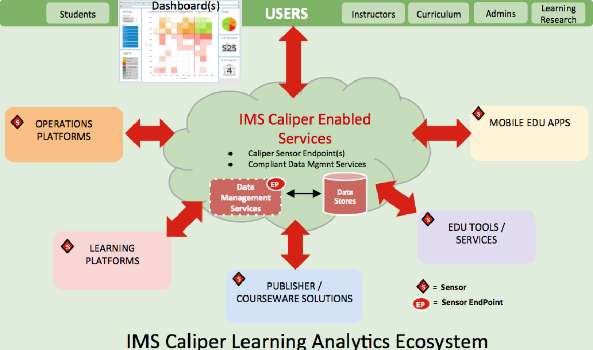
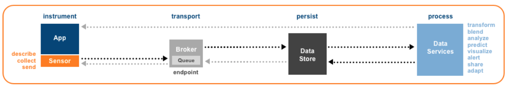

.. _caliper_realtime_events:

Caliper Real-time Events
########################

.. contents::
   :local:
   :depth: 3

Standardized Integration with Caliper
#####################################

Caliper is a standard that enables the collection, storage, and transport of data about learning. As a learning analytics framework, Caliper provides a common-gauge rail for disparate applications to use and share data from student interactions with learning software and administrative systems.

We have chosen Caliper as one of the primary communication standards for real-time events since many universities and other educational organizations prefer to use tools that require Caliper compliant activity tracking events.

Caliper Learning Analytics Ecosystem
####################################

Since the Caliper standard is widely accepted by the educational organizations, we can use this to generate events that could be used by adaptive learning engines and thus provide a rich user experience.

|ecosystem|

Sensor API
##########

`Sensor API`_ defines the basic learning events as well as standardizes and simplifies the gathering of learning metrics across the learning environments. These are used for marshaling and transmitting event data from instrumented applications to target endpoints for storage, analysis, and use.

There is a `sensor API library for python`_ that we can use in our routers for generating and propagating events. At present, the Sensor API can only Write/Post data to repository endpoints and does not support reading data from a data repository.

|sensorAPI|

See `Sensor API <https://www.imsglobal.org/sensor-api>`__ for more information.

.. _Sensor API: https://www.imsglobal.org/sites/default/files/caliper/v1p1/caliper-spec-v1p1/caliper-spec-v1p1.html#sensor
.. _sensor API library for python: https://github.com/IMSGlobal/caliper-python

The Information Model
#####################

Caliper specifications use an information model consisting of rules and relationships to define the learning activities. This model uses Metric Profile (“profile”) as the upper layer. A Metric Profile describes either a learning activity or an activity that facilitates learning e.g. grading.

While there are many profiles provided by caliper specifications, we are interested in the following:

-  Assessment Profile - for summative assessments

-  Assignable Profile - for formative assessments

-  Grading Profile - for scorable activities

-  Reading Profile - for text-based activities

-  Media Profile - for the audio, image, and video-based activities

The Caliper Event
*****************

A Caliper event is a generic type that describes the relationship between an actor and an object that was created due to an action undertaken by the actor.

A Caliper event essentially consists of the following: Actor, Action, and Object.

Actor
=====

The `Agent`_ who initiated an `Event`_, typically a `Person`_. A Caliper agent is a generic type that represents an `Entity`_. The actor value must be expressed either as an object or as a string corresponding to the actor’s `IRI`_.

The **Agent** can have many fields like name, dateCreated, dateModified but to keep the payload size minimal we will only use **id** and **type** which are the required fields.

**Id** is a valid IRI string capable of returning a representation of the resource. Keeping the learner’s privacy in mind, we can send an Open edX anonymized unique identifier of the learner (:ref:`oep-26-user-id`).

**Type** specifies the type of the agent. It’s mostly “Person” but can also be “Organization” or “SoftwareApplication”. We can use the generic “Agent” if no suitable type is available.

**Example:**

::

      {
            "id": "https://openedx.org/users/user-v1:<anonymized-user-id>",
            "type": "Person",
            "dateCreated": "2018-08-01T06:00:00.000Z",
            "dateModified": "2018-09-02T11:30:00.000Z"
      }

.. _Agent: https://www.imsglobal.org/sites/default/files/caliper/v1p1/caliper-spec-v1p1/caliper-spec-v1p1.html#agent
.. _Event: https://www.imsglobal.org/sites/default/files/caliper/v1p1/caliper-spec-v1p1/caliper-spec-v1p1.html#event
.. _Person: https://www.imsglobal.org/sites/default/files/caliper/v1p1/caliper-spec-v1p1/caliper-spec-v1p1.html#person
.. _Entity: https://www.imsglobal.org/sites/default/files/caliper/v1p1/caliper-spec-v1p1/caliper-spec-v1p1.html#entity
.. _IRI: https://www.imsglobal.org/sites/default/files/caliper/v1p1/caliper-spec-v1p1/caliper-spec-v1p1.html#iriDef

Action
======

The action or predicate binds the actor or subject to the object. An action is basically a verb in the past tense e.g. “Graded”, “Viewed”, “NavigatedTo”. The action range is limited to the set of `actions`_ described in the specification and may be further constrained by the chosen event type. Only one action can be specified per event.

**Examples:**

-  “NavigationEvent” supports “NavigatedTo” only.

-  “MediaEvent” supports a number of actions including “Started”, “Ended”, “Paused”, “Resumed”, “Restarted”, and “ForwardedTo”.

.. _actions: https://www.imsglobal.org/sites/default/files/caliper/v1p1/caliper-spec-v1p1/caliper-spec-v1p1.html#actions

Object
======

An object is an Entity that an Agent interacts with that becomes the focus, target, or object of interaction. The object value must be expressed either as an object or as a string corresponding to the object’s IRI. If the entity is expressed as an object, both the **id** and **type** properties must be specified.

**Id** value is a string that must be expressed as an IRI and should be capable of returning a representation of the resource assuming authorization to access the resource is granted.

**Type** value is the string representing the type of object upon which action has taken place by some actor. For a generic entity set the type value to the term “Entity”. If a subtype of entity is created, set the type to the `Term`_ corresponding to the subtype utilized, e.g. “Person”.

An **extensions** property is also defined so that implementers can add custom attributes not described by the model. We can use this to pass some extra information from edX events that are not required by the Caliper specified event field. Optional properties can be ignored when describing an entity.

Example:

::

      "object": {
            "id": "block-v1:org+course+run+type@video+block@<video_id>",
            "type": "VideoObject",
            "dateCreated": "2018-11-15T10:15:00.000Z",
            "startedAtTime": "2018-11-15T10:15:00.000Z",
            "endedAtTime": "2018-11-15T10:55:12.000Z",
            "duration": "PT40M12S"
      }

.. _Term: https://www.imsglobal.org/sites/default/files/caliper/v1p1/caliper-spec-v1p1/caliper-spec-v1p1.html#termDef

Context
=======

`JSON-LD`_ documents require inclusion of a *context*, denoted by the @context keyword, a property employed to map document terms to IRIs. Inclusion of a JSON-LD context provides an economical way for Caliper to communicate document semantics to services interested in consuming Caliper event data.

We can provide context in events in the following way:

::

      {
            "@context": "http://purl.imsglobal.org/ctx/caliper/v1p1",
            "id": "urn:uuid:3a648e68-f00d-4c08-aa59-8738e1884f2c",
            "type": "Event",
            ...
            ...
      }

.. _JSON-LD: https://www.imsglobal.org/sites/default/files/caliper/v1p1/caliper-spec-v1p1/caliper-spec-v1p1.html#jsonldDef

Open edX events
###############

Currently, the Open edX system supports and maintains events that are sent to tracking logs, as described in `Tracking Log Events <https://edx.readthedocs.io/projects/devdata/en/latest/internal_data_formats/tracking_logs/index.html>`__.

Prioritized List of Events
**************************

For this first iteration, we will focus primarily on the following events:

- **Enrollment events**

  + `edx.course.enrollment.activated <https://edx.readthedocs.io/projects/devdata/en/latest/internal_data_formats/tracking_logs/student_event_types.html#edx-course-enrollment-activated-and-edx-course-enrollment-deactivated>`_.
       Whenever a learner enrolls in a course.
  + `edx.course.enrollment.deactivated <https://edx.readthedocs.io/projects/devdata/en/latest/internal_data_formats/tracking_logs/student_event_types.html#edx-course-enrollment-activated-and-edx-course-enrollment-deactivated>`_.
       Whenever a learner unenrolls from a course.

- **Problem interaction events**

  + `edx.grades.problem.submitted <https://edx.readthedocs.io/projects/devdata/en/latest/internal_data_formats/tracking_logs/course_team_event_types.html#edx-grades-problem-submitted>`_.
      Whenever a learner submits any problem.
  + `problem_check <https://edx.readthedocs.io/projects/devdata/en/latest/internal_data_formats/tracking_logs/student_event_types.html#problem-check>`_.
       Whenever a learner's answer to a problem is checked.
  + `showanswer <https://edx.readthedocs.io/projects/devdata/en/latest/internal_data_formats/tracking_logs/student_event_types.html#showanswer>`_.
       Whenever a learner is shown the answer to a problem.
  + `edx.problem.hint.demandhint_displayed <https://edx.readthedocs.io/projects/devdata/en/latest/internal_data_formats/tracking_logs/student_event_types.html#edx-problem-hint-demandhint-displayed>`_.
       Whenever a learner requests a hint to a problem.

- **Video events**

  + `edx.video.loaded <https://edx.readthedocs.io/projects/devdata/en/latest/internal_data_formats/tracking_logs/student_event_types.html#load-video-edx-video-loaded>`_.
       Whenever a learner loads a video.
  + `edx.video.played <https://edx.readthedocs.io/projects/devdata/en/latest/internal_data_formats/tracking_logs/student_event_types.html#play-video-edx-video-played>`_.
       Whenever a learner plays a video.
  + `edx.video.stopped <https://edx.readthedocs.io/projects/devdata/en/latest/internal_data_formats/tracking_logs/student_event_types.html#stop-video-edx-video-stopped>`_.
       Whenever a learner stops a video.
  + `edx.video.paused <https://edx.readthedocs.io/projects/devdata/en/latest/internal_data_formats/tracking_logs/student_event_types.html#pause-video-edx-video-paused>`_.
       Whenever a learner pauses a video.
  + `edx.video.position.changed <https://edx.readthedocs.io/projects/devdata/en/latest/internal_data_formats/tracking_logs/student_event_types.html#seek-video-edx-video-position-changed>`_.
       Whenever a learner navigates to a different position in a video.

- **Course navigation events**

  + `edx.ui.lms.sequence.outline.selected <https://edx.readthedocs.io/projects/devdata/en/latest/internal_data_formats/tracking_logs/student_event_types.html#edx-ui-lms-outline-selected>`_.
       Whenever a learner navigates to a subsection in the course.
  + `edx.ui.lms.sequence.next_selected <https://edx.readthedocs.io/projects/devdata/en/latest/internal_data_formats/tracking_logs/student_event_types.html#example-edx-ui-lms-sequence-next-selected-events>`_.
       Whenever a learner navigates to the next content in the course.
  + `edx.ui.lms.sequence.previous_selected <https://edx.readthedocs.io/projects/devdata/en/latest/internal_data_formats/tracking_logs/student_event_types.html#edx-ui-lms-sequence-previous-selected>`_.
       Whenever a learner navigates to the previous content in the course.
  + `edx.ui.lms.sequence.tab_selected <https://edx.readthedocs.io/projects/devdata/en/latest/internal_data_formats/tracking_logs/student_event_types.html#edx-ui-lms-sequence-tab-selected>`_.
       Whenever a learner navigates to another unit within a subsection.
  + `edx.ui.lms.link_clicked <https://edx.readthedocs.io/projects/devdata/en/latest/internal_data_formats/tracking_logs/student_event_types.html#edx-ui-lms-link-clicked>`_.
       Whenever a learner clicks on any link in the course.

.. _Tracking Log Events: https://edx.readthedocs.io/projects/devdata/en/latest/internal_data_formats/tracking_logs/index.html

Event Field Mapping
*******************

Please see the `Open edX Caliper Events`_ document for a detailed view of the mapping between the above Open edX events and their equivalent Open edX Caliper formats.

.. _Open edX Caliper Events: https://docs.google.com/spreadsheets/d/1MgHddOO6G33sSpknvYi-aXuLiBmuKTfHmESsXpIiuU8/view

