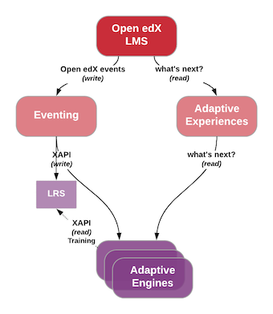

.. _xapi_realtime_events:

xAPI Real-time Events
#####################

.. contents::
   :local:
   :depth: 2

Standardized Integration with xAPI
**********************************
We have chosen xAPI as one of the primary communication standards for real-time events since it has `widespread industry support and usage`_ for tracking and analyzing learning activity. Please see `xAPI Architecture Overview`_ for further information on xAPI.

.. _widespread industry support and usage: https://xapi.com/adopters/
.. _xAPI Architecture Overview: https://www.adlnet.gov/research/performance-tracking-analysis/experience-api/xapi-architecture-overview/

.. Note:: Although xAPI specifies a standardized format, it is a low-level transaction schema and relies on higher-level "profiles" applied on top of it. So the profiles for specific Activities, Verbs, Contexts, etc used by Open edX need to be contractually maintained. This can be ensured by a community maintained :ref:`oep-26-validator` component.

.. _oep-26-lrs:

Learning Record Store (LRS) - Future
************************************

xAPI includes a specification for a Learning Record Store (LRS), which encapsulates a data store with APIs for storing and accessing xAPI data. While an LRS could be used for many different purposes, it can be used to train adaptive engines as shown in the diagram below.

We will not implement our own LRS. We will look into integration efforts with third party LRS services.

Statement API
*************

xAPI specifies 4 standard REST-ful JSON payload APIs, of which only the `Statement API`_ is needed for our purposes as that API is sufficient for tracking learning activity.

The Statement API has essentially the following parts: `xAPI Actor`_, `xAPI Verb`_, `xAPI Object`_, `xAPI Context`_, and `xAPI Result`_.

.. _Statement API: https://xapi.com/statements-101/

xAPI Actor
==========
Although the **Actor** field can be either an *Agent* or a *Group*, we will primarily support only the *Agent* type, which is used for individuals performing an activity (`xAPI Verb`_ on an `xAPI Object`_).

An Actor can be identified using `Friend of a Friend (FOAF)`_ vocabulary with either: (1) `email address`_, (2) `hash of email address`_, (3) `OpenID URI`_, or (4) `account`_ with a *homepage*-scoped identifier.  One of these is sent along with the Actor's "name". As of February 2025 we send #4 as the default, with an Open edX anonymized unique identifier of the learner (:ref:`oep-26-user-id`) however the system can be configured to use #1 or #2 if necessary.

Example
-------

Here is an example of an **Actor** JSON value that we would generate:

::

    "actor": {
        "objectType": "Agent",
        "account": {
            "name": "<anonymized-user-id>",
            "homePage": "https://openedx.org/"
        }
    }

See `Deep Dive: Actor/Agent`_ for more information on xAPI Actors.

.. _Friend of a Friend (FOAF): http://xmlns.com/foaf/spec/
.. _email address: http://xmlns.com/foaf/spec/#term_mbox
.. _hash of email address: http://xmlns.com/foaf/spec/#term_mbox_sha1sum
.. _OpenID URI: http://xmlns.com/foaf/spec/#term_openid
.. _account: http://xmlns.com/foaf/spec/#term_account
.. _Personally Identifiable Information (PII): https://en.wikipedia.org/wiki/Personally_identifiable_information
.. _`Deep Dive: Actor/Agent`: https://xapi.com/deep-dive-actor-agent/

xAPI Verb
=========

The **Verb** in xAPI is a past tensed value, identified by a URI from the `xAPI registry`_ and paired with a short display string. It denotes the action that was performed by the Actor on the Object in the statement. As best as possible, we will use standard and registered Verbs rather than creating custom ones. The chosen Verbs are documented in the `Open edX Events`_ section below.

The registry is automatically created from multiple profiles. For now, we will limit ourselves to only URIs prefixed by the following domains, in the following priority order (in case of conflicting names):

* ``http://adlnet.gov``
* ``http://w3id.org``
* ``http://id.tincanapi.com``

If, by any chance, a verb needed by Open edX does not exist in the registry, then we will create a pull request to recommend adding it to the `central GitHub repository of xAPI Profiles`_.

Here is an example of a **Verb** JSON value that we would generate:

::

    "verb": {
        "id": "http://adlnet.gov/expapi/verbs/answered"
    }

.. Note:: To keep the size of events as small as possible, we choose to avoid extraneous fields. For example, we intentionally exclude a "display" field in the example above.

See `Experience API Deep Dive: Verbs`_ for more information on xAPI Verbs.

.. _xAPI registry: http://xapi.vocab.pub/verbs/index.html
.. _central GitHub repository of xAPI Profiles: https://github.com/adlnet/xapi-authored-profiles
.. _`Experience API Deep Dive: Verbs`: https://xapi.com/deep-dive-verb/

xAPI Object
===========

Initially, the **Object** in an Open edX xAPI event will be an xAPI *Activity*, which is uniquely defined by a URI. (In the future, we may expand Objects to also be Actors in case of *social interactions*, and Statements in case of *voiding*.)

The **id** field is a unique identifier. The `Open edX Events`_ section has specifics on which Open edX identifier is used in each event.

The **type** of the Activity and the **name** of the Activity are included in the **definition** field.  Similar to Verbs, the type of the Activity is a standard URI taken from the `xAPI registry`_.

Here is an example of an **Object** JSON value that we would generate:

::

    "object": {
        "id": "https://courses.openedx.org/xblock/block-v1:openedx+origami-folding+1T2018+type@problem+block@abcd",
        "definition": {
            "type": "http://adlnet.gov/expapi/activities/question",
            "name": {
                "en-US": "Question on mountain fold needed to create an origami crane base",
            }
        }
    }

See `Deep Dive: Object`_ for more information on xAPI Object.

.. _`Deep Dive: Object`: https://xapi.com/deep-dive-object/

xAPI Context
============

The **Context** field allows us to embed additional contextual information in each statement. See specifics in the `Open edX Events`_ section below since it varies by event type.

Here is an example of a **Context** JSON value that we would generate:

::

    "context": {
        "registration": "https://openedx.org/enrollments/enrollment-v1:<anonymized-enrollment-id>",
        "contextActivities": {
            "parent": [{
                "objectType": "Activity",
                "id": "https://openedx.org/courses/course-v1:openedx+origami-folding+1T2018"
            }]
        }
    }

See `Deep Dive: Context`_ for more information on xAPI Context.

.. _`Deep Dive: Context`: https://xapi.com/deep-dive-context/

xAPI Result
===========

The **Result** field specifies the score the user earned on an activity.  Here is an example of a JSON value that we would generate for a problem type:

::

    "result": {
        "success": false,
        "completion": true,
        "score": {
            "min": 0,
            "max": 50,
            "raw": 10,
            "scaled": 0.20
        },
        "response": "foo"
    }

See `Deep Dive: Result`_ for more information on xAPI Result.

.. _`Deep Dive: Result`: https://xapi.com/deep-dive-result/

Open edX Events
***************

Currently, the Open edX system supports and maintains events that are sent to tracking logs, as described in `Tracking Log Events`_. The authoritative source for the mapping between these events and their xAPI equivalents is the `event-routing-backends XAPI transform`_ documentation.

.. _Tracking Log Events: https://docs.openedx.org/en/latest/developers/references/internal_data_formats/index.html
.. _event-routing-backends XAPI transform: https://github.com/openedx/event-routing-backends/blob/master/docs/event-mapping/xAPI_mapping.rst
