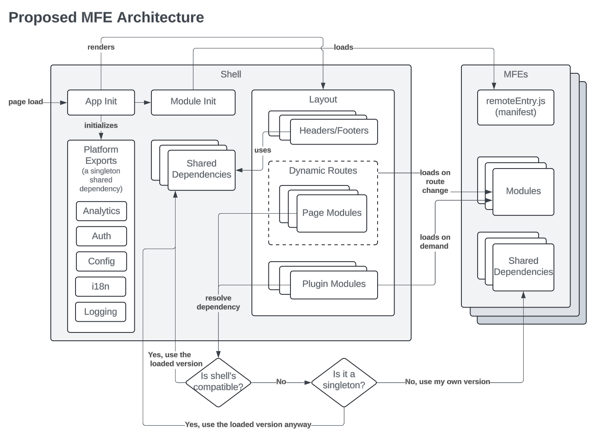

OEP-65: Frontend Composability
##############################

.. list-table::
   :widths: 25 75

   * - OEP
     - :doc:`OEP-65 <oep-0065-arch-frontend-composability>`
   * - Title
     - Frontend Composability
   * - Last Modified
     - 2024-04-12
   * - Authors
     - * Adolfo R. Brandes <adolfo@axim.org>
       * Pedro Martello <pedro@hammerlabs.net>
       * David Joy <david@joy.engineering>
   * - Arbiter
     - Adam Stankiewicz <astankiewicz@2u.com>
   * - Status
     - Provisional
   * - Type
     - Architecture
   * - Created
     - 2024-04-03
   * - Review Period
     - April 15, 2024 - May 10, 2024
   * - Resolution
     - Slack discussion on merging as Provisional: https://openedx.slack.com/archives/C1L370YTZ/p1713215512929479
   * - References
     - * `FC-0054 - Composable Micro-frontends Discovery <https://openedx.atlassian.net/wiki/spaces/COMM/pages/4063821827/FC-0054+-+Composable+Micro-frontends+Piral+Discovery>`_
       * `FC-0007 - Modular MFE Domains Discovery <https://openedx.atlassian.net/wiki/spaces/COMM/pages/3614900241/CLOSED+FC-0007+-+Modular+MFE+Domains+Discovery>`_
       * :doc:`ADR 0001 - Create a unified platform repository </architectural-decisions/oep-0045/decisions/0001-tutor-as-replacement-for-edx-configuration>`

.. contents::
	   :local:
	   :depth: 3

Abstract
********

This OEP proposes that Open edX micro-frontends (MFEs) adopt shared dependencies and runtime module loading - implemented via webpack module federation - as an approach to improve the consistency, performance, and flexibility of the MFE architecture.

Motivation
**********

Micro-frontends were originally designed to avoid some of the limitations of the monolithic ``edx-platform`` frontend, namely that otherwise independent teams in edX's large engineering organization were beholden to the build, test, and release lifecycle of the rest of the codebase. This dramatically slowed down the pace of frontend feature development, experimentation, and innovation on the master branch where the rate of change is particularly high.

As a result, the Open edX "micro-frontend" architecture focused on creating an un-opinionated, loosely coupled set of applications with the goal of enabling teams to iterate quickly and independently. This goal was successful.

However, we've discovered that the completely siloed nature of these MFEs has created its own set of problems. Our frontends are more like independent single-page applications than `micro-frontends <https://micro-frontends.org>`_, as we never invested in ways of composing them together. The problems inherent in siloed MFE architecture are described below.

Consistency
===========

Because each MFE is completely independent, this creates inconsistencies from MFE to MFE. Inconsistent installed dependency versions manifest in a variety of ways for users, but we also see inconsistency resulting from MFE developers making divergent choices in isolation.

Reusable components (Paragon)
-----------------------------

MFEs may use different versions of `paragon <paragon_>`_, resulting in functional and stylistic differences.

Header/Footer
-------------

MFEs may use different versions of the `frontend-component-header <frontend-component-header_>`_ and `frontend-component-footer <frontend-component-footer_>`_ components, also resulting in functional, stylistic, and content/navigation differences. MFE authors may also make their own headers and footers in isolation without following the best practice of using the shared components.

Branding
--------

Brand packages created from `brand-openedx <brand-openedx_>`_ may be different versions, resulting in any number of subtle visual differences. MFE authors may also make divergent choices like varying page widths, to the detriment of our user experience.

Other Dependencies
------------------

MFEs may have completely different versions of any other dependency. We mitigate some of this by consolidating some important dependencies in `frontend-build <frontend-build_>`_ and `frontend-platform <frontend-platform_>`_, but even those can have different versions from MFE to MFE. For developers, this increases cognitive load and slows velocity because of the need to adjust to the idiosyncrasies of each application.

User and Developer Experience
=============================

Bundle Size
-----------

Each MFE bundles all of its own dependencies, even if they're the same version as another MFE. This means that as a user navigates between MFEs, they end up downloading common dependencies over and over again. This results in megabytes of overhead for the average user navigating between a few MFEs and slows down the entire experience.

Full Page Refreshes
-------------------

Each MFE has its own index.html page, and needs to load all its own dependencies from scratch whenever you navigate to it. This means that the browser performs a full page refresh each time a user transfers from MFE to MFE.

Build time
----------

Each MFE bundles all its own dependencies at build-time, creating significant overhead for the Webpack build process. When building multiple MFEs, this additional, repeated overhead adds up quickly, making builds prohibitively slow for developers and site operators alike.

Dependency Maintenance
----------------------

Since each MFE has its own complete set of dependencies, the overhead of keeping them all up to date can be overwhelming. Security patches, bug fixes, new features, and breaking changes all add up and create a significant maintenance burden.

Composability
=============

A siloed MFE architecture does not provide a clean, low-overhead way of composing components from multiple MFEs into a single page, or extending an MFE with additional functionality.

The reality of MFEs is that while each application seeks to represent a single cohesive `domain <https://martinfowler.com/bliki/DomainDrivenDesign.html>`_ or `bounded context <https://martinfowler.com/bliki/BoundedContext.html>`_, sometimes content and functionality from more than one domain are needed on the page at the same time.

Alternately, site operators may want to show different *versions* of MFEs to different users while keeping the rest of the app (header, navigation, other MFEs) unchanged.

There are alternatives to runtime module loading and shared dependencies which are used in some situations. These are not *rejected* alternatives, and so we include them here to help illuminate how their limitations are motivation for adopting runtime module loading and shared dependencies.

Shared Libraries (Alternative #1)
------------------------------------

Because each MFE is siloed from each other - both in repositories and at runtime - we can share code by extracting it into a library and having our MFEs depend on it. This creates more repository/dependency overhead, and is only useful at build-time, meaning we need to rebuild all MFEs using the shared library whenever we want to update it.

Build-time package overrides (Alternative #2)
------------------------------------------------

NPM and package.json allow site operators to override dependency resolution by installing an alternate version of a dependency prior to build-time. This has historically been how we've allowed operators to override the header, footer, and brand.

The system is confusing, brittle, and only works at build-time. If a site operator needs different headers/footers/brands for different instances, this multiplies the number of required build processes for an instance.

Frontend Plugins (Alternative #3)
------------------------------------

`frontend-plugin-framework <frontend-plugin-framework_>`_ gives us the ability to share components across MFEs as plugins, either at build-time (direct plugins) or runtime (iframe plugins)

Direct plugins create some flexibility, but couple our repositories' builds together, similar to shared libraries above. Iframes are good for sandboxing and isolating code, but they're a very inefficient way to compose a UI, especially given the consistency and user/developer experience concerns raised above. In a way, they exacerbate the problem even more. There's no way to do direct plugins via the MFE config API, since they rely on importing modules directly into the build.

Specification
*************

Our approach centers on enabling *runtime module loading* and *shared dependencies*. Together, these two capabilities address the majority of the motivating problems described above (Consistency, User and Developer Experience, and Composability).

We intend to enable runtime module loading and shared dependencies via `Webpack module federation <https://webpack.js.org/concepts/module-federation>`_. Further, we need to complement this new architectural approach with ways of *maintaining dependency consistency* between MFEs or we won't be able to realize the benefits of sharing dependencies.

Capability: Runtime Module Loading
==================================

The capability to lazily load content from independently built modules into the page - without iframes - solves many of the `Composability`_ and `User and Developer Experience`_ issues above. In particular, it gives us a way of composing UI elements from different MFEs/Domains dynamically at runtime without a "host" application needing to know anything about the "guest" at build-time. The two remain completely decoupled, save some shared runtime configuration. It also cuts down on the number of full page refreshes experienced by users.

It's worth noting that adopting runtime module loading has a high degree of overlap with the capabilities of the `frontend-plugin-framework <frontend-plugin-framework_>`_ (FPF) and is a natural extension of its feature set.

Advantages: Runtime Module Loading
----------------------------------

* Reduces the frequency of full page refreshes. MFEs today are completely independent, so navigating between them means loading a completely new page (even if they share dependencies).
* Improves composability across MFEs/domains. We have no way to show more than one MFE on the same page today except by using iframes or by creating hard dependencies between MFEs at build-time by extracting 'shared' code into a new library, like `frontend-component-header <frontend-component-header_>`_, `frontend-component-footer <frontend-component-footer_>`_, or `frontend-lib-content-components <https://github.com/openedx/frontend-lib-content-components>`_. Each of these increases our dependency maintenance burden significantly.
* Improves runtime extensibility by allowing us to configure where an MFE's code should be loaded from, rather than needing to build it in to an app. It dovetails nicely with the `frontend-plugin-framework <frontend-plugin-framework_>`_ by providing us with a seamless, performant, and flexible way of extending our frontends without needing to rebuild the host.

Capability: Shared Dependencies
===============================

Sharing dependencies between MFEs at runtime compliments runtime module loading.

MFEs have a number of dependencies which are common between them but which aren't actually shared at runtime in any way. The capability to share these dependencies - such as ``react``, `paragon <paragon_>`_, etc. - would mitigate a great deal of our `Consistency`_ and `User and Developer Experience`_ issues.

We expect the following packages - which are used in the vast majority of MFEs today - should all be shared between MFEs.

.. list-table::
   :widths: 50 50

   * - **Package**
     - **Estimated Size**
   * - @edx/brand
     - Variable
   * - @edx/frontend-component-footer
     - 88.1k
   * - @edx/frontend-component-header
     - 156.9k
   * - @edx/frontend-platform
     - 355.3k
   * - @openedx/paragon
     - ~950k
   * - classnames
     - 0.8k
   * - prop-types
     - 0.9k
   * - react
     - 6.4k
   * - react-dom
     - 130.2k
   * - react-redux
     - 11.2k
   * - react-router
     - 58.9k
   * - react-router-dom
     - 77.1k
   * - redux (@reduxjs/toolkit)
     - 3.7k
   * - core-js
     - 241.1k
   * - regenerator-runtime
     - 6.6k

Total size: ~2,087.2k unzipped (Note that these sizes are solely based on bundlephobia.com's estimates, which may not accurately represent how much code we're actually bundling)

Advantages: Shared Dependencies
-------------------------------

* When MFEs use the same version of a given dependency we see many benefits: significant reduction of developer cognitive load and context switching involved in working with multiple MFEs, fewer visual inconsistencies at runtime, and more. The `Approach: Webpack Module Federation`_ section has more details on how we foresee this working.
* Reduces runtime bundle size. We'll ship far less code to the client across a user's browsing session.

Caveat: "build-time" and "dependency maintenance"
-------------------------------------------------

Note that "build-time" and "dependency maintenance" are not mentioned in the advantages above. The reasons for this have to do with how shared dependencies are resolved for modules at runtime, and are described in more detail in the `Approach: Webpack Module Federation`_ section below.

At a high level, even if MFEs share dependencies, we want to preserve the ability for them to "fall back" to their own version of a shared dependency if a version already loaded on the page is incompatible with their own. To do this, each MFE builds and deploys its own version of all its dependencies in case dependency resolution determines they're needed.

This means that the build of a given MFE has to take time to bundle their own dependencies, and the repository still needs the dependencies present in the package.json file. Sharing dependencies doesn't help us much in regard to build-time and dependency maintenance.

Approach: Webpack Module Federation
===================================

Module federation is implemented as a `plugin for Webpack <https://webpack.js.org/plugins/module-federation-plugin/>`_ that enables micro-frontends to be composed into the same page at runtime even if they're built separately and independently deployed. The pieces being composed are "modules". It lets us configure which dependencies should be shared between modules on a page and what modules a particular frontend exposes to be loaded by other frontends.

More information on module federation beyond its webpack implementation can be found on its `dedicated site at module-federation.io <https://module-federation.io/>`_.

If two modules require incompatible versions of a shared dependency, the second one loaded can fall back to loading a version it's compatible with from its own build. (see the link in step #4 below for details.)

In terms of Open edX MFEs, this means:

#. MFEs can continue to be built independently.
#. The Webpack build will include a manifest of which sub-modules the MFE provides at runtime.
#. `frontend-build <frontend-build_>`_ will specify - through its Webpack configs - a common set of shared dependencies to be used at runtime by all MFEs.
#. Webpack will intelligently resolve those dependencies at runtime, `taking into account each module's specific version requirements <https://www.angulararchitects.io/en/blog/getting-out-of-version-mismatch-hell-with-module-federation>`_.
#. MFEs can dynamically load modules from other MFEs at runtime with Webpack handling hooking them up to the right dependencies.

Because we already use Webpack, the work to add the ``ModuleFederationPlugin`` to our configurations is small and un-invasive (see proof of concept in the `Reference Implementation`_ section below).

Approach: Maintaining Dependency Consistency
============================================

This proposal fundamentally changes how we work with MFE dependencies, and will require us to adopt a more rigorous approach to ensuring dependency consistency and compatibility across MFEs. Independent MFE codebases must be kept in sync with regards to dependency versions or we lose the benefits of shared dependencies. Consistency doesn't come for free just by adopting shared dependencies at runtime.

MFEs need a compatible version of the shared dependency to be available, otherwise they need to fall back to their own version. The process, tooling, and/or code organization necessary to provide that consistency is not something module federation can help with and needs to be addressed separately.

We expect that this may need to take a number of possible forms.

Process
-------

We need to ensure maintainers and developers know what dependency versions to use, and when they need to upgrade to stay consistent. Open edX release documentation should include information on which frontend dependency versions are compatible with the release, likely pinned to a major version (i.e., React 17.x, Paragon 22.x, etc.)

We also need a process to migrate Open edX repositories through breaking changes in third-party dependencies. Ideally following the `Upgrade Project Runbook <https://openedx.atlassian.net/wiki/spaces/AC/pages/3660316693/Upgrade+Project+Runbook>`_.

Best Practices
--------------

We need to ensure we minimize breaking changes in our own libraries (such as `paragon <paragon_>`_, `frontend-component-header <frontend-component-header_>`_, `frontend-component-footer <frontend-component-footer_>`_, `frontend-platform <frontend-platform_>`_, `frontend-build <frontend-build_>`_, etc.) We suggest accomplishing this by:

* Creating new versions of components with breaking changes (``ButtonV2``, ``webpack.dev.config.v2.js``) rather than modifying existing ones.
* Leveraging the `DEPR process <depr-process_>`_ for communication and removing old component versions.
* Aligning that removal and the subsequent breaking changes with Open edX releases, and documenting it in their release notes.

Further, we could reduce the overhead of dependency maintenance and ensure MFEs stay up to date by pinning dependencies to major versions using ``^`` in our package.json files.

Tooling
-------

Maintainers and developers should be warned of incompatibilities created by their PRs, or outside the repository by another project (such as the shell application).

This could take the form of Github tooling which notifies maintainers and developers that their frontend code has:

#. Drifted behind the compatible version of a shared dependency for a given Open edX release or the main branch.
#. Has upgraded beyond what is compatible with a given Open edX release or the main branch.

Code Organization
-----------------

We may want to refactor how we organize our code to help MFEs ensure they are utilizing dependency versions that align with what other MFEs are using. The goals of such a refactoring are to:

#. Reduce the number of individual dependency updates necessary in MFEs, which in turn reduces maintenance burden.
#. Provide MFEs with a set of shared dependencies guaranteed to be the same as the shell application.
#. Provide MFEs with a more predictable update cycle for shared dependencies, in-line with the Open edX Release cadence.

An ADR attached to this OEP will describe the final approach taken to solve this problem.

Out of Scope
============

There are a few important - but tangential - concerns which are considered out of scope for this OEP and its resulting reference implementation.

* Implementation details of how module federation would be added in the frontend-plugin-framework.
* How Tutor and other distributions will need to change to adopt module federation.
* Opinions on which dependencies we should adopt going forward (such as redux or other state management solutions)

Rationale
*********

The majority of the concerns expressed in the `Motivation`_ section revolve around a lack of shared dependencies and the way in which MFEs are currently siloed from each other, preventing us from creating a more seamless, cohesive experience.

Module federation specifically addresses these use cases exactly. It's right-sized to the problem at hand, can be accomplished with a minimum of impact on our existing MFEs, and can be done in a backwards compatible way (more on that below).

An approach to maintaining dependency consistency is essential to realize the benefits of sharing dependencies. Without it, we've accomplished very little even though we've added the capability. An approach to providing this consistency is not a prerequisite for implementing module federation, to be clear, but the *success* of module federation is tightly coupled to it.

Backward Compatibility
**********************

We intend to maintain backwards compatibility while migrating to and adopting module federation. We can do this by creating a separate set of Webpack configurations in `frontend-build <frontend-build_>`_ and separate build targets in converted MFEs; the footprint of module federation on "guest" MFEs is very small, requiring virtually no code changes in the application itself, and a few additional configuration options in the MFE's Webpack config to identify exposed components. For an example of what this looks like, please see the POC repositories in the `Reference Implementation`_ section below.

Ultimately MFEs will no longer be responsible for initializing `frontend-platform <frontend-platform_>`_ or rendering the header and footer. We will follow the `DEPR process <depr-process_>`_ for retiring this code in MFEs once (and if) we make the module federation architecture required.

In the interim, MFEs will have both a Webpack configuration that exposes modules for consumption by other hosts as alternate entry points (to use Webpack parlance) _and_ the primary entry point which initializes `frontend-platform <frontend-platform_>`_ and loads the header/footer. The POC below suggests this won't be a problem.

Reference Implementation
************************

A proof of concept has been created that demonstrates how Webpack module federation works with two Open edX micro-frontends based on the `frontend-template-application <frontend-template-application_>`_. The POC has several shared libraries (``react``, ``react-dom``, and `paragon <paragon_>`_), and loads a React component module from a guest MFE into the page of a host MFE. It supports hot module replacement during development, and runs on the two MFEs' ``webpack-dev-server`` instances.

The POC repositories can be found here:

* `frontend-app-mf-host <https://github.com/davidjoy/frontend-app-mf-host>`_
* `frontend-app-mf-guest <https://github.com/davidjoy/frontend-app-mf-guest>`_

Proposed MFE Architecture
=========================

Diagram description: A diagram showing the proposed MFE architecture using Webpack module federation (`LucidChart source`_). Contains the shell application and a "guest" MFE. Shows how the `Shell MFE`_ loads a manifest from MFEs (remoteEntry.js), and then uses that to load modules from the MFE, on demand, at runtime. The decision process around incompatible dependencies is shown, showing how an MFE that needs an incompatible version of a shared dependency loads its own version into the page as necessary - unless that dependency is a "singleton", in which case it will always resolve to the first version loaded.

MFEs and Modules
----------------

Each of our MFEs will export a set of one or more modules that can be loaded by other MFEs or the `Shell MFE`_. For instance, ``frontend-app-profile`` would likely export the ``ProfilePage`` component. Other MFEs may export their own pages, or perhaps plugins/widgets/components to be loaded by the `frontend-plugin-framework <frontend-plugin-framework_>`_ via a "module" plugin type based on this implementation.

Hosts and Guests
----------------

MFEs become either "hosts" or "guests" or both. A host is an MFE that loads runtime modules from a guest. A guest may itself act as a host to modules from another guest. For example, the `Shell MFE`_ is only a host and all MFEs are guests in the shell; further, some pairs of MFEs might have a host/guest relationship with each other.

Shell MFE
---------

We will create a new "shell" MFE to act as the top-level host for all other MFEs. It is exclusively responsible for:

* Initializing the application via `frontend-platform <frontend-platform_>`_.
* Loading the default, expected version of all our shared dependencies.
* Rendering the "layout" of the application, including the header and footer.
* Loading the brand.

Like other hosts, it is also responsible for:

* Loading all the manifests from the "guest" MFEs from which it intends to load modules.
* Using module federation to load the guest MFEs' modules on demand.

Guest MFEs (not the shell)
--------------------------

Guest MFEs that require a version of a shared dependency that's incompatible with the shell's version may load their own provided that dependency isn't a "singleton". Singletons in this context are dependencies that may only be loaded into the page once because they break if there are multiple instances active on the same page. React and `frontend-platform <frontend-platform_>`_ are singletons, for example.

If a guest needs to load its own versions of shared dependencies, this degrades the performance and experience of end users. MFE developers and maintainers should endeavor to use dependencies compatible with the version loaded by the shell.  See `Approach: Maintaining Dependency Consistency`_ for details of how we might approach this.

Converting the POC to a reference implementation
================================================

To convert this POC into a reference implementation, we need to minimally:

* Create a new "shell" micro-frontend to be the top-level "host" for all our other micro-frontends.
* Create module federation-based development and production Webpack configurations in `frontend-build <frontend-build_>`_.
* Modify the Webpack configuration to share the complete list of shared dependencies from the shell.
* Pick an existing MFE (or two) to convert to use module federation. Add build targets to these "guest" micro-frontends that can be used to build them in module-federation mode.
* Extend the Webpack configuration in the MFEs by defining what modules each "guest" MFE exports. We suggest that the package.json `exports <https://nodejs.org/api/packages.html#subpath-exports>`_ field be used to codify this list of exports, and that Webpack pull it in from package.json to configure ``ModuleFederationPlugin``. The format appears to be the same.
* Give "guest" MFEs a way of seeing their own config, since they'll be getting `frontend-platform <frontend-platform_>`_ as a shared dependency from the shell, and won't be initializing it themselves.
* Unify our notion of a "plugin" in `frontend-plugin-framework <frontend-plugin-framework_>`_ with a "module" loaded via module federation. There is power in merging runtime module loading and module federation into our existing plugin mechanisms via FPF.

Secondary concerns include:

* Ensuring nested dynamic modules work correctly.
* Ensuring static assets load properly in guest modules.
* `DEPR process <depr-process_>`_ around the migration.
* Documentation on how to convert an MFE to use module federation and the shell.
* The configuration for loading the Open edX Platform's default MFEs.
* Documentation on how to do development with module federation and the shell.
* A decision on whether we use the MFE config API, env.config.js, both, or something else to supply the module federation configuration, whether it's one big combined document or whether each MFE has its own.
* How we sandbox and put error boundaries around dynamically loaded modules.
* How we manage breaking dependency changes across MFEs.

Rejected Alternatives
*********************

Piral
=====

A prior iteration of this OEP and discovery effort (`FC-0007 <https://openedx.atlassian.net/wiki/spaces/COMM/pages/3614900241/CLOSED+FC-0007+-+Modular+MFE+Domains+Discovery>`_) came to the conclusion that we should adopt Piral, a comprehensive micro-frontend web framework, to address our concerns with the Open edX micro-frontend architecture.

After further investigation and review of our stated pains, observed deficiencies, hopes, and vision for Open edx micro-frontends, we chose to adjust course away from Piral. Piral solves runtime module loading and shared dependencies in a similar way to Webpack module federation - and can in fact use it internally - but does so in a more proprietary, opinionated, and opaque way, adding additional layers/wrappers around it. While Webpack is one of many bundlers available, it's also the defacto standard against which others are judged, and has wide industry adoption. Webpack module federation is a standard approach for composing micro-frontends.

Piral is an impressive piece of software, built primarily by one individual, trying to solve a much broader problem than we have. Because of this, it brings along with it a great deal of complexity that we don't need and already have solutions for. Piral aims to be a complete toolkit for building web applications, including authentication, plugins, its own global state mechanism, extensions that provide ready-made UI components, etc.

We need a mechanism to provide shared dependencies and composable frontends that can fit in with our existing ecosystem. Adopting Piral would likely involve significant refactoring of existing MFEs to fit into its framework and to turn them into "pilets", which locks us in to the Piral way of doing things.

It feels like our needs more closely align with the narrower scope of module federation, and that it's a more right-sized solution to our architectural problems.

Combining MFEs into 2-3 monoliths
=================================

Folding our micro-frontends together into a few larger frontends (LMS and Studio, for instance) solves our need for shared dependencies in a different way - it just shares all the code so there's one set of dependencies for all of it. We could continue to rely on frontend-plugin-framework for cross-domain plugins, but "plugins" within the larger domain become a simple import from another part of the application.

This approach was abandoned because we still believe that MFE independence is a core need for our platform and we can't go back to a few monolithic frontends. MFE independence continues to allow independent teams to operate with autonomy, lets operators customize, build, and deploy MFEs independently as needed, and creates a more approachable platform for the community by keeping our frontends decoupled and focused.

Combining MFEs into a monorepo
==============================

A monorepo would co-locate all of the MFEs and frontend libraries in the core product in the same repository, but maintain their independent release and deployment cycles. We believe this would help us more readily keep consistent dependency versions across MFEs. But it would also introduce a layer of complexity to our code organization and be a highly invasive way of solving our dependency consistency issues, as we'd have to move all of our core product frontend code into a new repository.

Further, it wouldn't solve our consistency problems for anyone working with custom MFEs or libraries. We want to create parity between the process for core product and non-core product repositories to ensure our approach is serving everyone's needs, not just maintainers of official repositories.

We acknowledge that there are benefits here, but believe that it's more work than it's worth, is only a partial solution, and we have less complex options available to us.

Doing Nothing
=============

We feel that the siloing of micro-frontends, the proliferation of dependencies, the difficulty of extending our platform, and the toil of ongoing maintenance is untenable. This requires us to act to improve the approachability of our frontend architecture; it's not good enough yet.

.. _frontend-platform: https://github.com/openedx/frontend-platform
.. _frontend-build: https://github.com/openedx/frontend-build
.. _frontend-component-header: https://github.com/openedx/frontend-component-header
.. _frontend-component-footer: https://github.com/openedx/frontend-component-footer
.. _paragon: https://github.com/openedx/paragon
.. _brand-openedx: https://github.com/openedx/brand-openedx
.. _frontend-plugin-framework: https://github.com/openedx/frontend-plugin-framework
.. _depr-process: https://open-edx-proposals.readthedocs.io/en/latest/processes/oep-0021-proc-deprecation.html
.. _frontend-template-application: https://github.com/openedx/frontend-template-application
.. _LucidChart source: https://lucid.app/lucidchart/8c2db108-7c14-4525-8e3a-d2853db68b9e/edit?invitationId=inv_7a61f692-df0b-465b-8ec1-5a18ce4447ca

Change History
**************

2024-05-13
==========

* Merging OEP-65 as Provisional.

2024-04-03
==========

* Document created
* `Pull request #575 <https://github.com/openedx/open-edx-proposals/pull/575>`_ contains all review feedback.

2024-06-26
==========

* Adding a reference to ADR-0001, which describes creation of a unified platform repository.
