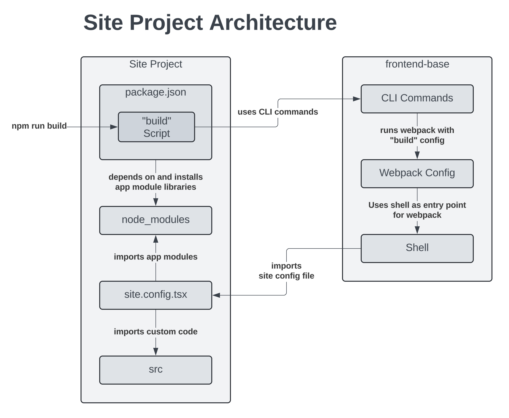
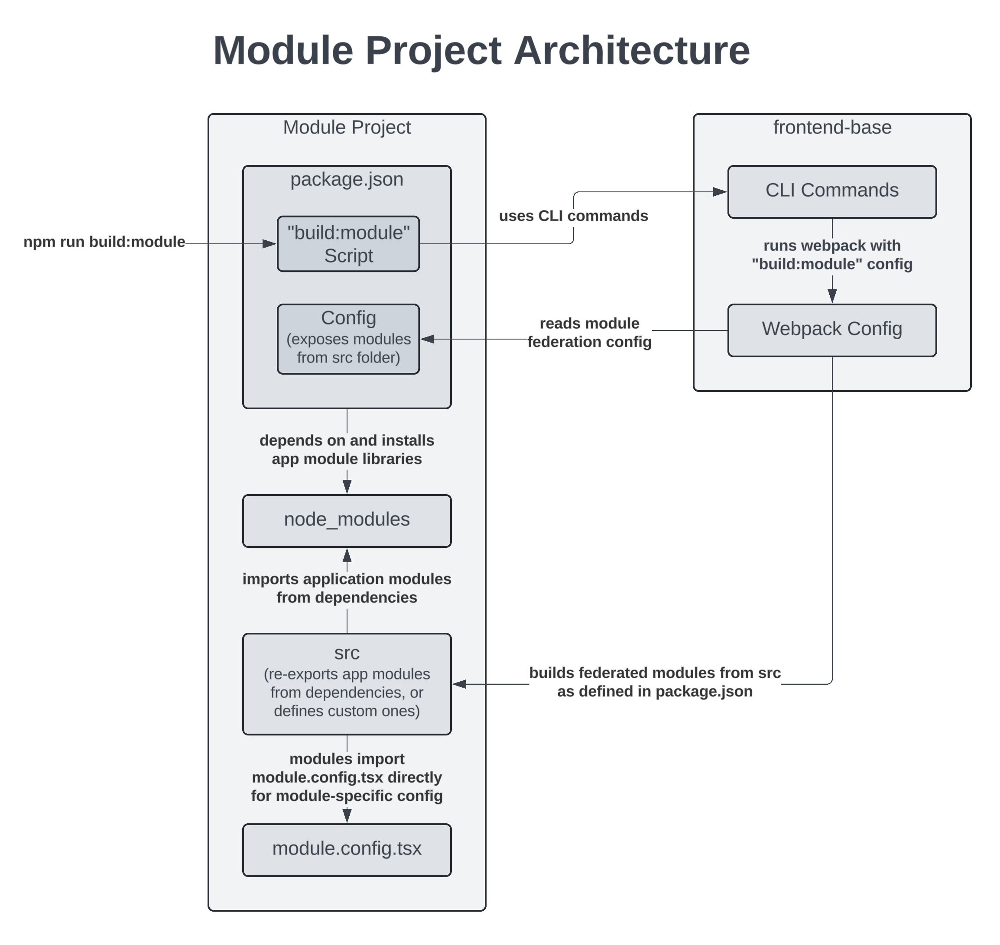

.. _Frontend Projects:

Frontend Projects
#################

Status
******

Accepted

Summary
*******

This ADR describes the architecture of and rationale for frontend :term:`Projects <Project>`, a way of building and customizing the :term:`Open edX Frontend`.

Context
*******

OEP-65 proposes adopting webpack :term:`module federation` for Open edX :term:`micro-frontends <Micro-frontend>` (MFEs) as a means to enable :term:`runtime module loading` and :term:`shared dependencies` in the :term:`Open edX frontend`. The OEP lays out a series of changes necessary to enable these capabilities, which it refers to as building a "reference implementation" of runtime module loading and shared dependencies.

This reference implementation is effectively a new underlying architecture for our frontend. This ADR refers to this new architecture as the "module" architecture, as opposed to the historical "micro-frontend" architecture that has existed prior to OEP-65.

As part of this re-architecture, we need a way for operators to work with and deploy the :term:`Shell`, which is a wrapper around our existing micro-frontends that will provide application initialization, the header and footer, and the services (logging, analytics, i18n, etc.) provided by ``frontend-base``'s runtime library. With micro-frontends, operators are expected to check out the MFE, add a configuration file (``.env`` or ``env.config.js``) co-located with the code, and run the build/development commands within the repository.

If we carried over this paradigm to the Shell, that would imply that operators should check out frontend-base, add a configuration file to their checkout, and run the CLI commands within the frontend-base repository.

In both cases, there are several important developer experience issues with this approach:

* A developer or operator should not have to check out the source code of a platform or framework in order to work with it.
* Adding a configuration file to the source code could tacitly encourage forking when it isn't necessary, as operators would like somewhere to check in their configuration.
* There's no clear path or best practice for operators to make customizations beyond simple configuration file changes.
* The approach of adding a config file and customizations to the source code is at odds with industry best practices and developer expectations when working with nearly any popular framework, such as Django, React, Next.js, or Rails.

Finally, our documentation and best practices around how to build and customize the Open edX frontend have always been a bit of an afterthought, and operators have been left to "figure it out" and rely on tools like Tutor to manage the complexity and uncertainty for them. We believe that the platform itself should take more responsibility for providing best in class tools and patterns for working with the code.

Decision
********

We will create a well-supported, built-in configuration and customization framework by adding support for frontend :term:`Projects <Project>`.

A frontend Project is a repository, created and owned by an operator, responsible for containing all of the frontend configuration and customized modules for an operator's various environments.

There are two primary types of projects: *site projects* and *module projects*.

Site Projects
=============

Site projects serve the shell, contain the bulk of the frontend's configuration, and are a place to check in customizations and extensions to the shell and modules built as part of the project.

A site project uses a :term:`Site Config` file to define the configuration for a :term:`Site`, which is an independently deployed portion of the Open edX frontend which renders a header, footer, and loads one or more Modules.

A site project consists of:

* One or more configuration files which account for all of an operator's config and customizations across all their environments.
* A set of build targets expressed as ``"scripts"`` in ``package.json`` which point at ``openedx`` CLI commands from ``frontend-base``.
* (Optional) A ``src`` sub-folder containing the operator's custom modules and extensions.

A site project can load modules in several different ways (:term:`Importing <Imported Module>`, :term:`Federating <Federated Module>`, or :term:`Linking <Linked Module>`), as defined in its Site Config. The simplest is to ``import`` the module into the Site Config file so that it is bundled with the Site Project.

To describe the steps in the above image:

1. A build is started with the ``npm run build`` command, which references a ``scripts`` entry in the project's package.json.
2. That script delegates to the ``openedx`` CLI ``build`` command provided by ``frontend-base``.
3. The ``build`` CLI command runs webpack with the ``build`` webpack config.
4. Webpack uses the :term:`Shell` - in ``frontend-base`` - as it's entry point.
5. The Shell initialization code imports the :term:`Site Config` (i.e., ``site.config.build.tsx``) file from the project.
6. The :term:`Site Config` file imports any :term:`Application Modules <Application Module>` from libraries it depends on (defined as ``dependencies`` in package.json), along with any other Modules from the ``src`` sub-folder.

Module Projects
===============

Module projects are a place to put customizations and extensions to federated modules, and contain configuration specific to those modules.

A Module Project uses a ``config`` data structure in ``package.json`` to define what modules it should bundle for :term:`module federation`. This mirrors the ``config`` data structure in the :term:`module libraries <Module Library>` (``frontend-app-*`` repositories). It also uses a :term:`Module Config` file for additional configuration of those modules beyond that which will be supplied by the site's :term:`Site Config`, i.e., module-specific configuration.

To describe the steps in the above image:

1. A build is started with the ``npm run build:module`` command, which references a ``scripts`` entry in the project's ``package.json``.
2. The script delegates to the ``openedx`` CLI ``build:module`` command provided by ``frontend-base``.
3. The ``build:module`` CLI command runs webpack with the ``build:module`` webpack config.
4. The webpack config reads the module federation config from the project's ``package.json``.  This will look something like:

    .. code-block:: json

      {
        // ...
        "config": {
          "name": "myModuleProject",
          "exposes": {
            "./ModuleOne": "./src/module-one/ModuleOne",
            "./ModuleTwo": "./src/module-two/ModuleTwo",
            "./ModuleThree": "./src/module-three/ModuleThree"
          }
        },
        // ...
      }

5. Webpack builds :term:`federated modules <Federated Module>` from the ``src`` based on the above configuration in ``package.json``.
6. The modules will be responsible for importing module-specific configuration from a :term:`Module Config` file.
7. The federated modules in ``src`` may be custom modules, or "pass-through" modules that re-export :term:`modules <Module>` from one of the project's dependencies. Note that webpack module federation cannot export modules from dependencies directly; a thin shim module is required (unfortunately).  This will function the same for all module sub-types.

Implicit Projects
=================

Fundamentally, site and module projects consist of:

* A (site or module) config file.
* Appropriate build scripts which use ``openedx`` CLI commands.
* Optionally, the source code of modules to bundle into the project (either in-project or as dependencies).
* For module projects, a ``config`` field in package.json with ``name`` and ``exposes`` sub-fields.

This means that any repository that satisfies these requirements can act as a project. These are :term:`"implicit" projects <Implicit Project>`.

Of particular note, ``frontend-app-*`` repositories will satisfy these requirements if we add a git-ignored Site Config or Module Config file to them, and in fact, we anticipate this will be a desirable way to do local development on module libraries.

Consequences
************

The addition of projects creates a first class way of managing the configuration and customization of an Open edX frontend instance without checking out the source of the Open edX Platform frontend itself.

As we begin to migrate the frontend to the :term:`module architecture`, operators will need to adjust their development, build and deployment processes to use projects. While this will require some effort, we believe that focusing the customization of the Open edX frontend around projects is a clearer, more approachable paradigm that has significant precident in the industry.

We expect that there will be edge cases that we didn't anticipate in the module architecture and project paradigm, particularly around customization, which may still require operators to fork the source, but we should endeavor to minimize cases where that's necessary.

References
**********

* :ref:`OEP-65: Frontend Composability <OEP-65 Frontend Composibility>`
* :ref:`OEP-65 Frontend Glossary <Frontend Glossary>`
* :ref:`ADR-0001: Unified Platform Repository <Create a unified platform repository>`
* :ref:`ADR-0002: Frontend App Migrations <Frontend App Migrations>`

Change History
**************

2024-09-04
==========

* Document created
* `Pull request #626 <https://github.com/openedx/openedx-proposals/pull/626>`_

2024-09-13
==========

* Updating the language use to match and reference the frontend glossary.
