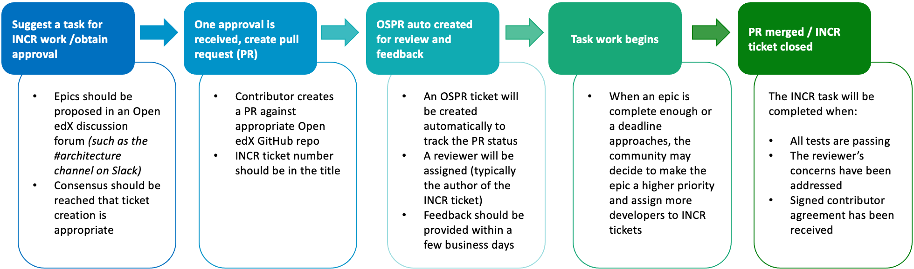

OEP-25: Incremental Improvements
################################

+-----------------+----------------------------------------------------------+
| OEP             | :doc:`OEP-25 <oep-0025-proc-incremental-improvements>`   |
+-----------------+----------------------------------------------------------+
| Title           | Incremental Improvements                                 |
+-----------------+----------------------------------------------------------+
| Last Modified   | 2020-11-18                                               |
+-----------------+----------------------------------------------------------+
| Authors         | Jeremy Bowman <jbowman@edx.org>                          |
+-----------------+----------------------------------------------------------+
| Arbiter         | Adam Stankiewicz <astankiewicz@edx.org>                  |
+-----------------+----------------------------------------------------------+
| Status          | Obsolete                                                 |
+-----------------+----------------------------------------------------------+
| Type            | Process                                                  |
+-----------------+----------------------------------------------------------+
| Created         | 2018-06-13                                               |
+-----------------+----------------------------------------------------------+
| `Review Period` | 2018-06-14 - 2018-08-15                                  |
+-----------------+----------------------------------------------------------+
| `Resolution`    | `Original pull request`_                                 |
+-----------------+----------------------------------------------------------+

.. _Original pull request: https://github.com/openedx/open-edx-proposals/pull/66#pullrequestreview-151034037

.. attention::

   The incremental improvements process is no longer being actively maintained.
   If you are looking for places where you can help the project check out issues
   tagged as `help wanted
   <https://github.com/openedx/public-engineering/issues?q=is%3Aopen+is%3Aissue+label%3A%22help+wanted%22>`
   in the ``public-engineering`` project.

TL;DR
*****

* **edX is continually looking to up its game in preemptively implementing repairs and solutions:** To date, we have largely relied on ourselves for major framework upgrades and replacing deprecated code, but most of these big projects require time and effort on many smaller routine tasks in order to complete.
* **Open edX can tap into its community to make better progress toward these long-term objectives:** By breaking down routine tasks for these large or ongoing projects, we can create bite-sized actions accessible to contributors from many backgrounds, requiring no specific prior knowledge of how the Open edX code is structured.
* **JIRA can help coordinate this effort:**  `The Incremental Improvements (INCR) JIRA project`_ allows for a standardized ticket workflow to ensure task requirements and goals are explicitly outlined for contributors to pick up and go.
* **Quality over quantity:** Not all project tasks will fit into the INCR workflow specifications, but those that are identified as appropriate can be entered into the ticket flow for completion by contributors. To avoid dilution of effort, tickets should be limited to a modest amount at any given time and agreed upon prior to creation via an Open edX forum (such as a team Slack channel).

.. _The Incremental Improvements (INCR) JIRA project: https://openedx.atlassian.net/jira/software/c/projects/INCR/issues/INCR-570?filter=allopenissues

High-Level INCR Jira Workflow Process
=====================================

* Tickets must meet the requirements for the INCR Jira project outlined in the `Specification`_ section of this document. For tickets that don't meet these requirements, please see suggestions for alternate workflow in the section: `How Should Related Non-INCR Work Be Coordinated?`_
* INCR tickets should only be written for the parts of the project for which they are appropriate (those that can realistically be broken into smaller tasks and don’t require more extensive knowledge of existing code).
* Work on INCR tickets can be done by but not limited to: Developers (experienced with Open edX or wanting more experience), computer programming students, hackathon teams, new edX technical employees, etc.

Abstract
********

Proposes a process for achieving large and/or long-term Open edX project goals
via the definition and distributed completion of many small, straightforward
development tasks.

Motivation
**********

There are often relatively straightforward changes to the Open edX codebase
which prove difficult to accomplish due to the sheer amount of code involved.
These are not major new features or complex refactorings of the code, but
rather things like:

* Support a new version of Python or Django
* Replace all uses of certain deprecated code with its preferred replacement
* Find all instances of a particular antipattern and fix them

Such projects can involve changing hundreds of files and thousands of lines of
code...but they are fundamentally composed of dozens of routine, localized
changes which can be made independently and without any particular prior
knowledge of how the Open edX code is structured.  It is very difficult for
any one organization to prioritize tackling one of these projects by itself,
but once broken down into very small pieces, the benefits of distributing
them across the entire community become rapidly apparent.

Specification
*************

The `Incremental Improvements`_ (INCR) JIRA project is home to small,
straightforward tasks which must be finished in order to achieve
larger, long-term objectives of the Open edX community. All tickets in it
should have the following characteristics:

* **Quick to implement.** Ideally no more than 3 hours for a contributor who
  is already familiar with the contribution process to submit a reasonable
  pull request.

* **Small in scope.** Should not affect significantly more than 10 files,
  and not require large amounts of new or refactored code.  This keeps the
  pull requests easy to review so feedback can be provided promptly. If a
  similar change needs to be made to dozens or hundreds of files, there
  should be a separate ticket for each small batch of files (and there
  should ideally be a script to automate the change).

* **No prerequisites.** Each INCR ticket should be doable immediately, without
  waiting for another change to be made.

* **Not urgent.** While all INCR tickets are important, they do not have
  pressing deadlines. A new contributor should have time to become familiar
  with the contribution process and the changes to be made, without feeling
  pressured to submit something quickly.

* **Requires no additional information or clarification.** The ticket
  description should clearly describe exactly what needs to be done.

* **Specifies the required skill(s).** There should be labels on the ticket
  listing any skills required beyond the core ones needed to submit a pull
  request. Typical labels include "javascript", "python", "css", etc.

* **Does not require knowledge of the existing Open edX code.** All INCR
  tickets should be implementable by a contributor with the appropriate
  fundamental skills, and described assuming little or no knowledge of the
  existing Open edX codebase. It can be assumed that the contributor has read
  enough documentation to start a devstack and understand the contribution
  process.

* **Not controversial.** If the instructions in the description are followed,
  it should be feasible to promptly review and merge the changes without
  extended deliberation.

* **Contributes to a larger goal.** Each ticket belongs to an INCR "epic"
  ticket describing a significant improvement to the Open edX codebase which
  depends on this small change being completed.

.. _Incremental Improvements: https://openedx.atlassian.net/projects/INCR/issues/INCR-1?filter=allopenissues

INCR Tickets in Context
=======================

Note that it is entirely possible that an epic in the INCR project may not be
achievable purely through the completion of INCR tickets.  There may be
changes required which require more domain knowledge of the existing code,
can't realistically be broken down into small enough tasks, or just aren't
understood well enough to allow writing a sufficiently detailed ticket
description without basically completing the task.  This is all fine; INCR
tickets should only be written for the parts of the project for which they
are appropriate.  The rest of the work can be coordinated in a variety of
ways; examples of such coordination are given later below.

It is also not necessary to immediately detail all of the INCR tickets that
will ultimately belong to an INCR epic when it is first created.  It is
usually sufficient to initially create just a handful of tickets that allow
several developers with any appropriate skill sets to contribute.  More should
be written as the tasks are completed, so there is always something available
to work on for those interested in contributing.  Tasks which depend on other
work being finished first but otherwise qualify as INCR tickets may be created
as such, but should immediately have their status marked as ``Blocked`` and be
linked to the tickets which are blocking progress.

Who Can Work on INCR Tickets?
=============================

Incremental Improvement tickets are appropriate for many kinds of contributors,
including (but not limited to):

* Developers who have an idea for a larger Open edX contribution, and want to
  practice with a smaller task first

* Students of computer programming who want to work on an important project in
  active use

* New technical employees of edX and other organizations in the Open edX
  community

* Experienced Open edX developers who want to do something productive with a
  small chunk of available time

* Hackathon teams who want to make a burst of progress on a big objective

* Technical writers who want to make gradual small improvements to the Open
  edX documentation.

When enough of an epic is complete that the scope of remaining work
becomes more manageable (or when an external deadline like end of support for
a current dependency approaches), one or more organizations in the community
may decide that it's worth making that epic a higher priority, assigning even
more developers to work on INCR tickets.

INCR Ticket Workflow
====================

Once the contributor is ready to submit their changes, the process will
typically go roughly as follows:

1. The contributor creates a Pull Request (PR) against the appropriate Open
   edX GitHub repository, mentioning the INCR ticket number in the title.
   This associates the PR with the INCR ticket.

2. As with any pull request contributed by the Open edX community, an `OSPR`_
   ticket will be automatically created to track the pull request's
   status.  This will be assigned to a reviewer (often the author of the
   INCR ticket).

3. The reviewer will provide feedback on the PR as promptly as feasible.
   The tickets are designed for the changes to be easy to review, so this
   should usually take no more than a few business days.

4. Once tests are passing, all of the reviewer's concerns have been addressed,
   and a signed contributor agreement has been received, the reviewer will
   merge the PR and close the INCR ticket.

.. _OSPR: https://openedx.atlassian.net/wiki/spaces/OPEN/pages/679772558/OSPR+Workflow+process

How Should Related Non-INCR Work Be Coordinated?
================================================

As noted above, it will often be the case that at least some of the work
needed to complete an INCR epic will not be appropriate for INCR tickets.
This proposal will not attempt to dictate how that remaining work should
be done, but here are a few suggestions:

* Capture the remaining work as JIRA tickets outside the INCR project, and
  link them to the related INCR epic.  This is most appropriate if the work
  is likely to be done by edX, as it can be difficult to verify that outside
  contributors have permission to access tickets across various JIRA projects.

* Describe the remaining work in a Confluence document, and link to it from
  the description of the INCR epic.  This document should be updated as tasks
  are fleshed out, started, and completed.

* Coordinate efforts in an appropriate Open edX Slack channel (for example,
  #python-3 for `Python 3 in edx-platform`_) which is specified in the epic's
  description.  This is not a substitute for an organized written enumeration
  of what needs to be and has been done, but can help when the pace of
  progress is rapid or there is confusion about what remains to be done.

.. _Python 3 in edx-platform: https://openedx.atlassian.net/browse/INCR-1

Who Creates INCR Tickets?
=========================

New top-level INCR epics should be proposed in an Open edX discussion forum
(such as the #architecture channel on Slack), and only created if there is
consensus that they should be added at that time.  The total number of active
epics should be kept limited to avoid dilution of effort between too many
projects.  An epic's author can delegate the creation of individual tickets
within it as appropriate.

Rationale
*********

Historically, edX has been relatively poor at pre-emptively completing major
framework upgrades (like Django 1.11 or Python 3).  We have also been somewhat
inefficient in replacing working but problematic code with newer solutions
which have already been demonstrated to work better in other parts of the
code.  A major contributing factor in this is that we have not effectively
enabled the Open edX community to share the burden of doing this maintenance
work.  edX keeps prioritizing work on new features in high demand by partners
in the community, while those partners get frustrated that it isn't clear how
to help and the code is somewhat dated and difficult to work with.  People new
to the project are often eager to contribute, but have no idea where to start
and get little useful guidance in that regard.

The goal of the Incremental Improvements process is to identify, document, and
bring attention to small chunks of work that can be performed by a broad
spectrum of community members and make meaningful progress towards larger
shared objectives.  The hope is that this will enable all of the following:

* Faster progress on large upgrade projects by distributing the work across
  more contributors

* A clearer path for new Open edX contributors to get started making useful
  contributions

* A simpler, cleaner codebase by allowing more developers to make progress
  on cleaning up old messes and deprecated code patterns

Rejected Alternatives
*********************

(Note that in the context of this draft, "rejected" does not mean that the
alternative has been completely ruled out, rather that it seemed implausible
when first considered.)

There are limitations to using an edX-managed JIRA project as the primary
system of coordination for Incremental Improvement tickets.  Contributors
outside of edX have limited ability to update and comment on the tickets,
and the system is not exactly intuitive for users who have not used JIRA
before.  Nevertheless, the other considered options seem to have even
greater obstacles:

* While GitHub Issues are a common choice for many open source projects,
  the distribution of Open edX code across dozens of repositories makes it
  very difficult to find the answers to simple questions like "what
  incremental improvement tasks are available to work on?" and "is there a
  sufficient backlog of tickets for new contributors to choose from?".  Such
  challenges could probably be overcome with automation, but that presents
  a significant barrier to even getting started creating and processing tasks.

* There was a suggestion to use the existing edX JIRA projects and use a label
  to identify incremental improvement tickets, but these projects greatly
  differ in access permissions and workflow.  Trying to find these tickets and
  identify which ones haven't been completed could be very difficult for even
  experienced JIRA users who don't have broad access to the edX JIRA system.

* A system other than the edX JIRA could be used, to make it easier to grant
  write access for contributors throughout the community.  A choice could be
  made which would also be more intuitive for developers who don't already
  have extensive experience with JIRA.  But this would isolate the Incremental
  Improvements work from the tracking system used for other Open edX work, and
  risks leaving the tasks unseen by the core contributors whose participation
  is needed to define and review them.

Other suggestions for handling this more elegantly are welcome, but understand
that there is significant resistance against either adding a second issue
tracker that edX employees would need to routinely use and monitor, or moving
core edX development from JIRA to a different issue tracker.

Change History
**************

2020-11-18
==========

* TL;DR section added to opening of doc.
* `Pull request #168 <https://github.com/openedx/open-edx-proposals/pull/168>`_

2018-10-09
==========

* Document created
* `Pull request #66 <https://github.com/openedx/open-edx-proposals/pull/66>`_
