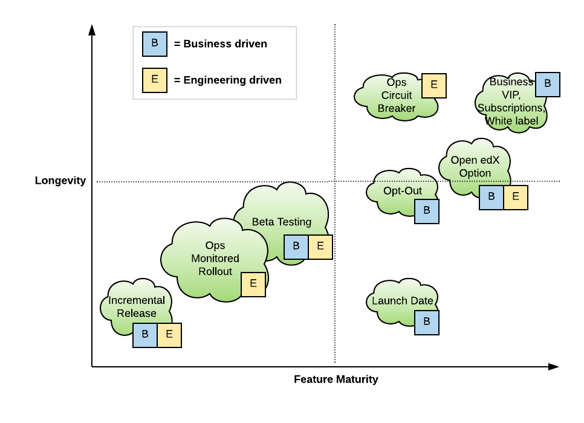
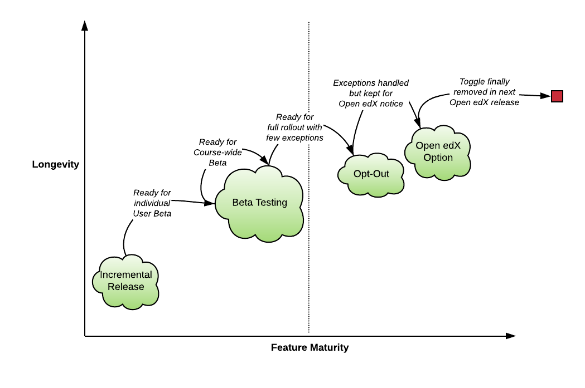

#########################
OEP-17: Feature Toggles
#########################

.. list-table::
   :widths: 25 75

   * - OEP
     - :doc:`OEP-17 <oep-0017-bp-feature-toggles>`
   * - Title
     - Feature Toggles
   * - Last Modified
     - 2021-04-26
   * - Authors
     - Nimisha Asthagiri <nimisha@edx.org>
   * - Arbiter
     - Eric Fischer <efischer@edx.org>
   * - Status
     - Accepted
   * - Type
     - Best Practice
   * - Created
     - 2018-02-14
   * - Review Period
     - 2018-02-14 - 2018-03-19
   * - Resolution
     -

.. contents::
   :local:
   :depth: 2

Abstract
########

A feature toggle is a software development technique that decouples deployment of code from release (enablement) of the code. When used with care, it can be a powerful tool in a continuous deployment environment to deploy changes incrementally with the main codebase while under development.  Additionally, it allows a team to reduce the risk of breaking production systems by providing levers to progressively test changes and quickly disable changes if needed. For a large platform, it is also used to selectively enable a change/feature for certain users or certain deployments.

However, feature toggles inherently add complexity to the code since they introduce multiple paths and configuration operations, with the potential to create an explosion in testing permutations and to create forgotten latent unused code paths. A thorough understanding of their implications and best practices is warranted to use them in a large-scale system.

Motivation
##########

Given the many benefits of using feature toggles, edX development teams have been using them since the very start. Additionally, since deployment latency for edx.org has reduced from monthly->weekly->daily and since teams have been bitten too many times by `long-term feature branches`_, teams now have a greater incentive to develop incrementally within the main branch. Updating legacy edX user experiences and features also drives the need for a framework where usability and behavior changes are gradually released and introduced to the edX user base.

Aligning on a common best practice for feature toggling is critical for both the short-term and long-term health of the system. Using different standards, strategies, testing procedures, etc., leads to confusion, production failures, and long-term maintenance issues.

.. _long-term feature branches: https://newrelic.com/blog/best-practices/long-running-branches-considered-harmful

Use Cases
*********

At its core, feature toggles allow teams to deploy alternative code paths and to choose between them at runtime. There are multiple scenarios where this capability comes in handy. The following section enumerates the use cases that are typically relevant for edX features.

**Note:** A given feature/change may require being in multiple use cases during its lifetime. To support this, a corresponding feature toggle may transition through different use cases.

.. contents::
   :local:
   :depth: 2

Use Case 1: Incremental Release
===============================
.. _Incremental Release: `Use Case 1: Incremental Release`_

When introducing new features in the platform, teams may want to submit incremental changes without exposing unfinished work. They can do so with a temporary toggle that gates a single (or very few) high-level entry point(s) to the feature changes.

The desire for a release toggle may come from either the engineering team (as a way to incrementally implement the changes) or through the product team (as a way to temporarily hide user-facing changes of a large feature).

**Note:** Consider alternatives to using release toggles. Specifically, think iteratively and not just incrementally. That is, instead of having a grand toggle to unlock many changes at once, consider breaking up your feature into `iterative verticals`_ that can be released (enabled) a bit at a time. See `Release Toggles Are The Last Thing You Should Do`_.

.. _iterative verticals: https://watirmelon.blog/2015/02/02/iterative-vs-incremental-software-development/
.. _Release Toggles Are The Last Thing You Should Do: https://martinfowler.com/bliki/FeatureToggle.html#ReleaseTogglesAreTheLastThingYouShouldDo

Use Case 2: Launch Date
=======================
.. _Launch Date: `Use Case 2: Launch Date`_

There may be a business case, advocated by the product team, to use a toggle to expose a new feature on a specific grand opening date. However, for a confident unveiling, this use case should be used in consideration with Ops_ and/or `Beta Testing`_ scenarios.

Ops
===

Dynamically controlling feature toggles, without needing to re-deploy an application, comes in very handy when considering the operational requirements for uptime metrics.

This use case is usually driven by the engineering team.

Use Case 3: Ops - Monitored Rollout
-----------------------------------
.. _Ops - Monitored Rollout: `Use Case 3: Ops - Monitored Rollout`_

As teams balance the needs for rapid agile development while continuously deploying to a large-scale system with 99.99% uptime requirements, they need the ability to test new changes in production while having the ability to revert quickly. That is, moving rapidly and taking risks can decrease Mean Time to Failure (MTTF), which needs to be counterbalanced with the ability to reduce `Mean Time to Recovery (MTTR)`_.

When a team is concerned about potential performance or scalability issues with an upcoming change, gating the change behind a toggle allows the team to:

* control when the change is enabled so they can monitor it in production at their own time, independent of the deployment cycle.

* quickly disable the change in case of unexpected issues in production.

* gradually rollout the change (`canary release`_), starting with a small percentage of random users, detecting regressions, addressing any issues that arise, before enabling for everyone.

Once the team is confident about their change and the change is released to all users, they would safely remove the gating toggle.

.. _Mean Time to Recovery (MTTR): https://www.thoughtworks.com/radar/techniques/focus-on-mean-time-to-recovery
.. _canary release: https://martinfowler.com/bliki/CanaryRelease.html

Use Case 4: Ops - Circuit Breaker
---------------------------------
.. _Ops - Circuit Breaker: `Use Case 4: Ops - Circuit Breaker`_

In certain cases, the development team (in consultation with the operations team) may choose to extend the lifetime of an Ops toggle in the codebase even after releasing its gated feature. A small number of such long-lived Ops "kill switches" provide operators dynamic controls to gracefully degrade the system under high load.  Operators can use these circuit-breaker capabilities either preemptively in the anticipation of a high-demand event or in response to taming an unanticipated high load or attack.

Typically, long-lived Ops toggles are useful for gating non-critical features that are very expensive on system resources. However, the long-term costs of maintaining the added complexity in the code should be measured against the benefits of operationally degrading the service when needed.

Use Case 5: Beta Testing
========================
.. _Beta Testing: `Use Case 5: Beta Testing`_

For user-facing changes, the engineering and product teams may choose to release them to a *specific subset* of the population before releasing to the rest. This is in contrast to the `Ops - Monitored Rollout`_ case where changes are rolled out to a *random subset* of users.

In the edX case, the Beta testing program may include the following types of population subsets:

* Users - list of specific users.

* Courses - users associated with any course within a list of specific courses *(for course-related features).*

* Content-provider Organizations - users associated with any course offered by any organization in a list of specific organizations *(for course-related features).*

* User-provider Organizations - enterprise users associated with any organization in a list of specific organizations.

The feature toggle is useful during the duration of the Beta testing period and is removed afterward.

Long-term Business
==================

There are sometimes business requirements for keeping long-term feature toggles in order to expose or limit certain features to certain groups.

Use Case 6: VIP / White Label
--------------------------------------------
.. _`VIP / White Label`: `Use Case 6: VIP / White Label`_

The business may choose to modify the product experience for different classes of users. For example, the state of a feature toggle may depend on whether the user is a paying customer or applicable to a white label site.

Use Case 7: Opt-out
-------------------
.. _Opt-out: `Use Case 7: Opt-out`_

In an extreme case, the business may choose to keep a feature disabled for a certain group (e.g., for a course or for an organization) in order to appease concerns about the change. However, as this introduces a roadblock to removing a toggle and its corresponding complexity, further effort should be made to tweak the feature to accommodate the group's concerns and/or to make the group more comfortable with the change.

Use Case 8: Open edX option
===========================
.. _Open edX option: `Use Case 8: Open edX option`_

When a team implements a feature that they do not expect to be adopted by all Open edX instances, they may introduce a toggle to gate the feature. However, since there is a large cost to supporting long-term toggles, the following alternatives should be considered:

* A management command to convert an old mechanism to a new one.

* Keep the toggle around for only 1 additional Open edX named release, providing Open edX operators the ability to rollout the change on their own systems.

* A design pattern such as a plug-in architecture that does not require code deployment toggles.

**Note:** Remember that feature toggles are not a substitute for clean architecture and SOLID design principles. Any long-term feature toggle should be carefully considered along with architectural patterns such as plugins, dependency injections, separable services and libraries with clear interfaces. Sometimes the need for a toggle can be completely eliminated. Other times the toggle may still need to exist but with much less complexity.

(Out of Scope) Use Case: Experimentation
========================================

Note that we are excluding `experiment toggles`_ from this list of use cases.  Experiment toggles are used to perform multivariate (A/B) testing in order to generate statistically significant results to make data-driven optimizations and feature changes. Users are placed in different experimentation groups that are associated with different code paths. The effectiveness of each code path is then evaluated by measuring its impact on users' aggregate behavior.

This is a deeper topic that is worth exploring in a separate OEP (see `Optimizely Tips and Tricks`_). For now, suffice it to say that edX uses an external A/B testing platform (Optimizely_) to serve this purpose. Among other things, Optimizely supports user segmentation and targeting, data aggregation capabilities, statistical tools, and toggled code customizations. At this time, Optimizely is used for edX experimentation, customizing edX code, but without merging any changes to the edX codebase. This also contrasts with the use cases that are in scope of this OEP.

**Note:** Having described `experiment toggles`_ as a specific toggle type that is out of scope, other uses cases in this OEP may still be useful when implementing an experiment.

.. _Optimizely: https://www.optimizely.com/
.. _Optimizely Tips and Tricks: https://openedx.atlassian.net/wiki/spaces/EXP/pages/199885286/Optimizely+Tips+and+Tricks
.. _experiment toggles: https://martinfowler.com/articles/feature-toggles.html#ExperimentToggles

Summary
*******

The following diagram summarizes the various use cases along 2 axes: feature maturity and longevity. Feature maturity corresponds to the level of certainty that the team has about the feature, including unexpected side-effects such as performance and user-behavior regressions. Longevity depicts the lifetime of the feature toggle and how long-lived it is expected to be.

The diagram also labels which use cases are primarily driven by engineering teams (E) and/or business product teams (B).

ong-term business, and parts of opt-out and open edX option use cases.

Example Transition of Use Case
==============================

A feature toggle may transition through use cases as its corresponding feature matures. As illustrated in the following example, a toggle may start in an `Incremental Release`_ phase as the feature/change is being developed.  Once it is ready for `Beta Testing`_, it may be gradually released to *individual users* before exposing it to a *few courses* in the Beta program.  Once the feature is further matured, it can be fully enabled, but may require select courses to Opt-out_ temporarily. Lastly, the feature toggle may be used to provide an `Open edX Option`_ for a single Open edX release before it is finally retired and removed.

Specification
#############

edX teams should use a common framework to implement feature toggles and should follow best practices to test them and remove them. Before deciding to use a feature toggle, the engineering team, in collaboration with the product team, need to decide on the release and development paths that the feature will take so they can choose the right toggle type(s).

.. contents::
   :local:
   :depth: 1

Decision Map
************

The following set of questions can help you determine the set of use cases required for a feature, as well as the required toggle type and its required duration. Answer each of the following questions and make a list of all use cases associated with an affirmative response, taking the "maximum" toggle type and "maximum" toggle durations.

The range of toggle types and toggle durations are:

* **Toggle types:** Switch Toggle < Rollout Toggle < Group Toggle
* **Toggle durations:** During Development < During Rollout < Settlement Period < Forever

.. list-table::
   :header-rows: 1
   :widths: 5 40 20 35

   * -
     - Question to ask
     - Team to ask
     - Use Case, Toggle Type, Duration
   * - 1
     - *Is this a hypothesis-driven change that needs to be validated via an A/B testing framework?*
     - Business and Engineering
     - Read `Optimizely Tips and Tricks`_ instead of this OEP.
   * - 2
     - *Is the feature being developed incrementally and needs to be hidden while it is unfinished? If so, are you sure the development of the feature cannot be redesigned so it can be released in a more optimal iterative fashion instead?*
     - Business and Engineering
     - * `Incremental Release`_
       * Switch Toggle
       * During Development
   * - 3
     - *Are there any operational concerns, such as unanticipated performance, scalability, or functional regressions, which must be confirmed in the production environment?*
     - Engineering
     - * `Ops - Monitored Rollout`_
       * Rollout Toggle
       * During Rollout
   * - 4
     - *Are there any user-facing changes for which you would like to receive feedback from select users or groups before releasing to everyone? Or are there any groups that want early access to the changes before they are officially rolled out?*
     - Business and Engineering
     - * `Beta Testing`_
       * Group Toggle
       * During Rollout
   * - 5
     - *Is there a specific big grand opening date for this feature? If so, is it really necessary for it to remain hidden until that time?*
     - Business
     - * `Launch Date`_
       * Switch Toggle
       * During Rollout
   * - 6
     - *Are there any specific groups that are adamant about opting out of the feature? If so, are we unable to convince them to adopt the feature in time of rolling it out to the rest of the users?*
     - Business
     - * `Opt-out`_
       * Group Toggle
       * Settlement Period or Forever
   * - 7
     - *Will other open edX instances want to control the availability of this feature? If so, are you sure other implementation alternatives, such as pluggability, are not possible for this feature?*
     - Business and Engineering
     - * `Open edX option`_
       * Switch Toggle
       * Settlement Period or Forever
   * - 8
     - *Is there a long-term business requirement to expose or limit the availability of this feature to select groups, such as paid users or users accessing through a white-label site?*
     - Business
     - * `VIP / White Label`_
       * Group Toggle
       * Forever
   * - 9
     - *Is this an expensive but non-vital functionality that would be useful to disable gracefully in a future event of high load or attack? If so, does the availability of the control outweigh the costs of maintaining the toggle?*
     - Engineering
     - * `Ops - Circuit Breaker`_
       * Switch Toggle
       * Forever

Framework
*********

Technology
==========

The recommendation is to create a common edX framework on top of `Django Waffle`_.  Waffle provides a simple and intuitive API to dynamically configure toggles in a continuously deployed system, with toggles stored in a generic relational table.  Waffle's built-in capabilities satisfy some, but not all, of our Requirements_.

.. _Django Waffle: https://waffle.readthedocs.io/en/stable/

Requirements
============

For long-term sustainability and operational success, a Feature toggle framework should have the capabilities listed in the following table. For each requirement that is not supported by Waffle, further information is provided in the subsequent Details_ section.

+---+-----------------+-------------------------------------+--------------------------------------+
|   | Requirement     | Description                         | Supported by Waffle                  |
+===+=================+=====================================+======================================+
| 1 | Dynamic         | It should be easy to enable or      | **Yes.**                             |
|   |                 | disable a toggle without deploying  |   Stored in relational database      |
|   |                 | new code.                           |   and configurable via Django admin. |
+---+-----------------+-------------------------------------+--------------------------------------+
| 2 | Self-serve      | Individual teams should be able to  | **Yes.**                             |
|   |                 | control the values of their own     |   Teams can configure via Django     |
|   |                 | feature toggles.                    |   admin.                             |
+---+-----------------+-------------------------------------+--------------------------------------+
| 3 | Removability    | It should be relatively easy to     | **Yes.**                             |
|   |                 | remove a toggle from the system to  |   No migrations are needed since it  |
|   |                 | encourage teams to do so.           |   stores values in a generic table.  |
|   |                 |                                     |   Any new models added by the        |
|   |                 |                                     |   framework should also use generic  |
|   |                 |                                     |   tables to satisfy this requirement.|
+---+-----------------+-------------------------------------+--------------------------------------+
| 4 | Testability     | It should be possible to test the   | **Yes.**                             |
|   |                 | different toggle states in the code |   Waffle supports setting            |
|   |                 | even when they are not enabled.     |   `deterministic values`_ and        |
|   |                 |                                     |   `overriding values`_ in tests,     |
|   |                 |                                     |   which the framework can adapt.     |
+---+-----------------+-------------------------------------+--------------------------------------+
| 5 | Auditability    | Operators and teams should be able  | **Not natively, but...**             |
|   |                 | to tell the who, what, and when of  |   Can view history in                |
|   |                 | toggle changes.                     |   django_admin_log table for edits   |
|   |                 |                                     |   made via Django admin. Any new     |
|   |                 |                                     |   models added by the framework      |
|   |                 |                                     |   should also support auditability.  |
+---+-----------------+-------------------------------------+--------------------------------------+
| 6 | Performance     | The value of a toggle should be     | **Yes, but...**                      |
|   |                 | cached so it is not repeatedly      |   Cached using `Django cache`_, but  |
|   |                 | retrieved from storage.             |   the framework also needs to cache  |
|   |                 |                                     |   in a request-specific cache to     |
|   |                 |                                     |   avoid repeated hits to Memcached.  |
+---+-----------------+-------------------------------------+--------------------------------------+
| 7 | Toggle types:   | The 3 necessary toggle types are    | **Yes, but...**                      |
|   |                 | supported and easy to use by edX    |   Waffle's Switch_ class supports the|
|   | - Switch        | developers.                         |   "Switch" toggle type. Waffle's     |
|   | - Rollout       |                                     |   Flag_ class supports the "Rollout" |
|   | - Group         |                                     |   toggle type. However, since edX    |
|   |                 |                                     |   (currently) does not store course  |
|   |                 |                                     |   and organization relationships as  |
|   |                 |                                     |   `Django groups`_, the framework    |
|   |                 |                                     |   must provide support for the       |
|   |                 |                                     |   "Group" toggle type.               |
+---+-----------------+-------------------------------------+--------------------------------------+
| 8 | Non-collision   | Feature toggles created by          | **No.**                              |
|   |                 | independent teams should not collide|   The framework must support         |
|   |                 | with each other. See `Financial     |   namespacing.                       |
|   |                 | disaster caused by repurposing a    |                                      |
|   |                 | feature flag`_ for a scary anecdote.|                                      |
+---+-----------------+-------------------------------------+--------------------------------------+
| 9 | Multi-tenancy   | As edX uses `Django Sites`_ for     | **No.**                              |
|   |                 | multi-tenancy, there should be a way|   The framework must provide this    |
|   |                 | for any site to override the value  |   additional capability              |
|   |                 | of any feature toggle.              |                                      |
+---+-----------------+-------------------------------------+--------------------------------------+
| 10| Least Privilege | As different toggles may have       | **No.**                              |
|   |                 | varying impact on the business,     |   The framework must support this    |
|   |                 | operators may want to limit who can |   if/when business-sensitive toggles |
|   |                 | edit certain toggles.               |   are used.                          |
+---+-----------------+-------------------------------------+--------------------------------------+
| 11| Discoverability | There should be a way for an        | **No.**                              |
|   |                 | operator to discover all available  |   The framework must provide this    |
|   |                 | feature toggles in the system.      |   additional capability.             |
+---+-----------------+-------------------------------------+--------------------------------------+
| 12| Report          | There should be an administrative   | **No.**                              |
|   |                 | interface to retrieve information   |   The framework must provide this    |
|   |                 | and status of existing toggles      |   additional capability.             |
|   |                 | (e.g., description, type, dates).   |                                      |
+---+-----------------+-------------------------------------+--------------------------------------+
| 13| Distributed     | There should be administrative      | **No.**                              |
|   |                 | supporting tools to manage feature  |   This capability is outside the     |
|   |                 | toggles across distributed service  |   scope of this OEP. See             |
|   |                 | boundaries.                         |   `Distributed Configuration`_ below.|
+---+-----------------+-------------------------------------+--------------------------------------+

.. _Financial disaster caused by repurposing a feature flag: http://swreflections.blogspot.it/2014/08/feature-toggles-are-one-of-worst-kinds.html
.. _deterministic values: https://waffle.readthedocs.io/en/v0.9/testing-waffles.html
.. _overriding values: https://github.com/jsocol/django-waffle/blob/master/waffle/testutils.py
.. _Django cache: https://docs.djangoproject.com/en/2.0/topics/cache/
.. _Django groups: https://docs.djangoproject.com/en/2.0/ref/contrib/auth/#django.contrib.auth.models.Group
.. _Switch: https://waffle.readthedocs.io/en/stable/types/switch.html
.. _Flag: https://waffle.readthedocs.io/en/stable/types/flag.html
.. _Django Sites: https://docs.djangoproject.com/en/2.0/ref/contrib/sites/

Details
=======

The framework, which lives in edx-toggles_, is a viable starting point for addressing the Requirements_. Some features only available in the waffle_utils_ app in edx-platform are noted below. It has basic support for Requirements_ 1-8,11,12. Details below describe what would be needed for the remaining requirements.

.. _edx-toggles: https://github.com/edx/edx-toggles

Framework Classes
-----------------

The framework provides the following classes for the required toggle types:

* SettingToggle and SettingDictToggle classes

  * supports the "Switch" toggle type.
  * supports configuration as code.

* WaffleSwitch class

  * supports the "Switch" toggle type.
  * though recommend using WaffleFlag instead since it has more support for testing.

* WaffleFlag class

  * supports the "Switch" toggle type.
  * supports the "Rollout" toggle type for `Ops - Monitored Rollout`_ with support for percentage rollouts.
  * supports the "Group" toggle type with `Beta Testing`_ for certain users.

* CourseWaffleFlag class

  * supports whatever WaffleFlag class supports.
  * supports the "Group" toggle type with `Beta Testing`_ for course-level overrides and Opt-out_ for certain courses.
  * only available in edx-platform in waffle_utils_.

See `how to choose the right toggle class`_ for more details on each of these classes

Eventually, the following classes should be added if/when needed:

* OrgAsContentProviderWaffleFlag class

  * supports the "Group" toggle type with `Beta Testing`_ for content-provider organization-level overrides.

* OrgAsUserProviderWaffleFlag class

  * supports the "Group" toggle type with `Beta Testing`_ for user-provider (enterprise) organization-level overrides.

.. _waffle_utils: https://github.com/edx/edx-platform/blob/master/openedx/core/djangoapps/waffle_utils/__init__.py
.. _how to choose the right toggle class: https://edx.readthedocs.io/projects/edx-toggles/en/latest/how_to/implement_the_right_toggle_type.html#implementing-the-right-toggle-class

Req 8: Non-collision
--------------------

The edx-toggles_ classes require namespaces. The namespace should be unique to each Django app so it doesn't collide with other installed apps in the system.

Req 9: Multi-tenancy
--------------------

In order to allow White Label sites to override feature toggles, the framework needs to integrate with the `edX Site Configuration`_ feature. When a caller requests the value of a feature toggle, the framework should first check if there's an override for the current site and return it instead.

.. _edX Site Configuration: https://github.com/edx/edx-platform/blob/3290bce9932916439e3ff8244ba34dd1444e0702/openedx/core/djangoapps/site_configuration/__init__.py#L6

Req 10: Least Privilege
-----------------------

If business-sensitive toggles are used that need to have limited access, the framework should be extended to support fine-grained write access to feature toggles. One possibility is to add a new "group access" field with each toggle and update the Django admin interface to enforce access.

Req 11: Discoverability
-----------------------

The framework needs to be able to discover all edx-toggles_ classes declared in all installed Django apps in the system. Initially, the discoverability can be scoped to within each microservice, but ultimately accessed via a centralized tool across all distributed services.

To support this, the framework will use a combination of the following:

* The ability to find annotated toggles in code.
* The ability to have each service report on feature toggles and their state.

Req 12: Report
--------------

In order to provide a useful and informative administrative report of the existing feature toggles in the system, the framework needs to be able to present the following information for each toggle.

.. list-table::
   :header-rows: 1

   * - Report data
     - Purpose
     - Data source
   * - Name
     - The name of the feature toggle.
     - In code, by developer
   * - Description
     - Brief human-readable information about its usage and context.
     - In code, by developer
   * - Implementation
     - The class used to implement the feature toggles.
     - In code, by developer
   * - All Use Cases
     - Lists one or more `Use Cases`_ to specify all expected usages of this toggle.
     - In code, by developer
   * - Created in Code Date
     - Required field to specify the date the toggle was added to the codebase; to easily find all stale toggles.
     - In code, by developer
   * - Target Removal Date
     - Optional field to specify target date of removal; to easily find all expired toggles.
     - In code, by developer
   * - Current Setting(s)
     - Summary of the current configuration and value of the feature toggle; to easily evaluate its readiness to transition or retire.
     - Derived from relational tables
   * - First Modified Time
     - Date the toggle was first set in the system; to get the starting date of its use.
     - Derived from relational tables
   * - Last Modified Time
     - Date the toggle was last set/unset in the system; to easily find all unused toggles.
     - Derived from relational tables

Testing
*******

Words of Caution
================

As `James McKay puts it`_:

  "Visible or not, you are still deploying code into production that you know for a fact to be buggy, untested, incomplete and quite possibly incompatible with your live data. Your if statements and configuration settings are themselves code which is subject to bugs – and furthermore can only be tested in production.
  ...
  Your features may not be as isolated from each other as you thought they were, and you may end up deploying bugs to your production environment.”

.. _James McKay puts it: https://jamesmckay.net/2011/07/why-does-martin-fowler-not-understand-feature-branches/

Testing Best Practices
======================

Given that, here are best practices for testing a Feature Toggle:

* Tests should run with whatever states are in production (including Prod and Edge).

* Tests should run in both on and off Toggle states unless they are guaranteed to not be enabled in production.

  * Acceptance or end-to-end tests for Toggles that gate user-facing changes should also be run in both on and off Toggle states.

  * Browser-based automation (e.g., Selenium_) tests should be able to:

    * determine the state of a Toggle by calling a REST API (e.g., `wafflejs API`_ using WaffleJS_).

    * override a Toggle value by passing in the desired value in a request parameter (e.g., `Overriding Flags`_).

* Test environments, such as Devstack_ and central Staging should allow incoming requests to override Toggles (e.g., by setting WAFFLE_OVERRIDE_).

.. _Selenium: http://www.seleniumhq.org/
.. _wafflejs API: https://github.com/jsocol/django-waffle/blob/f4b10e8c46cf5305fbaa082b169f221fdab72162/waffle/urls.py#L8
.. _WaffleJS: https://waffle.readthedocs.io/en/stable/usage/javascript.html
.. _Overriding Flags: https://waffle.readthedocs.io/en/v0.9/usage.html#overriding-flags
.. _Devstack: https://github.com/edx/devstack
.. _WAFFLE_OVERRIDE: https://waffle.readthedocs.io/en/v0.9/usage.html#waffle-override

Test Plans for Toggle Use Cases
===============================

The following table summarizes test plans for the various toggle use cases while taking best practices into consideration.

Short-lived Use Cases
---------------------

.. list-table::
   :widths: 20 80
   :header-rows: 1

   * - Use Case
     - Test Plan
   * - `Incremental Release`_
        Toggle is disabled in all environments, but tested in both states on master.
     - .. image:: oep-0017/test_release.png
   * - `Beta Testing`_, `Ops - Monitored Rollout`_
        Toggle is enabled for some and disabled for others, so should be tested in both states on both master and stage.
     - .. image:: oep-0017/test_rollout.png
   * - `Launch Date`_
        Toggle should be tested in both conditions with ample time before the grand date. It may or not be enabled in other production environments.
     - .. image:: oep-0017/test_launch.png

Long-lived Use Cases
--------------------

.. list-table::
   :widths: 20 80
   :header-rows: 1

   * - Use Case
     - Test Plan
   * - Opt-out_, `Ops - Circuit Breaker`_, `VIP / White Label`_
        Toggle must be tested indefinitely in both states on both master and stage, since it may be in either state in any production environment.
     - .. image:: oep-0017/test_opt_out.png
   * - `Open edX option`_
        Toggle should be tested in both states on master, but only needs to be tested in a single state on Stage (whatever is on Prod).
     - .. image:: oep-0017/test_openedx.png

Removal
*******

As mentioned previously, feature toggles inherently bring along code complexity.  In order to manage the "toggle debt", we need to keep their inventory at a minimum. The framework's Removability and Report features make it possible to do so. But it must be accompanied by a proactive process of actually removing the toggles and their branches within the code.

In addition to using the Report as a central tool for overseeing the toggles, individual teams should create tickets in their backlogs for removing toggles according to their intended expiration dates.

Rationale
#########

Although feature toggles have been in use from the very early stages of development on the platform, the `Feature Flags and Settings on edx-platform`_ wiki was one of the first documents to capture our thoughts on the subject. It includes preliminary discussions on best practices as well.

Additionally, there have been recent episodes with `end-to-end test failures`_ resulting from ad-hoc changes to waffle settings on a central Staging environment.

.. _Feature Flags and Settings on edx-platform: https://openedx.atlassian.net/wiki/spaces/OpenDev/pages/40862688/Feature+Flags+and+Settings+on+edx-platform
.. _end-to-end test failures: https://openedx.atlassian.net/browse/LEARNER-4098

Related work
************

* `Martin Fowler's Feature Toggles`_ is a great reference for enumerating the types of toggles and best practices based on solid learnings from the field.

* featureflags.io_ provides resources on toggle use cases, patterns, etc.

.. _`Martin Fowler's Feature Toggles`: https://martinfowler.com/articles/feature-toggles.html
.. _featureflags.io: http://featureflags.io/

Backward Compatibility
######################

In order to support the Report and Discoverability requirements, existing feature toggles that use waffle_utils_ will need to migrate to the edx-toggles_ framework. This migration should be done in a shortly focused effort as soon as the framework is ready.

Existing feature toggles that don't use edx-toggles_ will need to gradually migrate over as possible.

Non-Django Applications
***********************

edX applications that are not written in Django (for examply Ruby on Rails or Drupal applications) are currently considered technical debt. There is expectation they will eventually be rewritten or migrated. If in the meantime they need to use feature toggles, they cannot use Django-based edx-toggles_ and should therefore have their own application-specific feature toggle best practices document that applies to their own application.

Reference Implementation
########################

The edx-toggles_ repo is the starting point for the framework. Some features, as noted below, are only available in the waffle_utils_ app in edx-platform.  As described above, however, additional enhancements are needed to support Requirements_ 9-10, and 13.

Here are a few examples of usages of the toggle classes:

.. note::

    The following examples are out of date, because they don't include the new annotations used for reporting. See `how to document feature toggles`_ for more details.

* WaffleSwitch: A Switch toggle that was introduced for `grading enhancements`_ but was removed after being confident of its usage.

* WaffleFlag: A Rollout toggle introduced for a `user-facing change`_ accompanied by a developer TODO comment with a backlog ticket number as a reminder to remove.

* CourseWaffleFlag: Group toggles that were introduced for user-facing changes to allow `course-wide Beta Testing and Opt-outs`_. CourseWaffleFlag is only available in edx-platform.

Updated examples of feature toggle reporting:

* Sample `readthedocs documention for edx-platform feature toggles`_.
* Based on `annotated toggles in the edx-platform codebase`_.

Updated documentation on feature toggles and reporting:

* See `how to choose the right toggle class`_ for the latest details on our feature toggle classes.
* See `how to document feature toggles`_.
* See `how to enable feature toggle reports for an IDA`_.

.. _readthedocs documention for edx-platform feature toggles: https://edx.readthedocs.io/projects/edx-platform-technical/en/latest/featuretoggles.html
.. _annotated toggles in the edx-platform codebase: https://github.com/edx/edx-platform/search?q=toggle_name
.. _how to document feature toggles: https://edx.readthedocs.io/projects/edx-toggles/en/latest/how_to/documenting_new_feature_toggles.html
.. _grading enhancements: https://github.com/edx/edx-platform/pull/16082
.. _user-facing change: https://github.com/edx/edx-platform/blob/6db93fc791fd2fb52ce705d47320e7868a937587/openedx/features/learner_profile/__init__.py#L13
.. _course-wide Beta Testing and Opt-outs: https://github.com/edx/edx-platform/blob/6db93fc791fd2fb52ce705d47320e7868a937587/openedx/features/course_experience/__init__.py#L13-L44
.. _how to enable feature toggle reports for an IDA: https://edx.readthedocs.io/projects/edx-toggles/en/latest/how_to/adding_new_ida_to_toggle_report.html

Rejected Alternatives
#####################

Here are a few alternatives to using feature toggles.

Long-term Feature Branches
**************************

As an alternative to using a Switch toggle for an `Incremental Release`_, a team can work and make all their changes within a separate branch from the master branch. However, there are many pitfalls to using `long-term feature branches`_, including drifting away from the main branch, resulting in a painful conflict resolution experience upon merging back. Even if the team rebases often with the main branch, their code remains hidden and untested by the rest of the organization, resulting in repeated merge conflict resolutions.

Environment Variables
*********************

Specifying toggle configuration in environment variables or command-line arguments is difficult to coordinate across multiple nodes in a large deployment and requires redeployment and/or restarting each process.

Configuration Files
*******************

Storing toggle configuration in separate files allows the configuration to be decoupled from the code and allows different deployments to override values. However, any change to the configuration requires a redeploy of the application (see note with update).

.. note::

    **UPDATE:** Since first written, edX has implemented immediate updates to configuration changes that don't require full deployment. We have thus implemented some feature toggles based on Django settings. See `how to choose the right toggle class`_ for details.

Many features in the edX platform use `JSON Configuration files`_ to store their settings, including toggle configuration. It is recommended that features instead use a more dynamically configurable alternative such as Feature Toggles or `Configuration Models`_, unless (1) the setting is security-sensitive or (2) is guaranteed to not need to change for a given Open edX deployment.

Examples of security-sensitive data are secret credentials (API keys, private keys, etc) and private network identifiers (AWS S3 bucket names, external service hostname, etc).

.. _JSON Configuration files: https://github.com/edx/edx-platform/blob/master/lms/envs/docs/README.rst#json-configuration-files

Configuration Models
********************

A viable alternative to Feature Toggles is edX' `Django Configuration Model`_.  Built on top of `Django Models`_, it stores configuration in a relational table, provides an audit trail of changes, and supports granular permissions.  Each feature creates its own Config Model, which allows the feature to include whatever additional `Django Fields`_ it requires. In fact, Config Models are the recommended framework for storing all non-boolean edX feature settings that need to be dynamically manipulated via `Django Admin`_.

For light-weight boolean Feature Toggles, however, Config Models have proven to be `difficult to clean up after use`_. The primary reason for this is that teams must manage a `multi-phase rollout to remove columns or tables`_ in a blue-green deployment since the previous version of the code continues to access the deleted column/table even after the database has been migrated.

On the other hand, the Waffle API is attractively simple and does not require database migrations since it uses a centralized generic table to store all Feature Toggles.

Since the well-maintained_ Waffle library already has extensive built-in capabilities for Rollout Toggles (controlling percentage of population) and Group Toggles (controlling users, roles, etc via its `Flag attributes`_), it provides a more comprehensive framework for Feature Toggles than Config Models do out of the box.

One thing to note, however, is the tradeoff made between (a) supporting Least Privilege (via Config Model) and (b) Developer ease-of-use and Code maintainability (via Waffle). Since Config Models are stored in distributed tables, operators can easily place fine-grained control over who has access to which tables. This will be much harder to implement using Waffle. With Waffle, we can easily detect, but not prevent, access to feature toggles.

.. _Django Configuration Model: https://github.com/edx/django-config-models
.. _Django Models: https://docs.djangoproject.com/en/2.0/topics/db/models/
.. _Django Fields: https://docs.djangoproject.com/en/2.0/ref/models/fields/
.. _Django Admin: https://docs.djangoproject.com/en/2.0/ref/contrib/admin/
.. _difficult to clean up after use: https://openedx.atlassian.net/wiki/spaces/ENG/pages/158277112/RCA+ECOM-7196+-+Remove+fields+from+program+config+model
.. _multi-phase rollout to remove columns or tables: https://openedx.atlassian.net/wiki/spaces/ENG/pages/162953307/Migration+Don+ts
.. _well-maintained: https://github.com/jsocol/django-waffle/graphs/contributors
.. _Flag attributes: https://waffle.readthedocs.io/en/stable/types/flag.html#flag-attributes

Distributed Configuration
*************************

There are various open-source service discovery and distributed configuration libraries that provide a flexible key-value storage to manage Feature Toggles amongst other dynamic configuration settings. For example, Zookeeper_, Consul_, and etcd_ are viable options.

Unlike Waffle and Config Models, these services provide out-of-the-box support for centrally managing and synchronizing configuration changes across all microservices in a distributed system. This is where we ultimately want to be. **UPDATE:** See `Configuration Files`_.

However, since we expect that migrating our platform to use such a service will be a large undertaking, we are postponing that effort to a later date. In the meantime, this OEP focuses on enabling teams to align on a common strategy for dynamically configuring and managing application-specific Feature Toggles.

.. _Zookeeper: https://zookeeper.apache.org/
.. _Consul: https://www.consul.io/intro/index.html
.. _etcd: https://coreos.com/etcd/docs/latest/

Change History
##############

2021-04-26
**********

* Added additional links to the reference implementation section.

2021-04-08
**********

* Renamed "Graceful Degradation" to "Circuit Breaker", which was decided to be a more standard name for this use case.
* Added reference to the new edx-toggles library and its discoverability and reporting features, including its how-to documents.
* Updated our use of Django Settings for feature toggles, now that we can more easily deploy configuration changes.
* Removed some of the links to specific classes in favor of how-tos which are more likely to be kept up to date.
