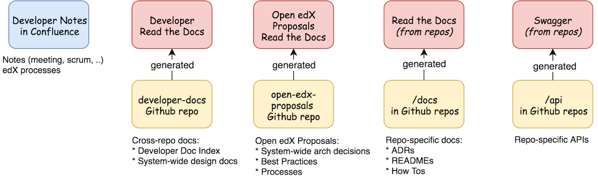

#################################
OEP-19: Developer Documentation
#################################

.. list-table::
   :widths: 25 75

   * - OEP
     - :doc:`OEP-0019 <oep-0019-bp-developer-documentation>`
   * - Title
     - Developer Documentation
   * - Last Modified
     - 2022-06-22
   * - Authors
     - Grant Goodman, Robert Raposa, Ned Batchelder, Nimisha Asthagiri
   * - Arbiter
     - Cali Stenson
   * - Status
     - Accepted
   * - Type
     - Best Practice
   * - Created
     - 2018-03-27
   * - Review Period
     - 2018-12-06 - 2019-01-11

.. contents::
   :local:
   :depth: 2

Context
*******

Developers who work on the Open edX platform, both inside and outside of edX, need accurate and current documentation about platform architecture, APIs, and development best practices.

**Developer documentation** is defined as written specification, instructions, and resources for software developers who extend and contribute to the Open edX platform. It does not include documentation resources targeted for edX learners, educators, researchers, and Open edX operators. Those are out of scope of this OEP and maintained at docs.edx.org_.

Developer documentation is inconsistent and poorly maintained. Documents are also difficult to find. They exist in multiple locations, including `Read the Docs`_, GitHub_ repositories, Confluence_ wiki, and `Google Docs`_.

*Development team notes* used for project management, brainstorming, meeting notes, etc. as well as *code comments* that a developer may add to clarify or rationalize a code segment are out of scope of this OEP.

.. Note:: The best practices and guidelines captured in this OEP are intended to be followed (for example, co-locating docs in GitHub, classifying different doc types, consolidating on formats). We have omitted considerations that we intend to experiment upon and capture in future edits of this OEP or other OEPs (for example, ownership responsibilities, API documentation details, choosing between writing ADRs versus OEPs, etc).

.. _Read the Docs: https://readthedocs.org
.. _Confluence: https://openedx.atlassian.net/wiki
.. _GitHub: https://github.com/edx
.. _Google Docs: https://docs.google.com

Decisions
*********

* We will use `reStructuredText (rST)`_ as our default documentation format for all developer documentation except for the exceptions outlined here. See the `Format Rationale`_ section below for more info on why RST.

  * Python docstrings that are going to be rendered in an `Open API`_ context should be formatted in Markdown.

  * When we need to embed active react components in the documentation to document frontend capabilities, `MDX`_ should be used.

* The repo `edx-developer-docs`_ will contain the main index for all repo specific and system wide developer docs.

* The `Developer Docs`_ section of docs.edx.org will link to the published version of `edx-developer-docs`_.

* System wide decisions, best practices and processes will live in the `open-edx-proposals`_ repository.

* ADRs, How Tos and other single repo impacting docs will live in a ``/docs`` folder in the impacted repo.

* edX Inc. specific documentation such as notes, agile meeting artifacts, and documentation of edX specific process and decisions will live in `Confluence`_.

.. _open-edx-proposals: https://github.com/edx/open-edx-proposals
.. _edx-developer-docs: https://github.com/edx/edx-developer-docs
.. _Developer Docs: https://edx.readthedocs.io/projects/edx-developer-docs/en/latest/
.. _Open API: https://www.openapis.org/
.. _MDX: https://mdxjs.com/

Agile Documentation Types
=========================

With Agile development and `Clean Code`_, we can minimize documentation (and its maintenance) since code should be readable and self-documenting. However, for long-term maintenance of a platform, the following types of developer documentation are still needed:

.. _Clean Code: https://www.oreilly.com/library/view/clean-code/9780136083238/

.. contents::
   :local:
   :depth: 1

OEPs
----

.. list-table::
   :widths: 15 75

   * - **Description**
     - Open edX Proposals (OEPs) are a collection of system-wide technology decisions made by the Open edX community, in the form of best practices, architecture designs, and processes.
   * - **Answers the questions**
     -
       * *What are the best practices and processes for developing on the Open edX platform?*
       * *How does system-wide framework X work on the Open edX platform? (e.g., Analytics, Authorization, etc).*
       * *Why was system-wide technology X or design Y chosen for the Open edX platform?*
   * - **Rationale**
     - To establish software development coherency and efficiency with minimal centralized governance across a long-term maintained platform.
   * - **Location in GitHub**
     - Stored and reviewed in the `open-edx-proposals`_ GitHub repo; published to `Open edX Proposals Read The Docs`_.
   * - **Maintenance**
     - OEP-1_ describes the OEP review process. They will be maintained by the `edX Architecture team`_.

.. _open-edx-proposals: https://github.com/edx/open-edx-proposals
.. _Open edX Proposals Read The Docs: https://open-edx-proposals.readthedocs.io
.. _OEP-1: https://open-edx-proposals.readthedocs.io/en/latest/oep-0001.html
.. _edX Architecture team: https://openedx.atlassian.net/wiki/spaces/AC/pages/439353453/Architecture+Team

.. _Architecture Decision Record (ADR):

ADRs
----

.. list-table::
   :widths: 15 75

   * - **Description**
     - Inspired by `Nygard's post`_, Architecture Decision Records (ADRs) are local lightweight documents of technical decisions co-located with their corresponding code. They provide rationale behind the code and the archeological path to their current state. The status of an ADR can be:

       * **draft** if the decision is newly proposed and in active discussion
       * **provisional** if the decision is still preliminary and in experimental phase
       * **accepted** once it is agreed upon
       * **superseded** with a reference to its replacement if a later ADR changes or reverses the decision

       **Note:** Unlike code comments that focus on immediately surrounding code, ADRs provide the big picture context.
   * - **Answers the questions**
     -
       * *What technical decisions were made for the component/feature in this repo/app/folder?*
       * *Why does this component/feature do X?*
   * - **Rationale**
     - These records prove to be an `invaluable technique`_ for engineering teams to onboard
       new members, to understand discovered historical traces, to refer back to past decisions,
       and to support external oversight.
   * - **Location in GitHub**
     - A local folder named **decisions** will be created within a **docs** folder in the repo/app/folder
       (for example, the `edx/credentials/docs/decisions`_ folder).
       The goal is to keep the decisions in as close proximity to the code as possible for their
       discovery and usage.
   * - **Maintenance**
     - Since ADRs are inherently a historical trail of technical decisions, by design, they do not need ongoing maintenance.

.. _`Nygard's post`: https://cognitect.com/blog/2011/11/15/documenting-architecture-decisions
.. _invaluable technique: https://www.thoughtworks.com/radar/techniques/lightweight-architecture-decision-records
.. _edx/credentials/docs/decisions: https://github.com/edx/credentials/tree/master/docs/decisions

A suggested ADR template:

.. code-block:: rst

  0000 Title For ADR
  ##################
  .. The title should be a short noun phrase. For example, "0001 Django IDA" or "0009 LDAP for Multitenant Integration"; filename should be lowercase with punctuation removed and spaces replaced by dash

  Status
  ******

  .. Standard statuses
      - **Draft** if the decision is newly proposed and in active discussion
      - **Provisional** if the decision is still preliminary and in experimental phase
      - **Accepted** *(date)* once it is agreed upon
      - **Superseded** *(date)* with a reference to its replacement if a later ADR changes or reverses the decision

      If an ADR has Draft status and the PR is under review, you can either use the intended final status (e.g. Provisional, Accepted, etc.), or you can clarify both the current and intended status using something like the following: "Draft (=> Provisional)". Either of these options is especially useful if the merged status is not intended to be Accepted.

  Context
  *******

  .. This section describes the forces at play, including technological, political, social, and project local. These forces are probably in tension, and should be called out as such. The language in this section is value-neutral. It is simply describing facts.

  Decision
  ********

  .. This section describes our response to these forces. It is stated in full sentences, with active voice. "We will …"

  Consequences
  ************

  .. This section describes the resulting context, after applying the decision. All consequences should be listed here, not just the "positive" ones. A particular decision may have positive, negative, and neutral consequences, but all of them affect the team and project in the future.

  Rejected Alternatives
  ******************

  .. This section lists alternate options considered, described briefly, with pros and cons.

  References
  **********

  .. (Optional) List any additional references here that would be useful to the future reader. See `Documenting Architecture Decisions`_ for further input.

  .. _Documenting Architecture Decisions: https://cognitect.com/blog/2011/11/15/documenting-architecture-decisions

The author is encouraged to add other sections as appropriate, such as "Author Concerns", "Related Decisions", etc.

READMEs
-------

.. list-table::
   :widths: 15 75

   * - **Description**
     - READMEs provide a top-level summary and intentional purpose of the repo/app/folder.
   * - **Answers the questions**
     -
       * *What is the responsibility and purpose of this component?*
       * *What are the terms and definitions of this component's ubiquitous language?*
       * *How can I navigate the documentation within and related to this component?*
   * - **Rationale**
     - The future evolution and development of a component remains within the intended boundaries of the component's responsibility. Otherwise, it invites unintended complexity and incongruity.
   * - **Location in GitHub**
     - Since GitHub automatically renders the contents of the repo's top-level README.rst file on the repo's home page, README files will be located at the top-level of their corresponding repo/app/folder.
   * - **Maintenance**
     - The development team that owns the component should keep its README updated.

How-Tos
-------

.. list-table::
   :widths: 15 75

   * - **Description**
     - How-To documents provide relatively long-term step-by-step instructions in using a feature/component/etc. For instructions that are expected to be ephemeral and short-lived, other alternatives such as `Etsy's FYIs`_ can be explored.
   * - **Answers the questions**
     -
       * *How do I install/enable/use/test/etc this component?*
   * - **Rationale**
     - To provide concise recipe-style instructions to users of the component so they can get started quickly without needing to understand the technical nuances and code of the component.
   * - **Location in GitHub**
     - A how_tos_ folder will be created within a **docs** folder in the repo/app/folder. The goal is to keep the How-Tos in synch with the code so that (1) developers running older versions of the code have the appropriately versioned information and (2) developers updating the component have easy access to update the corresponding How-Tos.
   * - **Maintenance**
     - The developer and code reviewer that updates the component will be responsible for updating the relevant How-Tos in that repo (preferably in the same PR as the code changes).

.. _how_tos: https://github.com/edx/edx-platform/tree/master/openedx/core/djangoapps/oauth_dispatch/docs/how_tos
.. _`Etsy's FYIs`: https://codeascraft.com/2018/10/10/etsys-experiment-with-immutable-documentation/

APIs
----

.. list-table::
   :widths: 15 75

   * - **Description**
     - API documentation provide information on interfaces for integrating with or enhancing the platform.
   * - **Answers the questions**
     -
       * *What are the public and supported APIs for this component?*
       * *What are the request/response/authentication/etc protocol for this component?*
   * - **Rationale**
     - Developers that use and integrate with the component have a clearly defined and consistently documented interface.
   * - **Location and tools**
     - The documentation of APIs should be automatically generated and extracted from the code and its annotations. For example:

       * REST API interfaces should be automatically generated using Swagger_.
       * The Open edX Learning Exchange (OLX) format should be automatically generated.
       * Plugin interfaces (e.g., Proctoring integration) should be automatically generated using Sphinx_.
       * Public APIs (e.g., supported Javascript libraries, supported Python APIs) should be automatically generated using Sphinx_.
   * - **Maintenance**
     - Since they are automatically generated, API documentation do not need additional maintenance and will be in synch with their corresponding code.

.. _Swagger: https://swagger.io/
.. _Sphinx: http://www.sphinx-doc.org/en/master/

Requirements
============

This section summarizes the requirements for long-term developer documentation.

* **Discoverable**. Users must be able to find the documentation that is relevant to their needs. This calls for a high-level index and search mechanism for finding content.

  * **Search**. For the time-being, we will make use of Google and GitHub's search functionality for finding content since all developer documentation will be in GitHub.  Certain IDEs may also have tools for searching.

  * **Index**. In the future, we will invest time in a better automated indexing tool to aggregate and structure the documentation. For the time being, we will manually create and maintain documentation indices at:

    * edx-developer-docs_ will include the landing page for developer documentation and be a container of orphaned and cross-repo developer documentation.

    * docs.edx.org_ will be the main landing page for *all* Open edX documentation, including a link to the developer documentation index listed above.

* **Maintainable**. Writers, editors, and reviewers must be able to create and modify documentation without too much effort.

  * **Co-located**. The closer the documentation lives with its corresponding code, the more likely it will be kept up-to-date.

    * For repo-specific documentation:

      * ADRs_ and How-Tos_ will live within **docs** folder(s) within the repo.
      * READMEs_ will be located as top-level documents in the repo/folder/app.
      * Documentation should not live within the code itself (e.g., in __init__.py modules).

    * For system-wide documentation:

      * OEPs_ will live within the open-edx-proposals_ repo.
      * If other system-wide documentation is needed, they will live within the edx-developer-docs_ repo.

  * **Exported Diagrams**. In order to keep diagrams updated across time, they will need to be exported from whichever tool they were created in, with the exported version maintained in GitHub.

    * draw.io diagrams will be exported and imported as XML files.
    * Lucidchart diagrams will be exported and imported as Visio (VDX) files.

* **Version Controlled**. Documentation must be maintained under version control in GitHub, for the following reasons:

  * **Reviewed**. They will be properly reviewed as defined by that repo's process. Anyone in the Open edX community with access to the repo will have the ability to add, update, fix, and contribute to documentation by following the repo's review and maintenance process.

  * **Tagged**. They will be appropriately in-synch with their corresponding code. For example, when an open edX instance runs an older named release, the operator can refer to the matching documentation for that version of the codebase.

  * **Source Controlled**. They will have the advantages of having source-control backed files, including sharing across multiple developers and robust storage.

.. _edx-developer-docs: https://github.com/edx/edx-developer-docs
.. _docs.edx.org: https://docs.edx.org/

Format Rationale
================

We will use `reStructuredText (rST)`_ for all developer documentation.

* rST scales up: it can be used for anything from docstrings to single-page documents to books to multi-volume book sets.

* rST has a rich feature set, including inter-document links, table of contents, auto-collection of code documentation, list-formatted tables, semantic markup, and multiple output formats.

* A single documentation format enables consistency.  It also avoids conversion to rST when we require its additional features.  Our experience has shown that these two benefits of standardization keep down the overall cost of documentation maintenance.

* rST is the standard markup format for Python project documentation.

* rST does not suffer from incompatible implementations, with different features supported differently by different renderers.

* GitHub renders rST natively.

More details on these points are in Eric Holscher's `why rST over Markdown for documentation`_ blog post.

.. _reStructuredText (RST): http://docutils.sourceforge.net/rst.html
.. _why rST over Markdown for documentation: http://ericholscher.com/blog/2016/mar/15/dont-use-markdown-for-technical-docs/

Best practices
--------------

* We strongly recommend that rST documents **auto-wrap** rather than have fixed line lengths (of 120, for example), for the following reasons:

  * Both GitHub and popular IDEs_ support rendering of auto-wrapped files.
  * Auto-wrapping allows renderers to be responsive, automatically format according to the reader's view width, and better supports split-window mode of development.
  * Developers don't need to spend time continually reformatting lines whenever they edit their documents in order to remain within fixed line length limits.
  * Although GitHub's diff-ing capabilities are currently better when line breaks exist, this seeming advantage actually disappears when developers reformat lines in a paragraph to adjust to line length limits.

* Consistency across rST documents is not a requirement.  However, you can use the raw version of this OEP as a reference example.

Learning rST
------------

* If you are familiar with Markdown:

  * Here is edX's `cheatsheet comparing rST to Markdown`_.
  * Here is `another comparison of Markdown and rST`_.

* See the `reStructuredText (rST) Primer`_.

.. _cheatsheet comparing rST to Markdown: https://github.com/edx/mdrst/blob/master/mdrst.rst
.. _another comparison of Markdown and rST: https://gist.github.com/dupuy/1855764
.. _reStructuredText (rST) Primer: http://www.sphinx-doc.org/en/master/usage/restructuredtext/basics.html

Helpful rST-related tools
-------------------------

* `Online reStructuredText editor`_ helps, but isn't perfect.
* `Online table generator`_ (supports multiple formats).
* Pandoc_ can be used to convert between many formats, like Google Doc or Markdown to rST.
* Other options are listed on stackoverflow_.

IDEs
^^^^
The following IDEs have rST editor support and rST preview capabilities.

* `Visual Studio Code`_
* PyCharm_
* Atom_

.. _Visual Studio Code: https://marketplace.visualstudio.com/items?itemName=tht13.rst-vscode
.. _PyCharm: https://www.jetbrains.com/help/pycharm/restructured-text.html
.. _Atom: https://atom.io/packages/rst-preview-pandoc
.. _Online reStructuredText editor: http://rst.ninjs.org/
.. _Online table generator: http://truben.no/table/
.. _Pandoc: https://pandoc.org/
.. _stackoverflow: https://stackoverflow.com/a/2747041

Rejected alternatives
*********************

Markdown Format
===============

We are choosing to not use `Markdown (MD)`_ for documentation. A single format enables consistency, and avoids conversions to rST when requiring additional features. See the `Format Rationale`_ section for more details. The `Learning rST`_ section has resources comparing Markdown and rST.

.. _Markdown (MD): https://www.markdownguide.org/

Confluence
==========

Currently edX uses Confluence_ for storing both long-term and short-term developer documentation. Confluence does provide a WYSIWYG editor, which makes its relatively easy to create and edit documents. Its transitory nature also provides an impetus to rapidly writing down notes and thoughts. Given this, we do expect some hesitancy with transitioning to writing rST files in GitHub. However, as described in this OEP, GitHub provides the benefits of versioning, reviewing, release-tagging, and co-locating, which we expect will result in better quality and maintenance of our developer documentation.

Confluence Usage and Migration
******************************

We will continue to use Confluence for transitory and "edX private" documentation needs since it is already a
hub of communication for both edX employees and the Open edX community. However, the long-term types of developer
documentation listed in `Agile Documentation Types`_ will need to migrate to their new locations.

Migration
=========

When migrating content from Confluence to GitHub, we will:

#. Reformat it to rST and store it in the appropriate location in GitHub.
#. Delete the content from the old page, with a forwarding link to the new `Read The Docs`_ location.
#. Archive_ the old page, as explained below.

Archive
=======

For sustainable maintenance of Confluence documents, ongoing cleanup will be implemented using Confluence's
useful `Space Archive`_ feature. All engineering related documents will be archived to the private `Archive: Engineering`_ space.

When a page is archived:

* The page and its contents are no longer included in normal searches, thus keeping our search results de-cluttered.
* The page no longer appears in Google searches.
* Links to the old page are automatically forwarded to its new location in the Archived space (unless the old page's containing space is entirely deleted).

You can search for archived pages using Confluence's advanced search. From the Confluence search panel, select **Advanced Search**, then select **Search archived spaces**.

.. image:: oep-0019/confluence-archive-search.png

.. _Space Archive: https://confluence.atlassian.com/doc/archive-a-space-284368719.html
.. _`Archive: Engineering`: https://openedx.atlassian.net/wiki/spaces/ArchiveEng/overview

Index
=====

Since we will continue to use Confluence for certain types of documents, we will maintain the following two top-level indices for engineering related documents:

* `Architecture and Engineering`_ for public documents
* `Engineering (Internal)`_ for "edX private" documents

.. _Architecture and Engineering: https://openedx.atlassian.net/wiki/spaces/AC/overview
.. _Engineering (Internal): https://openedx.atlassian.net/wiki/spaces/ENG/overview

Next Steps
**********

* **Publishing**: The intention is to have all rST documents published to `Read the Docs`_.
* **Validation**: The intention is to have all rST document changes in all repositories automatically validated as part of the Continuous Integration quality tests for any PR. See the edx-developer-docs_ repo or the cookiecutter-django-app_ repo for examples.

.. _cookiecutter-django-app: https://github.com/edx/cookiecutter-django-app

Change History
==============

2022-06-22
----------

* Clarify how to provide a Draft status when the ADR PR is planned to be merged with a status other than Accepted, like Provisional.

2022-06-13
----------

* Add ADR template, add Change History section
* `Pull request #340 <https://github.com/openedx/open-edx-proposals/pull/340>`_
