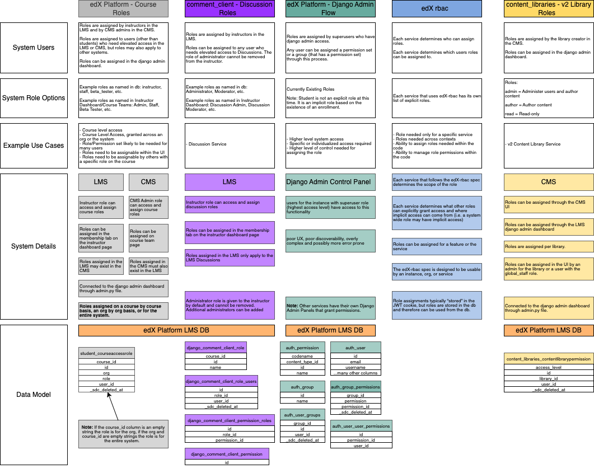
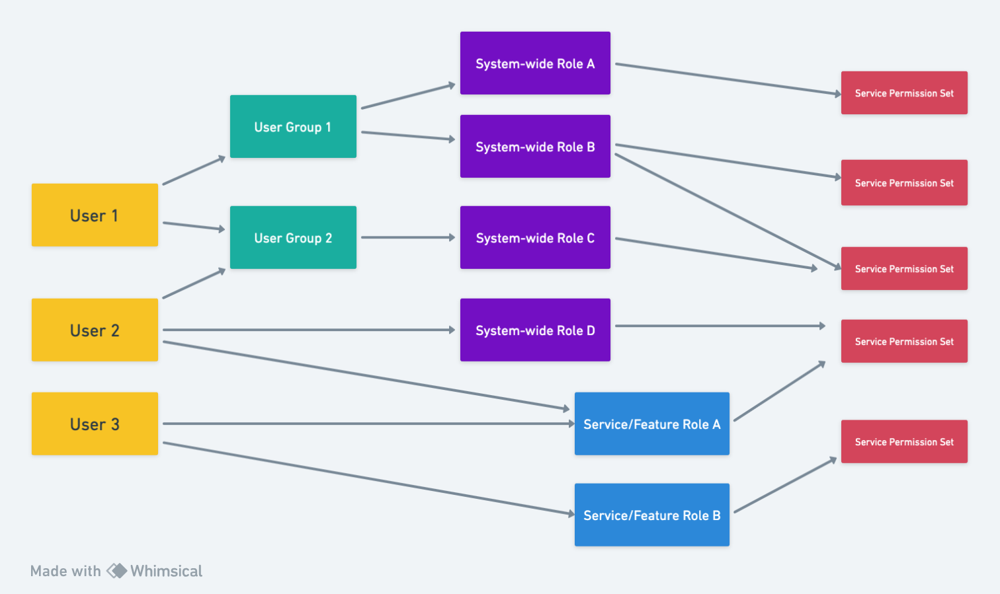

.. _OEP-66 User Authorization:

OEP-66: User Authorization
##########################

.. list-table::
   :widths: 25 75

   * - OEP
     - :doc:`OEP-66 <oep-0066-bp-authorization>`
   * - Title
     - User Authorization
   * - Last Modified
     - 2023-10-20
   * - Authors
     - Hilary Sinkoff (hsinkoff@2u.com), Jeremy Bowman (jbowman@edx.org)
   * - Arbiter
     - Feanil Patel (feanil@axim.org)
   * - Status
     - Accepted
   * - Type
     - Best Practice
   * - Created
     - 2023-08-21
   * - `Review Period`
     - 2023-09-27 - 2023-10-18
   * - Replaces
     - :ref:`OEP-9`
   * - References
     -
       * :ref:`OEP-4`
       * :ref:`OEP-42 Authentication`

Summary
*******

There are a variety of manners in which authorization is handled within the Open edX ecosystem.
The goal of OEP-66 is to provide best practices that should be used with each of the
systems/protocols and outline the systems/protocols that are currently in use.

Motivation
**********

Best Practices Motivation
-------------------------
To date, the implementation and verification of permissions have been somewhat
conflated in the Open edX codebase.  When a user attempts an action which is not
permitted for all users, the code typically directly checks properties of the
user: are they a superuser, do they belong to a particular group or have a
particular role, etc.  This has a few drawbacks:

* This is often a violation of DRY ("Don't Repeat Yourself") which results in
  the same basic permission check being copied in multiple code locations,
  making it very difficult to consistently change its implementation (as may
  happen when a new type of user is introduced, or the need for a special
  exception becomes clear).
* Fine-grained permission checks have sometimes been avoided even when
  appropriate due to the difficulty of copying the permission code around,
  finding a common place to store it, or updating all the code that used a
  coarser initial implementation.  This has resulted in some users being
  technically capable of performing actions which logically should not be
  permitted.
* When a decision is made to change who is granted a particular permission,
  it can be difficult to avoid accidentally changing other permissions with
  a similar implementation.

Systems/Protocols Overview Motivation
-------------------------------------
There are currently multiple systems/protocols that control authorization.
Determining which combination of systems/protocols are responsible for granting access
is a complex task made more complex by the lack of
unified documentation on the systems/protocols. This OEP aims to compile existing
knowledge and documentation into a central document that will give an overview of each
system/protocol. The aim is not to be the only source of information for each system/protocol,
but rather a starting point when learning about authorization within the Open edX codebase.

Defined Terms
*************

Authorization (Authz)
---------------------

Authorization is the granting of permission of a certain user to perform specific operations in an application. A user can also delegate an application to be authorized to perform operations on their behalf without being logged in or authenticated, which is the basis of OAuth.

.. note::
  The definition of authorization found here is the same as that found in
  :ref:`OEP 42 <OEP-42 Authentication>`.
  Credit for this definition belongs to the authors of OEP-42; Robert Raposa, Nimisha Asthagiri, and Julia Eskew.

Authentication (Authn)
----------------------

Authentication is the verification of the identity of a user, which typically initiates at a “login” application point. Authentication is required whenever we need to identify a client/caller/user/etc.

.. note::

  Authentication is out of scope of this OEP.
  The definition is included here to clarify the difference between it and Authorization.
  The definition comes from :ref:`OEP 42 <OEP-42 Authentication>`.
  Credit for this definition belongs to the authors of OEP-42; Robert Raposa, Nimisha Asthagiri, and Julia Eskew.

RBAC
----
Role Based Access Control. A system in which roles are assigned to a user
in order to grant that user permission to perform specific operations.

There are multiple RBAC implementations in use within the Open edX codebase,
including, but not limited to, `edx-rbac`_ and `student_courseaccessrole`_.
The implementations will be described in detail below.

.. _student_courseaccessrole: https://github.com/openedx/edx-platform/blob/master/common/djangoapps/student/roles.py
.. _edx-rbac: https://github.com/openedx/edx-rbac/tree/master

Explicit Role
-------------
A role that is specifically assigned to a user with
the intent of providing the user permission to perform specific operations.

Implicit Role
-------------
A "role" that is understood to belong to a user based
on data that is not role assignment data.

Implicit roles grant users permissions, but are not specifically assigned
to a user.

System-wide Role
----------------
A role that can be used across all Open edX Software.

Super User
----------
A service specific role that exists only for the specified service and
grants a high level of access to the service (for example access to Django Admin
or read-write access for all database models).

Best Practices
**************

Permission Checks
-----------------

Most authorization checks in Python code should use the standard
`Django authorization API`_, including the optional support for object-level
permissions which isn't implemented in the default backends.  Some examples
can help give context for the details:

.. _Django authorization API: https://docs.djangoproject.com/en/3.2/topics/auth/default/#permissions-and-authorization

`This code checks if a user has the permission stated.`

.. code-block:: python

   if user.has_perm('my_app.change_modelname', model_instance):
       # Code which depends on the user being allowed to edit that specific model instance

   if user.has_perm('other_app.add_othermodel'):
       # Code which depends on the user being allowed to create new instances of OtherModel

`This code requires the permission app.modelname in order to perform the my_view action.`

.. code-block:: python

   from django.contrib.auth.decorators import permission_required

   @permission_required('app.modelname')
   def my_view(request):
       # ...

.. note::
  A permission name should respect the following rules:

  * It should contain only lower-case ASCII letters, periods, and underscores.
  * It should start with the name of a Django application followed by a period.
  * It should follow an "action_modelname" pattern for the rest of the name
    if appropriate (especially because several of these are used by the Django
    admin interface if defined), or a short description of an action otherwise.

  `Example permission names:`

  *  my_app.change_modelname
  *  other_app.add_othermodel

Extending Permission Checks
===========================

While the
`Django authorization API`_ is quite flexible, many Django developers
have not really utilized it because the default authentication backend that
comes with Django lacks support for object-level permissions and requires the
addition of per-user database records for even the most trivial permission
checks.  Fortunately, Django supports custom authentication backends, and
checks each one that's in use when making authorization checks.

The backend
which we currently recommend for use in defining new permission checks is
`bridgekeeper`_.

`bridgekeeper`_ is "heavily inspired by `django-rules`_". It allows the creation of new permissions by mapping
the permission name to a function which implements the permission check.  It also allows permission checking by
QuerySet.

Django apps which are
implemented in the repository for a service should generally define their
custom permissions in a ``rules.py`` module where they will be automatically
loaded, as described in the documentation.  For example:

.. _bridgekeeper: https://bridgekeeper.readthedocs.io/en/latest/index.html
.. _django-rules: https://github.com/dfunckt/django-rules

`This code grants the my_app.view_report permission to users that return true from the new
is_report_owner function or the imported is_superuser function.`

.. code-block:: python

   import bridgekeeper
   from bridgekeeper.rules import blanket_rule
   from .rules import is_superuser

   @blanket_rule
   def is_report_owner(user, report):
       return report.owner == user

   rules.add_perm('my_app.view_report', is_report_owner | is_superuser)

This allows permissions to be named and implemented in one place, without
requiring any additional database configuration.  Note that reusable Django
applications should not automatically register implementations of their
permissions, as the actual services using them may need to implement their
own rules for them.

Note that although the optional second argument to ``User.has_perm()`` is
often a model instance, it can technically be any Python object which contains
information relevant to the permission being tested, including a QuerySet.  This allows for even
greater flexibility in the kinds of authorization rules that can be
implemented.

Django REST Framework
*********************

When using Django REST Framework (DRF) to build a REST API, note that it has object
permissions and query filtering mechanisms which are designed to be compatible
with Django's authorization API.  This means they also work well with the
``bridgekeeper`` authentication backend described above.

You can
`set the permissions policy`_ to a class such as `DjangoObjectPermissions`_
and DRF will automatically check the appropriate object permission whenever
performing an action on a single object.  That particular class always denies
permission to anonymous users and assumes that there are no ``view_*``
permissions relevant to viewing or listing objects; those points can be
changed if desired by creating a subclass, for example:

.. _DjangoObjectPermissions: https://www.django-rest-framework.org/api-guide/permissions/#djangoobjectpermissions
.. _set the permissions policy: https://www.django-rest-framework.org/api-guide/permissions/#setting-the-permission-policy

.. code-block:: python

   class DjangoObjectPermissionsIncludingView(permissions.DjangoObjectPermissions):
       authenticated_users_only = False
       perms_map = {
           'GET': ['%(app_label)s.view_%(model_name)s'],
           'OPTIONS': ['%(app_label)s.view_%(model_name)s'],
           'HEAD': ['%(app_label)s.view_%(model_name)s'],
           'POST': ['%(app_label)s.add_%(model_name)s'],
           'PUT': ['%(app_label)s.change_%(model_name)s'],
           'PATCH': ['%(app_label)s.change_%(model_name)s'],
           'DELETE': ['%(app_label)s.delete_%(model_name)s'],
       }

If additional information about the session is needed beyond the user's
identity in order to make a permission decision (for example, if an action
should only be allowed if the client has been granted a particular OAuth
scope, as outlined in :ref:`OEP 4 <OEP-4>`),
then a custom `BasePermission`_ subclass can
be implemented which both consults the Django authorization API and makes the
necessary checks against the session or other properties of the request
object.

In order to filter the querysets used to generate list responses to only
include objects appropriate for the users permissions, an appropriate filter
class should also be set.  A generic implementation using the library
proposed above for mapping permissions to Q objects might look as follows:

.. code-block:: python

    from qpermissions import perms

    class DjangoPermissionRulesFilter(BaseFilterBackend):

        perm_format = '%(app_label)s.view_%(model_name)s'

        def filter_queryset(self, request, queryset, view):
            user = request.user
            model_cls = queryset.model
            kwargs = {
                'app_label': model_cls._meta.app_label,
                'model_name': get_model_name(model_cls)
            }
            permission = self.perm_format % kwargs
            if permission not in perms:
                return queryset
            return queryset.filter(perms[permission](user))

Such a class would be used in a view's `filter_backends`_ attribute or
could be used by default for all view classes which don't override it.

.. _BasePermission: https://www.django-rest-framework.org/api-guide/permissions/#custom-permissions
.. _filter_backends: https://www.django-rest-framework.org/api-guide/filtering/#setting-filter-backends

Systems/Protocols Overview
**************************
The following systems/protocols are currently used in the Open edX ecosystem
to grant users different levels of access. Each system/protocol is used in different
ways. A user's authz level is determined based on a combination of these systems/protocols.
It is important to note that it is the interplay of these systems/protocols that
determines whether a user has permissions for a given operation, not necessarily a single
system.

Basic information about each system/protocol is included in the diagram and data tables.
More in-depth information is included in the sections below the diagrams.

Open edX Auth Overview Diagram
------------------------------

.. toctree::
  :maxdepth: 1
  :glob:

  oep-0066/Open_edX_Auth_Overview_Table.rst

Open edX Authorization Explicit Roles Diagram
---------------------------------------------

.. toctree::
  :maxdepth: 1
  :glob:

  oep-0066/Open_edX_Authorization_Explicit_Roles_Table.rst

Open edX Authorization Implicit Roles Diagram
---------------------------------------------

.. toctree::
  :maxdepth: 1
  :glob:

  oep-0066/Open_edX_Authorization_Implicit_Roles_Table.rst

Django Admin (auth_permission)
------------------------------

Permissions are granted for the entire instance.

There are two ways in which the Django auth_permissions can be used to grant access.

* Users can be granted model permissions based on the database models.
* Users can be assigned to groups which can be granted model permissions based on the database models.

Django Admin auth_permissions grants permissions to users or groups, but does not
control whether the user is able to login to a service (authn) or access a service through other permissions
(i.e. an implicit student role).
In this way, it can grant permissions to a user that they will not be able to use.

auth_permission users and groups are assigned through the Django Admin Dashboard. Each
service can have its own Django Admin Dashboard. In the Open edX software, the LMS Django Admin Dashboard
will be used to control (most) user and group permissions.

student_courseaccessrole
------------------------

Explicit roles are assigned to users, generally on a course level basis.

The roles are hardcoded strings that can be granted in the LMS or CMS.
In addition to granting the roles in the UI, it is possible to assign
the roles through the LMS Django Admin Dashboard.

Each role assignment will generate one row in the database table. The values
in the row will determine if the user is granted access for a single course, all
courses in the org, or all courses in the instance.

* If the course_id is not nil, the role grants permissions on the course level.
* If the course_id is nil and the org_id is not nil, the role grants permissions on the organization level.
* If the course_id and org_id are both nil, the role grants permissions on the instance level.

django_comment_client_role
--------------------------

Explicit roles are assigned to users on a course level basis.

Each role is made up of a combination of permissions stored in the database.

These roles require that the user already be enrolled in the course
(have an enrollment, audit or verified).

Roles are assigned through the LMS in the same place in the UI as the student_courseaccessrole roles.
They can also be granted in the LMS Django Admin Dashboard.

Access is granted through a combination of checking a user's role and checking if a user has a specified permission.
In some situations, the code also checks if a user has a combination (and or or) of permissions to grant access.

course_roles_role (Proposed Service)
------------------------------------

.. note::
  Code related to the course_role schema is in progress.
  This section describes the intended usage, but not all portions have been implemented at this time.
  The code is not being used in production at this time.

  Please see `platform-roadmap issue 246 <https://github.com/openedx/platform-roadmap/issues/246>`_ for more information about the status of the project.

Explicit course level roles are assigned to users. The roles grant access on the course level,
but can also be assigned organization or instance wide.

**Permissions:**

Each role is a combination of the permissions found in the course_roles_permission database table.
The permissions in course_roles_permission are used to determine authorization (access) within the code. As a result,
new roles can be added to the database, connected to existing permissions, and utilized in the system
with minimal effort.

**Role Assignment**

A course_roles_role can be assigned to a user in the LMS, CMS, or Django Admin Dashboard.
These three locations are stored in the course_roles_service database table.
If needed, additional UI locations can be added at a later date.
When a course_roles_role is created, a course_roles_roleservice database row (or rows) should also be created that link the role to the UI service where the role should be assignable to users.
The course_roles_role list will be filtered by course_roles_roleservice values to determine which roles to show in each UI role assignment page (Course Team, Membership, Course_Roles).

Each role assignment will generate one row in the course_roles_userrole database table. The values
in the row will determine if the user is granted access for a single course, all
courses in the org, or all courses in the instance.

* If a userrole is assigned to a course, it grants access based on the related permissions to that course.
* If a userrole is assigned on an organization wide level, it grants access based on the related permissions to all courses that belong to the organization.
* If a userrole is assigned on an instance wide level, it grants access based on the related permissions to all courses that belong to the instance.

The course_roles_userrole database table utilizes foreign keys to user, role, course (CourseOverview), and organization. It is not
possible to assign a course_roles_userrole on an object that is not a course (does not have a CourseOverview) in the database.

.. note::
  Once the proposed course_roles architecture is created, the next planned step is to migrate
  existing student_courseaccessrole roles to the course_roles schema and deprecate the student_courseaccessrole roles.
  The comment_client roles are also being considered for migration to course_roles, but are considered lower
  priority because they are already based upon permissions.

.. image:: oep-0066/Open_edX_Course_Roles_Proposal.png
  :alt: A diagram that provides an overview of the proposed architecture for course_roles. The information in the diagram is also in the Open edX Course Roles Proposal Table (linked to in this document).

.. toctree::
  :maxdepth: 1
  :glob:

  oep-0066/Open_edX_Course_Roles_Proposal_Table.rst

edx-rbac
--------

Permission is granted on a Feature.

edx-rbac is a protocol that can be implemented by any feature, but each
feature that implements it would need to set up its own implementation.

It allows for creating feature specific roles with feature specific permissions.
The feature specific roles can be accessed by other
features which can choose to use or ignore this data point.

The feature specific roles are stored on the jwt token. This mixes authz into an
authn data point, but is an accepted way to implement feature specific roles and permissions.
It is advisable to be very careful regarding the jwt token header limits if adding a new feature specific
set of roles using this implementation path.

content_libraries_contentlibrarypermission
------------------------------------------

Permission is granted on a Feature, in this case Content Library.

Permission is assigned in the CMS exclusively for providing explicit permission to
view or edit a library in the CMS.

It grants access on a library by library basis and is used for v2 of content libraries
in the CMS.

.. note::
  v1 libraries (deprecated) granted access to libraries on a course by course basis
  and was controlled by student_courseaccessrole.

Student/Learner
---------------
student/learner is an implicit role.

It is not currently controlled by a system/protocol
whose primary focus is authorization.

System-wide Roles
-----------------
System-wide roles are configurable and can differ between different Open edX instances. This
means that different instances can have different system-wide roles.

System-wide user-roles (user assignments to a specific system-wide role) are
stored in a central user service (currently LMS) and communicated via JWT Tokens.

If a feature/service utilizes a system-wide role, the feature/service enforces the roles in its own codebase.

Example System-wide Role:

* Global Staff - propagated in JWTs as the "administrator" field

Example AuthZ User Access Flows
-------------------------------

Users can be granted elevated access via different means (system-wide roles, edx-rbac, student_courseaccessroles, etc).
This diagram illustrates some, but not all, ways a user can be granted elevated access.

User 1 is assigned to User Group 1 and User Group 2.
Being in User Group 1 grants the user System-wide Role A and System-wide Role B,
which in turn each grant a specific permission set or sets for a service.
Being in User Group 2 grants access to System-wide Role C
which grants access to a service permission set.

User 2 is assigned to User Group 2.
Being in User Group 2 grants access to System-wide Role C
which grants access to a service permission set.
User 2 is also directly assigned System-wide Role D
which grants access to a different service permission set.
User 2 is also assigned Service/Feature Role A
which grants access to a service permission set.

User 3 is assigned to Service/Feature Role A and Service/Feature Role B.
Each role grants the user a specific service permission set.

As demonstrated by the above flows:

* a user can belong to multiple user groups
* a user can be granted one or many service/feature roles
* a user can belong to one or many user groups and one or many service/feature roles
* a user group can assign a user one or many system-wide roles
* a user can be assigned a system-wide role directly
* system-wide roles and service/feature roles all assign users permission sets that apply only to a specific service
* a system-wide role can have one or many associated service permission sets within a service
* a service/feature role can have one or many associated service permission sets
* a service permission set can be associated with multiple system-wide roles and/or service/feature roles

.. note::
  Not illustrated in the diagram or user flows is the fact that multiple services can use the same
  system-wide roles to grant different permission sets.
  The permission sets do not persist between services, but the system-wide roles are available globally.

Historical Systems/Protocols
****************************

This is a listing of the systems/protocols that have been used historically, but have since been phased out.
This list should include a link to any ADRs or documents that reflect why these changes were made.

* `rules`_ was previously the preferred method for extending permission checks.
   * `ADR for adding django-rules <https://github.com/openedx/edx-platform/blob/master/lms/djangoapps/courseware/docs/decisions/0002-permissions-via-django-rules.rst>`_
   * `ADR for switching to bridgekeeper <https://github.com/openedx/edx-platform/blob/master/lms/djangoapps/courseware/docs/decisions/0003-permissions-via-bridgekeeper.rst>`_

.. _rules: https://github.com/dfunckt/django-rules

References
**********

`Authorization Architecture Vision & Principles <https://openedx.atlassian.net/wiki/spaces/AC/pages/935919751/Authorization>`_

`django Authentication System <https://docs.djangoproject.com/en/4.1/topics/auth/default/#permissions-and-authorization>`_

`django-rules <https://github.com/dfunckt/django-rules>`_

`bridgekeeper <https://bridgekeeper.readthedocs.io/en/latest/index.html>`_

Change History
**************

2024-01-23
----------

* Update django_comment_client_role section
* Add draft course_roles section
* `Pull request #556 <https://github.com/openedx/open-edx-proposals/pull/556>`_

2023-10-23
----------

* PR comment updates - add additional diagram, add information from `Authorization Architecture Vision & Principles`_
* `Pull request #520 <https://github.com/openedx/open-edx-proposals/pull/520>`_

2023-08-21
----------

* Document created
* `Pull request #520 <https://github.com/openedx/open-edx-proposals/pull/520>`_

