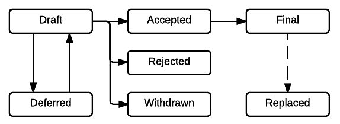

=================================
OEP-1: OEP Purpose and Guidelines
=================================

+---------------+-------------------------------------------+
| OEP           | :doc:`OEP-1 </oeps/oep-0001>`             |
+---------------+-------------------------------------------+
| Title         | OEP Purpose and Guidelines                |
+---------------+-------------------------------------------+
| Last-Modified | 2016-08-24                                |
+---------------+-------------------------------------------+
| Author        | Calen Pennington <cale@edx.org>           |
+---------------+-------------------------------------------+
| Arbiter       | Eddie Fagin <efagin@edx.org>              |
+---------------+-------------------------------------------+
| Status        | Accepted                                  |
+---------------+-------------------------------------------+
| Type          | Process                                   |
+---------------+-------------------------------------------+
| Created       | 2016-03-26                                |
+---------------+-------------------------------------------+
| Resolution    | `open-edx-proposals#1`_                   |
+---------------+-------------------------------------------+

.. _open-edx-proposals#1: https://github.com/edx/open-edx-proposals/pull/1#issuecomment-220419055

What is an OEP?
===============

OEP (pronounced "oh-epp") stands for Open edX (Enhancement) Proposal. An OEP is
a document that details a specific technology decision being made by the Open
edX community, in the form of a best practice, architecture design, or process
adjustment. An OEP should provide the use cases and rationales that surround
that choice. OEPs are not the only way for a change to be made to Open edX,
however, the goal is to create a collection of OEP documents as a repository or
knowledge archive of large and broadly relevant choices made for the platform.

A template, ``oep-template.rst``, is available to help you provide all of the
necessary information for your proposal.

OEP Types
=========

* A **Process** proposal describes a change to how the Open edX community
  functions.

* A **Best Practices** proposal describes a technology or implementation
  choice that the Open edX community believes all applicable Open edX services
  and/or libraries should use or follow.

* An **Architecture** proposal describes relationships between Open edX
  services and libraries, including their APIs and data formats.

Workflow
========

.. contents::
  :local:
  :depth: 1

Submitting an OEP
-----------------

The OEP process begins with a new idea for Open edX. It is highly recommended
that a single OEP contain a single key proposal or new idea. Small enhancements
or patches often don't need an OEP and can be injected into the Open edX
development workflow with a patch submission.

Each OEP must have a Author: someone who writes the OEP using the style and
format described below, shepherds the discussions in the appropriate forums,
and attempts to build community consensus around the idea. The OEP Author
should first attempt to ascertain whether the idea is appropriate for an OEP.
Posting to either the `edx-code`_ mailing list, or to ``arch@edx.org`` and
``archexternal@edx.org`` is the best way to go about this.

Vetting an idea publicly before going as far as writing an OEP is meant to save
the potential author time. Many ideas have been brought forward for changing
Open edX that have been rejected for various reasons. Asking the Open edX
community first if an idea is original helps prevent too much time being spent
on something that is guaranteed to be rejected based on prior discussions
(searching the Internet is not always sufficient). It also helps to make
sure the idea is applicable to the entire community and not just the author.
Just because an idea sounds good to the author does not mean it will work for
most Open edX installations.

Once the Author has asked the Open edX community whether an idea has any chance
of acceptance, a draft OEP should be submitted as a pull request against the
`central OEP repository`_. To identify the draft proposal, the Author should
check the numbered list of previous OEP pull requests and select the next
available number. The pull request title must start with "OEP-XXX", which
claims that OEP number for the included proposal.

.. _central OEP repository: http://github.com/edx/open-edx-proposals

As updates are necessary, the OEP Author can update the pull request.

OEPs can be reference pull requests to other Open edX repositories which
will act as reference implementations.

OEP Review & Resolution
-----------------------

After the Author drafts an OEP, and submits it as a pull request, they request
an Arbiter from the edX Chief Architect. This Arbiter will be recorded in the
"Arbiter" header on the OEP. The rest of Open edX community will be given the
opportunity to comment on the OEP, with the Arbiter serving to keep the
discussion on track and to evaluate when it has reached a final conclusion.

For an OEP to be accepted by the Arbiter, it must meet certain minimum
criteria. It must be a clear and complete description of the proposed
enhancement. The enhancement must represent a net improvement. The proposed
implementation, if applicable, must pass the existing
`Open edX Contribution Guidelines`_.

.. _Open edX Contribution Guidelines: http://edx.readthedocs.org/projects/edx-developer-guide/en/latest/process/index.html

Once an OEP has been accepted by an Arbiter, it is "Under Review". Once this
state is acheived, we recommend announcing the OEP to the community in relevant
forums such as the edx-code and more relevant mailing lists, the
#open-edx-proposals Slack channel, and any other relevant Slack channels. It 
should also be added to the list of "Under Review" OEPs in the OEP repo.

A Draft OEP can be assigned the status "Deferred". The OEP Author or Arbiter
can assign the OEP this status when no progress is being made on the OEP. If an
OEP is deferred, the OEP Author can reassign it to Draft status.

An OEP can also be "Rejected" by the Arbiter. Perhaps after all is said and
done it was not a good idea. It is still important to have a record of this
fact. The "Withdrawn" status is similar: it means that the OEP Author
themselves has decided that the OEP is actually a bad idea, or has accepted
that a competing proposal is a better alternative.

When an OEP is Accepted, Rejected, or Withdrawn, the OEP should be updated
accordingly. In addition to updating the Status field, at the very least the
Resolution header should be added with a link to the relevant post in the
edx-code mailing list archive or to the appropriate section of the PR, and the
Last-Modified header should be set to the current date.

OEPs can also be superseded by a different OEP, rendering the original
obsolete.

The possible paths of the status of OEPs are as follows.

      Draft, and from Draft to Accepted, Rejected, or Withdrawn. From Accepted,
      the next status is Final. A Final OEP can be Replaced.

Please note that OEP statuses do not necessarily coincide with the status of
the pull request that contains the OEP. For example, OEPs that have been
rejected should still be merged, but should be marked with the Rejected status.
This preserves the rationale and description of the OEP in the generated
documentation.

Likewise, an OEP that is in "Draft" status can be merged to capture a set of
edits, and to make the proposal more visible to community comment. From that
point, additional pull requests can be opened to edit the "Draft" OEP, until it
converges to being either "Accepted" or "Rejected".

OEP Roles
---------

Each OEP has an Arbiter (as described in `OEP Review & Resolution`_). The
Arbiter will be chosen by the edX Chief Architect (currently Eddie Fagin). The
Arbiter will be the person making the final decision on whether the OEP should
be Accepted, and as such, the Arbiter should be knowledgeable about the
contents of the proposal, and willing to listen to arguments both for and
against it by the rest of the community.

The Author of an OEP will never be selected as the Arbiter of that OEP.

The Arbiter is also responsible for helping the Author to solicit feedback from
the community on the OEP, and for helping to move the OEP towards a final
decision (whether that decision is Accepted, Rejected, or Deferred). The
Arbiter (in discussion with the Author) can merge an in-progress OEP (if it has
reached a stage of relative stability) to allow for additional incremental
updates.

Finally, the Arbiter is responsible for the decision to transfer an OEP if the
original Author has become unresponsive (as described in `Transferring OEP
Ownership`_).

OEP Maintenance
---------------

In general, OEPs are not modified after they have reached the Final state. They
can be replaced by subsequent OEPs, however (OEPs that are replaced are given
the status "Replaced").

The choice of whether an edit to an OEP should be allowed or whether a new OEP
should be published is up to the Arbiter of the original OEP, or the edX Chief
Architect if that Arbiter is no longer available.. However, as a general
guideline, the following updates would not require a replacement OEP.

* Formatting changes.
* Grammatical and spelling corrections.
* Adding links to additional relevant resources and discussions.
* Additional diagrams or clarifying material (as long as the Arbiter agrees
  that the substance of the OEP isn't changed).

The following updates warrant replacement OEPs.

* Changing the choice of technology in a Best Practice OEP (such as
  which test-runner should be used).
* Changing how a set of services is separated in an Architecture OEP (for
  example, splitting one service into two, or combining two services into one).

What belongs in a successful OEP?
=================================

Each OEP should have the following parts.

*Preamble*
    A table containing metadata about the OEP, including the OEP number,
    a short descriptive title, the names, and optionally the contact info for each author.

*Abstract*
    A short (~200 word) description of the technical issue being addressed.

*Copyright*
    All OEPs must be shared under the `Creative Commons Attribution-ShareAlike 4.0 International License`_.

.. _Creative Commons Attribution-ShareAlike 4.0 International License: https://creativecommons.org/licenses/by-sa/4.0/

.. We talked about copyright vs. licensing. Can we require them to license as CC-by-SA? can we let them reserve copyright to themselves? Tena, help! Also, this comes later in the template -- make the sequence here match the sequence there?

*Motivation*
    The motivation is critical for OEPs that want to change Open edX. It should
    clearly explain why the existing architecture or process is inadequate to
    address the problem that the OEP solves, or why Open edX would be significantly
    improved by adopting the best practice. OEP submissions without sufficient
    motivation are unlikely to be accepted.

*Specification*
    The technical specification should describe the syntax and
    semantics of any new API, or the details of what the Best Practice,
    Process, or Architecture being proposed by the OEP are.

*Rationale*
    The rationale fleshes out the specification by describing what
    motivated the design and why particular design decisions were made. It
    should describe alternate designs that were considered and related work,
    for example, how the feature is supported in other systems.

    The rationale should provide evidence of consensus within the community
    and discuss important objections or concerns raised during discussion.
    It should also link to any major and pertinent discussions of the OEP
    that happened in other fora (such as the `edx-code`_ mailing list).

    .. _edx-code: https://groups.google.com/forum/#!forum/edx-code

*Backward Compatibility*
    All OEPs that introduce backward incompatibilities
    must include a section describing these incompatibilities and their
    severity. The OEP must explain how the author proposes to deal with these
    incompatibilities. OEP submissions that do not consider backward
    compatibility are unlikely to be accepted.

*Reference Implementation*
    The reference implementation must be completed before any OEP is given
    a status of "Final", but it need not be completed before the OEP is
    accepted. While there is merit to the approach of reaching consensus on
    the specification and rationale before writing code, the principle of
    "rough consensus and running code" is still useful when it comes to
    resolving many discussions of API details.

    The final implementation must include test code and documentation,
    following the `Open edX Contribution Guidelines`_.

.. _Open edX Contribution Guidelines: http://edx.readthedocs.org/projects/edx-developer-guide/en/latest/process/index.html

*Rejected Alternatives*

    The OEP should list any alternative designs or implementations that were
    considered and rejected, and why they were not chosen. It should also link
    to the original source of that discussion.

*Change History*

    A list of dated sections that describes a brief summary of each revision
    of the OEP.

OEP Formats and Templates
-------------------------

OEPs are UTF-8 encoded text files that use the `reStructuredText`_ format.
ReStructuredText [8] allows for rich markup that is relatively easy to read,
and can also be rendered into good-looking and functional HTML. OEPs are
rendered to HTML using Sphinx. An `OEP template`_ can be found in the repo.

.. _reStructuredText: http://docutils.sourceforge.net/rst.html
.. _OEP template: https://github.com/cpennington/open-edx-proposals/blob/master/oep-template.rst

OEP Header Preamble
-------------------

Each OEP must begin with an ReST table with metadata about the OEP. The rows
must appear in the following order. Rows in italics are optional and are
described below. All other rows are required.

+---------------+-------------------------------------------+
| OEP           | :doc:`OEP-XXX </oeps/oep-0xxx>`             |
+---------------+-------------------------------------------+
| Title         | <OEP title>                               |
+---------------+-------------------------------------------+
| Last Modified | <date string, in YYYY-MM-DD format>       |
+---------------+-------------------------------------------+
| Author        | <list of authors' real names and          |
|               | optionally, email addresses>              |
+---------------+-------------------------------------------+
| Arbiter       | <OEP czar's real name>                    |
+---------------+-------------------------------------------+
| Status        | <Draft | Accepted | Deferred |            |
|               | Rejected | Withdrawn | Final |            |
|               | Replaced>                                 |
+---------------+-------------------------------------------+
| Type          | <Architecture | Best Practice |           |
|               | Process>                                  |
+---------------+-------------------------------------------+
| Created       | <date created on, in YYYY-MM-DD format>   |
+---------------+-------------------------------------------+
| `Resolution`  | <links to any discussions where the final |
|               | status was decided>                       |
+---------------+-------------------------------------------+
| `Replaces`    | <OEP number>                              |
+---------------+-------------------------------------------+
| `Replaced-By` | <OEP number>                              |
+---------------+-------------------------------------------+

The Author header lists the names, and optionally the email addresses, of all
the authors/owners of the OEP. The format of the Author header value must be
``Random J. User <address@dom.ain>`` if the email address is included, or
``Random J. User`` if the address is not given. If there are multiple authors,
their names and addresses should appear in a comma separated list.

The Arbiter field is used to record who has the authority to make the final
decision to approve or reject the OEP.

The Type header specifies the type of OEP: Architecture, Best Practice, or
Process.

The Created header records the date that the pull request for the OEP was
opened. It should be in YYYY-MM-DD format, e.g. 2016-04-21.

OEPs can also have a Replaced-By header indicating that a OEP has been rendered
obsolete by a later document; the value is the number of the OEP that replaces
the current document. The newer OEP must have a Replaces header that contains
the number of the OEP that it rendered obsolete.

Auxiliary Files
---------------

OEPs may include auxiliary files such as diagrams. Such files must be added to
an oep-XXXX/ directory, where "XXXX" is the OEP number.

Reporting OEP Bugs, or Submitting OEP Updates
---------------------------------------------

While a pull request that contains the initial draft of an OEP is open,
comments should be made on that pull request, or by submitting a new pull
request that targets the branch from which the OEP pull request was made.

Once an OEP has been merged to the open-edx-proposals repository (which can
happen when the OEP is in any status, including Draft), changes can be
suggested to it via new pull requests. Whether those changes are included is up
to the Author of the OEP.

Transferring OEP Ownership
--------------------------

It occasionally becomes necessary to transfer ownership of OEPs to a new
Author. In general, it is preferable to retain the original Author as a co-
author of the transferred OEP, but that is really up to the original Author.

* A good reason to transfer ownership is because the original Author no longer
  has the time or interest in updating it or following through with the OEP
  process, or has fallen off the face of the 'net (that is, unreachable or not
  responding to email).

* A bad reason to transfer ownership is because the Author does not agree with
  the direction of the OEP. A significant aim of the OEP process is to try to
  build consensus around an OEP, but if that is not possible, the Author can
  always submit a separate OEP with an alternative proposal.

Change History
==============

2016-08-24
----------

* Add a definition of the *Change History* section.
* Add a copyright notice.

Copyright
=========

.. image:: https://i.creativecommons.org/l/by-sa/4.0/88x31.png
    :alt: Creative Commons License CC-BY-SA
    :target: http://creativecommons.org/licenses/by-sa/4.0/

This work is licensed under a `Creative Commons Attribution-ShareAlike 4.0 International License`_.

.. _Creative Commons Attribution-ShareAlike 4.0 International License: https://creativecommons.org/licenses/by-sa/4.0/
