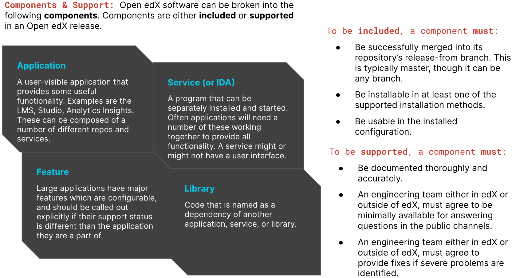

=========================
OEP-10: Open edX Releases
=========================

+---------------+---------------------------------------------------+
| OEP           | :doc:`OEP-10 <oep-0010-proc-openedx-releases>`    |
+---------------+---------------------------------------------------+
| Title         | Open edX Releases                                 |
+---------------+---------------------------------------------------+
| Last Modified | 2021-02-05                                        |
+---------------+---------------------------------------------------+
| Author        | Ned Batchelder <ned@edx.org>                      |
+---------------+---------------------------------------------------+
| Arbiter       | Jeremy Bowman                                     |
+---------------+---------------------------------------------------+
| Status        | Accepted                                          |
+---------------+---------------------------------------------------+
| Type          | Process                                           |
+---------------+---------------------------------------------------+
| Created       | 2016-10-14                                        |
+---------------+---------------------------------------------------+
| Resolution    | `Original pull request`_                          |
+---------------+---------------------------------------------------+

.. _Original pull request: https://github.com/edx/open-edx-proposals/pull/26

..
    - Expectations for component owners

TL;DR
========

* **Open edX is packaged into named releases which occur approximately every 6 months:** Releases are named alphabetically: Dogwood, Eucalyptus, Ficus, Gingko, etc.; these named releases also have follow-on releases appropriately numbered (Eucalyptus.2, Eucalyptus.3, etc.). Additional detail on creating releases / involving repos may be found in `Release creation`_.
* **Dependencies and support are important to keep in mind, especially when choosing which version to use:** Open edX software is built on layers of additional software supported by their creators. An Open edX release is supported by edX until the next release, and developers must support any supporting layers for the entirety of an Open edX named release (approx. 6 months). A calendar of known dependencies and their overlap with Open edX can be found `here`__.
* **Installing Open edX:** Open edX supports the following installation options. Note that none of the supported installation methods are intended for production (see `Installing Open edX`_ for more detail): 

  * Devstack: for developers planning to modify Open edX code.
  * Native: for adopters looking to experiment with Open edX in a non-production environment. Also useful as a starting point for people designing their production deployment.

.. __: https://docs.google.com/spreadsheets/d/11DheEtMDGrbA9hsUvZ2SEd4Cc8CaC4mAfoV8SVaLBGI 

Abstract
========

Open edX is packaged occasionally into releases. This document details the
process.

Motivation
==========

Open edX releases happen roughly every six months. EdX engineers are typically
focused on the much more frequent edx.org releases.  This document standardizes
aspects of the release process to ensure that all involved understand and
participate appropriately.

Specification
=============

Components
----------

When talking about software that is part of Open edX, there are a number of
components that might be useful to discuss, of various sizes:

- Application: this is a user-visible application that provides some useful
  functionality.  Examples are the LMS, Studio, Analytics Insights.  These can
  be composed of a number of different repos and services.

- Service (or IDA): this is a program that can be separately installed and
  started.  Often applications will need a number of these working together to
  provide all functionality.  The LMS and Studio applications are implemented
  by the edxapp service, which also uses the forums service.  A service might
  or might not have a user interface.

- Feature: large applications have major features which are configurable, and
  should be called out explicitly if their support status is different than the
  application they are a part of.

- Library: code that is named as a dependency of another application, service,
  or library.

Levels of support
-----------------

Components in Open edX are either *included* or *supported* in a release.

To be **included** in an Open edX release, a component must meet these
criteria.

- It must be successfully merged into its repository's release-from branch.
  This is typically master, though it can be any branch.

- It must be installable in at least one of the supported installation methods.

- It must be usable in the installed configuration.

Beyond inclusion, to be **supported** in an Open edX release, a component must
meet further criteria:

- It must be documented thoroughly and accurately.

- An engineering team either in edX or outside of edX, must agree to be
  minimally available for answering questions in the public channels.

- An engineering team either in edX or outside of edX, must agree to provide
  fixes if severe problems are identified.

Many of these criteria are open to interpretation, or varying degrees of
effort. For example, what does "documented thoroughly" mean? We can't quantify
that. It and other loose criteria are included here because they are important
parts of providing a finished quality product, and we don't want to overlook
them.

Dependencies
------------

Our software is built atop other software layers supported by their creators.
It's important to consider the support windows for those layers when choosing
which version to use.  An Open edX release is supported by edX until the next
release, so for about six months.  The supporting layers must be supported by
their developers for the entire Open edX release.

Typically this means choosing Long Term Support (LTS) versions of the
supporting layers, but it's possible shorter-term support versions will provide
the support needed.

The layers in question here are Django, Python, and Ubuntu.  Here's a `calendar
of the known support windows`__ and how they overlap with Open edX plans.

.. __: https://docs.google.com/spreadsheets/d/11DheEtMDGrbA9hsUvZ2SEd4Cc8CaC4mAfoV8SVaLBGI

Release creation
----------------

A new release line is created roughly every six months.  Release lines are
named with words in alphabetical order: Dogwood, Eucalyptus, Ficus, Gingko,
and so on.  On a release line, there will be a handful of releases. The first
is called .1 (Eucalyptus.1 for example).  Follow-on releases are numbered from
there: Eucalyptus.2, Eucalyptus.3, and so on.

After the .1 release, new releases in a line are made only for severe problems
such as security problems, data loss, or feature breakage. 

A new release line is created by making a "release master" branch in each
involved repo.  These are named "open-release/RELEASENAME.master".  This branch
will be where changes are accumulated to create each release in the line.
Releases will be tagged "open-release/RELEASENAME.1",
"open-release/RELEASENAME.2", and so on.

Involving repos in the Open edX build process
---------------------------------------------

:doc:`OEP-2 <oep-0002>` defines a file format for repository metadata.  The 
``openedx-release`` key is an optional dictionary governing the participation
of the repo in the Open edX release process.

Repos for applications and IDAs that are part of the Open edX software need to
have the ``openedx-release`` key.   Libraries that are part of Open edX do not
need the key, because they will be pulled in by whatever component uses them as
a dependency.

``openedx-release``: dictionary (optional)

    Possible keys:

    ``ref``
        The name of the release-from branch in this repo. This is the branch
        that will be tagged when an Open edX release is made.

    ``maybe``
        A boolean, but only ever "true" if present.  This key is created by the
        repo initialization tool (cookiecutter).  If it is present, the repo
        will be skipped during releases, but will be flagged so the release
        manager can start a conversation with the repo owner to determine if
        the repo should be included.

    Obsolete keys:

    ``requirements``
        This key is obsolete, and can be removed.

    ``parent-repo``
        This key is obsolete. It was used by libraries. Repos marked with this
        key should have the entire ``openedx-release`` key removed.

Installing Open edX
-------------------

Open edX provides a few supported installation methods, explained below.
Currently, none of the supported installation methods are intended for
production.  Running production servers requires making many choices based on
factors such as expected load, budget, and expertise.

Our installations are based on Ansible playbooks.  Up until the Eucalyptus
release, all supported installation methods were single-machine: all of
the Open edX software was installed and ran on a single machine, either a
Virtualbox image, or a native machine.

That model does not scale up as the number of services and applications grows.
Newer services are supporting Docker for installation.  Eventually, we would
like the supported installation methods to be based on an all-Docker model
where an installation is just a constellation of Docker containers.

To allow us to move gradually from a single-machine model to an all-Docker
model, we'll support a machine running a number of edX services and
applications, and also running a number of Docker containers.

Installation methods
--------------------

There are two supported installation methods:

- Devstack: for developers planning to modify Open edX code.

- Native: for adopters looking to experiment with Open edX in a non-production
  environment.  Also useful as a starting point for people designing their
  production deployment.

.. note::

    In Ginkgo and before, there was a third installation method, called
    Fullstack.  This was similar to the native installation, but ran under
    Vagrant.  There was no conceptual difference between Native and Fullstack,
    so we dropped Fullstack.  If adopters want to run the Native installation
    under Vagrant, it is not hard to do.

The devstack installation is Docker-based and follows :doc:`OEP-5 <oep-0005>`.

.. note::

    We haven't determined how best to allow developers to configure which
    services to run and which should be editable.

The native installation will use an Ansible playbook to install Open edX
components onto the machine.

.. note::

    We will update this OEP later with specifics of the playbook used.

Change History
==============

2020-04-26: Added the "maybe" key for "openedx-release".

2018-08-22: Installation details adjusted to match current Hawthorn realities.
