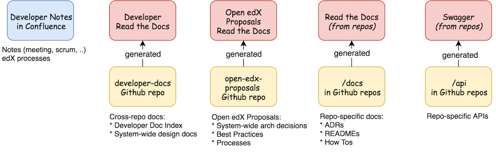

#################################
OEP-0019: Developer Documentation
#################################

.. list-table::
  
   * - OEP
     - :doc:`OEP-0019 </oeps/oep-0019>`
   * - Title
     - Developer Documentation
   * - Last Modified
     - 2018-11-28
   * - Authors
     - Grant Goodman, Robert Raposa, Nimisha Asthagiri
   * - Arbiter
     - Cali Stenson
   * - Status
     - Draft
   * - Type
     - Best Practice
   * - Created
     - 2018-03-27
   * - Review Period
     - 2018-12-06 - 2018-12-20

.. contents::
   :local:
   :depth: 2

Context
-------

Developers who work on the Open edX platform, both inside and outside of edX, need accurate and current documentation
about platform architecture, APIs, and development best practices.

Developer documentation is inconsistent and poorly maintained. Documents are also difficult to find. They
exist in multiple locations, including `Read the Docs`_, GitHub_ repositories, Confluence_ wiki, and `Google Docs`_.

This proposal focuses on long-term developer *Documentation* needs. It does not concern itself with any transitory
*Notes* that a development team may use for project management, brainstorming, meeting notes, etc. Code *Comments*
that a developer may add to clarify or rationalize a code segment are also out of scope of this OEP.

.. _Read the Docs: https://readthedocs.org
.. _Confluence: https://openedx.atlassian.net/wiki
.. _GitHub: https://github.com/edx
.. _Google Docs: https://docs.google.com

Decisions
---------

    relationships. This is further described below.

Agile Documentation Needs
~~~~~~~~~~~~~~~~~~~~~~~~~

With Agile development and `Clean Code`_, we can minimize documentation (and its maintainence) since code should
be readable and self-documenting. However, for long-term maintainence of a platform, the following developer
documentation are still needed:

1. **System-wide Decisions and Best Practices (OEPs)** are necessary to establish coherency
   and efficiency with minimal centralized governance across a long-term maintained platform.
   
   * As described in OEP-1_, system-wide technical decisions, best practices, and development
     processes are captured in the `open-edx-proposals`_ repo.

2. **Architecture Decision Records (ADRs)** are local lightweight documents of
   technical decisions co-located with its corresponding code. They are needed to 
   understand the rationale behind the code and the archeological path to its current state. 
   These records prove to be an `invaluable technique`_ for engineering teams to onboard
   new members, to understand discovered historical traces, to refer back to past decisions,
   and to support external oversight.
   
   * Note: Since ADRs are inherently a historical trail of technical decisions, by design,
     they do not need ongoing maintainence.

   * Example: A `local decisions`_ folder will be created as a top-level folder in a repo
     and/or as subfolders of a repo, depending on the size of the repo's codebase. The goal
     is to keep the decisions in as close proximity to the code as possible for their discovery
     and usage.

3. **READMEs** provide a top-level summary and intentional purpose of the repo or app.

   * The README.rst includes a description of the *responsibility* of that component. This is important
     so that future development remains within the boundaries of the intention of the author rather than
     the component evolving in incongruent ways. In the event that the responsibility of the component
     changes, the README.rst needs to be updated.

   * The README may also serve as an index to the published docs of the component.

4. **How-To Documentation** provides step-by-step instruction in enabling and using a feature.

   * These will be stored in Github co-located with the relevant code.

5. **API Documentation** provide information on interfaces for integrating with or enhancing the platform.
   These should be automatically generated, as possible. For example:

   * REST API interfaces will be automatically generated using Swagger_.
   * The Open edX Learning Exchange (OLX) format should be automatically generated.
   * Plugin interfaces (e.g., Proctoring integration) should be automatically generated using Sphinx_.

.. _Clean Code: https://www.oreilly.com/library/view/clean-code/9780136083238/
.. _OEP-1: https://open-edx-proposals.readthedocs.io/en/latest/oep-0001.html
.. _open-edx-proposals: https://github.com/edx/open-edx-proposals
.. _invaluable technique: https://www.thoughtworks.com/radar/techniques/lightweight-architecture-decision-records
.. _local decisions: https://github.com/edx/credentials/tree/master/docs/decisions
.. _Swagger: https://swagger.io/
.. _Sphinx: http://www.sphinx-doc.org/en/master/

Tools and Location
~~~~~~~~~~~~~~~~~~

The recommended tools and locations for developer documentation are described below, inlined with the
requirements they meet.

* **Discoverable**. Users must be able to find the documentation that is relevant to their needs. This 
  calls for a high-level index and search mechanism for finding content.

  * **Search**. For the time-being, we will make use of Google and Github's search functionality for
    finding content since all developer documentation will be in Github.  Certain IDEs may also have good
    tools for searching.

  * **Index**. In the future, we will invest time in a better automated indexing tool to aggregate and
    structure the documentation. For the time being, we will manually create and maintain documentation
    indices at:
    
    * edx-developer-docs_ will include the landing page for developer documentation and be a container of
      orphaned and cross-repo developer documentation.

    * docs.edx.org_ will be the main landing page for *all* Open edX documentation, including a link to the
      developer documentation index listed above.

* **Maintainable**. Writers, editors, and reviewers must be able to create and modify documentation without
  too much effort. Anyone, inside or outside of edX, should have the ability to contribute to documentation.

  * **Co-located**. The closer the documentation lives with its corresponding code, the more likely it will be
    kept up-to-date.

    * Repo-specific documentation will live within a "docs" folder within its repo. This includes local
      "decisions", "how-tos", and README.rst. Documentation should not live within the code itself (e.g., in
      an __init__.py python module).

    * System-wide decisions will live within the open-edx-proposals_ repo.

    * Other system-wide documentation will live within the edx-developer-docs_ repo.

  * **Exported Diagrams**. In order to keep diagrams updated across time, they will need to be exported
    from whichever tool they were created in, with the exported version maintained in Github.

    * draw.io diagrams will be exported and imported as XML files.
    * Lucidchart diagrams will be exported and imported as Visio (VDX) files.

* **Version Controlled**. Documentation must be maintained under version control in Github, for the
  following reasons:

  * **Reviewed**. They will be properly reviewed as defined by that repo's process.

  * **Tagged**. They will be appropriately in-synch with its corresponding code. When an open edX instance
    is running a specific named release, they can refer to the matching documentation for that version of the
    codebase.

  * **Source Controlled**. They will have the advantages of having source-control backed files, including sharing
    across multiple developers and robust storage.

.. _edx-developer-docs: https://github.com/edx/edx-developer-docs
.. _docs.edx.org: docs.edx.org

Format
~~~~~~

We will use `Restructured Text (rST)`_ for all developer documentation.

Best practices
^^^^^^^^^^^^^^

* We strongly recommend keeping line length between 80 and 120 characters. Keeping it less than 120
  leaves room for future edits.

* Consistency across rST documents is not a requirement.  However, you can use the raw version of this OEP
  as a reference example.

Learning rST
^^^^^^^^^^^^

* See the `reStructuredText (rST) Primer`_.

Helpful rST-related tools
^^^^^^^^^^^^^^^^^^^^^^^^^^

* `Visual Studio Code`_ works pretty well.

* `Online reStructured Text editor`_ helps, but isn't perfect.

* `Online table generator`_ (supports multiple formats).

* `Pandoc`_ can be used to convert between many formats, like Google Doc to rST.

* Other options are listed on stackoverflow_.

.. _Restructured Text (RST): http://docutils.sourceforge.net/rst.html
.. _reStructuredText (rST) Primer: http://www.sphinx-doc.org/en/master/usage/restructuredtext/basics.html
.. _Visual Studio Code: https://marketplace.visualstudio.com/items?itemName=tht13.rst-vscode
.. _Online reStructured Text editor: http://rst.ninjs.org/
.. _Online table generator: http://truben.no/table/
.. _Pandoc: https://pandoc.org/
.. _stackoverflow: https://stackoverflow.com/a/2747041

Rejected alternatives
---------------------

Markdown Format
~~~~~~~~~~~~~~~

We are choosing to not use `Markdown (MD)`_ for documentation. A single format enables consistency, and avoids
conversions to rST when requiring additional features. Here is an interesting blog post on `why rST over Markdown for
documentation`_.

.. _Markdown (MD): https://www.markdownguide.org/
.. _why rST over Markdown for documentation: http://ericholscher.com/blog/2016/mar/15/dont-use-markdown-for-technical-docs/

Confluence
~~~~~~~~~~

Currently edX uses Confluence_ for storing both long-term and short-term developer documentation. Confluence does
provide a WYSIWYG editor, which makes its relatively easy to create and edit documents. Its transitory nature also
provides an impetus to rapidly writing down notes and thoughts. Given this, we do expect some hesitancy with
transitioning to writing rST files in GitHub. However, as described in this OEP, GitHub provides the benefits of
versioning, reviewing, release-tagging, and co-locating, which we expect will result in better quality and maintainence
of our developer documentation.

Confluence Usage and Migration
------------------------------

We will continue to use Confluence for transitory and "edX private" documentation needs since it is already a
hub of communication for both edX employees and the Open edX community. However, the long-term types of developer
documentation listed in `Agile Documentation Needs`_ will need to migrate to their new locations.

Migration
~~~~~~~~~~

When migrating content from Confluence to GitHub, we will:

#. Reformat it to rST and store it in the appropriate location in GitHub.
#. Delete the content from the old page, with a forwarding link to the new `Read The Docs`_ location.
#. Archive_ the old page, as explained below.

Archive
~~~~~~~

For sustainable maintainence of Confluence documents, ongoing cleanup will be implemented using Confluence's
useful `Space Archive`_ feature. All engineering related documents will be archived to the private
`Archive: Engineering`_ space.

When a page is archived:

* The page and its contents are no longer included in normal searches, thus keeping our search results decluttered.
* The page no longer appears in Google searches.
* Links to the old page are automatically forwarded to its new location in the Archived space (unless the old page's
  containing space is entirely deleted).

.. _Space Archive: https://confluence.atlassian.com/doc/archive-a-space-284368719.html
.. _`Archive: Engineering`: https://openedx.atlassian.net/wiki/spaces/ArchiveEng/overview

Index
~~~~~

Since we will continue to use Confluence for certain types of documents, we will maintain the following 2
top-level indices for engineering related documents:

* `Architecture and Engineering`_ for public documents 
* `Engineering (Internal)`_ for "edX private" documents

.. _Architecture and Engineering: https://openedx.atlassian.net/wiki/spaces/AC/overview
.. _Engineering (Internal): https://openedx.atlassian.net/wiki/spaces/ENG/overview

Next Steps
----------

* **Publishing**: The intention is to have all rST documents published to `Read the Docs`_.
* **Validation**: The intention is to have all rST document changes in all repositories automatically
  validated as part of the Continuous Integration quality tests for any PR. See the edx-developer-docs_
  repo or the cookiecutter-django-app_ repo for examples.

.. _cookiecutter-django-app: https://github.com/edx/cookiecutter-django-app

.. image:: oep-0019/quill.png
   :align: center
