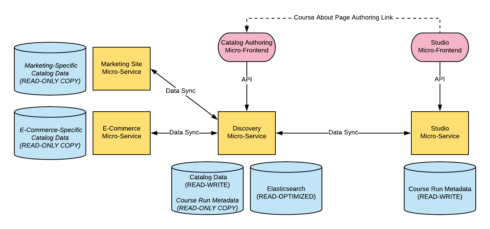

===================================
OEP-0027: Course Metadata Authoring
===================================

+-----------------+----------------------------------------------------------------+
| OEP             | :doc:`OEP-0027 </oeps/oep-0027-arch-course-metadata-authoring>`|
+-----------------+----------------------------------------------------------------+
| Title           | Course Metadata Authoring                                      |
+-----------------+----------------------------------------------------------------+
| Last Modified   | 2018-07-13                                                     |
+-----------------+----------------------------------------------------------------+
| Authors         | Farhanah Sheets, Michael Roytman, Nimisha Asthagiri            |
+-----------------+----------------------------------------------------------------+
| Arbiter         | <TODO>                                                         |
+-----------------+----------------------------------------------------------------+
| Status          | Under Review                                                   |
+-----------------+----------------------------------------------------------------+
| Type            | Architecture                                                   |
+-----------------+----------------------------------------------------------------+
| Created         | 2018-07-13                                                     |
+-----------------+----------------------------------------------------------------+
| `Review Period` | <TODO>                                                         |
+-----------------+----------------------------------------------------------------+

Context
-------

In the Open edX system, course content authoring occurs in the Studio tool, which focuses mainly on authoring of
course structure and content within a **Course Run**. A Course Run is marketed on the edX marketing site via
the context of a **Catalog Course**. The **Catalog Course** data authoring needs a good user experience.

Today, Catalog Course metadata authoring occurs in multiple places, including the Studio, Ecommerce, and
Marketing sites. We introduced a new tool, called Publisher, to ease the Catalog Course metadata 
authoring process. The Publisher tool includes an inflexible workflow engine for the process of provisioning
a course. Currently, this course publish cycle can take up to fifteen days in order to provision 
a new course. 

We also run into data synchronization issues between the separate services since there are multiple sources of truth and
multiple writers of the relevant metadata.

Decision
--------

* We will no longer embed workflow into the core system. Rather, we will allow for a self-service workflow tool that will reduce the provisioning time.

* The following data is Course Run data and should be edited only from within Studio:

  * course run dates

    * start
    * end
    * enrollment start
    * enrollment end
    * certificate availability

  * pacing type

* The following data is Catalog Course data and should be edited only from within the `Discovery subdomain`_:

  * course about image
  * instructors
  * seat price
  * seat type
  * other catalog course marketing data

  **Note:** course about image and instructors are currently managed as Course Run metadata but will transition to be Catalog Course metadata. 

* We will provide a unified authoring user experience by having Studio be the portal to authoring both Course Run metadata and
  Catalog Course data. However, authoring of Catalog Course metadata will live in the Discovery subdomain. From the user's perspective, 
  there will be a seamless transition between the two front ends.

  * This will depend on upcoming architectural infrastructure work on single sign on across the edX microservices and a universal
    front end header and footer.

* We will introduce a new front end for editing Catalog Course metadata, written using the latest recommended front end technologies.

* The Discovery service will continue to remain the single source of truth for all above data. Though, to address the data
  synchronization, we are limiting the editing of a piece of data to a single owner.

  .. _Discovery subdomain: https://openedx.atlassian.net/wiki/spaces/AC/pages/213910332/Domain-Driven+Design 

Consequences
------------

* By separating the concepts of Course Run metadata authoring from Catalog Course metadata authoring, we allow the overall
  edX system to integrate better with other external systems. We have found that other systems use Open edX for the Course
  Run learning experience and often choose to integrate with their own organizational Catalog Course management system.

  As a consequence, the authoring experience is biforcated into two different subdomains in our system, Studio and Discovery. However,
  we do hope that an integration at the UI layer will avoid any disparate user experience. The separation of concerns in the back end
  allows us to have clearer integration points. We believe this is a worthwhile trade-off.

* By removing the workflow engine from the system, we are reducing the turn around time for course provisioning. This introduces a potential
  risk for less review by internal teams. However, by making the workflow self-service, we believe that the course provisioning process will be
  more scalable. Also, by using a third party workflow management tool, the workflow will be more flexible.

* In the past, course authors were able to edit data using multiple tools, primarily in the tool where the data was presented to learners. Now, 
  the authoring experience will be isolated to one location, potentially not where that data is surfaced to learners.

References
----------

