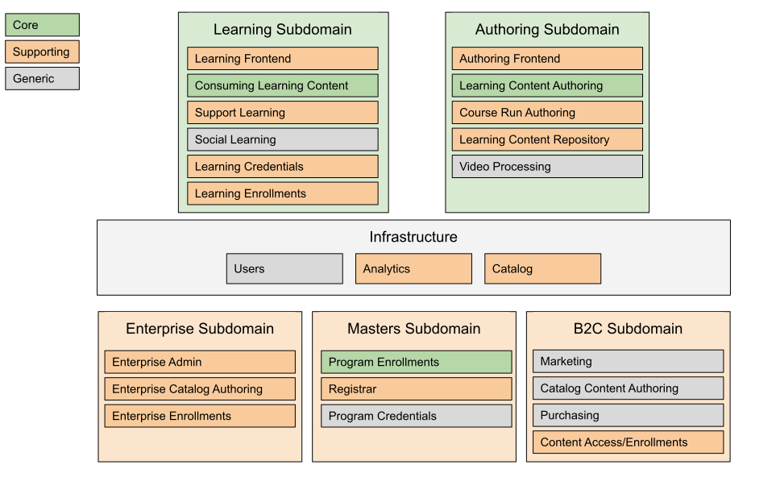

####################################
OEP-46: Domain-Driven-Design Domains
####################################

.. list-table::
  :widths: 25 75

  - - OEP
    - :doc:`OEP-46 </oeps/oep-0046-arch-ddd-domains.rst>`
  - - Title
    - Domain-Driven-Design (DDD) Domains
  - - Last Modified
    - 2020-04-28
  - - Authors
    - Cale Pennington <cale@edx.org>
  - - Arbiter
    - <Arbiter's real name and email address>
  - - Status
    - Draft
  - - Type
    - Architecture
  - - Created
    - 2020-04-23
  - - Review Period
    - 2020-04-23 - ???
  - - Resolution
    - 
  - - References
    - 

Abstract
********

Open edX is a large software project with a number of different teams working
various portions of it. Using Domain Driven Designs (and in particular, Bounded
Contexts) to enumerate the distinct portions of the system and how they can
interact will allow teams to work with minimal coordination.

Motivation
**********

Domain Driven Design presents a description of the Open edX system that can
be used to clarify decisions in the following areas:

- Communication
  - Should these two components communicate synchronously or asynchronously?
  - Is this API using the same terminology that my component is?
- Level of effort
  - Should we consider buying this component rather than custom building it?
  - Is this component something an Open edX operator might want to replace?

Specification
*************

The Open edX system consists of the following bounded contexts.

Terminology and Behaviors
=========================
Subdomain:
  A group of related bounded contexts. A Subdomain is **Core** if it is a key differentiator for
  Open edX, **Supporting** if it has Open edX specifics, but isn't **Core**, or **Generic** if
  it has no Open edX business context.

  There should be **no** synchronous communication between separate subdomains. Any
  exceptions to this must be documented in this OEP.

  Business logic should also **not** be distributed between subdomains. For instance,
  if the Marketing or Purchasing systems need to calculate a discount, it should be based
  solely on data in their databases, and code in their repositories, rather than
  requiring api calls to other subdomains.

Bounded Context:
  A single service inside a Subdomain. Each Bounded Context owns its own data storage,
  has its own Ubiquitous Language that describes all of the entities owned by that service,
  and uses Anti-Corruption Layers to translate incoming objects into that language.

  Bounded Contexts within a Subdomain **should** use asynchronous communication with
  other Bounded Contexts in the same Subdomain, but may elect to use synchronous
  communication if required.

  Like Subdomains, **core** Bounded Contexts in a Subdomain implement the
  key Open edX business logic for that Subdomain. **supporting** Contexts
  have Open edX logic, but are not **core** to their Subdomain, and **generic**
  contexts should be replaceable and contain no Open edX business logic.

Ubiquitous Language:
  The set of terms and definitions that defines the entities and relationships
  within a Bounded Context. These terms may not have the same definitions across
  different Bounded Contexts.

Anti-Corruption Layer:
  A layer around the edge of a Bounded Context that converts entities and information
  retrieved from other Bounded Contexts in the same Subdomain into the Ubiquitous Language
  of this Bounded Context.

Overall Behavior Flows
======================

A **learner** engages with a **Business Subdomain** to find learning content that meets their
learning goals. They purchase that learning content via whatever mode is appropriate
for that **Business Subdomain** (direct purchase, free enrollment, subscriptions, etc).
The **Business Subdomain** requests fulfillment from the **Learner Subdomain** to allow the
**learner** access to their selected learning content.

An **educator** engages with the **Content Authoring** Subdomain to author learning content
and make it available to the **Learning** subdomain.

An **administrator** engages with the **Learning** Subdomain to set up learning content with
specific dates, and with the **Business Subdomain** to group learning content
created by **educators** in the **Content Authoring** Subdomain into units that match
learners educational goals.

The Big Picture
===============

Learning Content Subdomains
===========================

These subdomains are used to create and consume learning content

Content Authoring
-----------------
**Core** Subdomain

Content Authoring (core) allows educators to create, modify, discover, package, annotate (tag), and share learning content.  Learning content may be packaged from multiple content sources.

Users:
  - Course teams
  - Instructional designers

Bounded Contexts
~~~~~~~~~~~~~~~~

.. list-table::
   :widths: 10 10 70

   - - Bounded Context
     - Type
     - Description
   - - Course Run Authoring
     -	supporting
     - Course Run Authoring (supporting) allows educators to launch a Course Run. This includes the ability to override configuration settings and fields, including dates and grading policy.
   - - Learning Content Authoring
     - core
     - Learning Content Authoring (core) allows educators to create and publish learning content and pathways,  which can be utilized to create course runs.
   - - Learning Content Repository
     - supporting
     - Learning Content Repository (supporting) provides a shared service for storing, versioning, sharing, and discovering published learning content.  The learning content is available at varying degrees of granularity - including Pathways, Blocks and Units.
   - - Video Processing
     - generic
     - Video Processing  generic) is a service for processing, encoding, and translating authored videos for consumption by learners.

Learning
--------
**Core** Subdomain

Learning allows learners to consume content and perform actions in a learning activity (participating on forums, etc) on the platform.  It also allows educators to support learners via interactions with learners and other support tools.

Users: 
  - Learners
  - Admins

Bounded Contexts
~~~~~~~~~~~~~~~~

.. list-table::
  :widths: 10 10 70

  - - Bounded Context
    - Type
    - Description
  - - Consuming Learning Content
    - core
    - Consuming Learning Content (core) is the primary context where learners engage with content in personalized learning pathways.  This includes functionality such as:

      - Completion / Progress
      - Digital Journal
      - Grades
      - xBlocks (each as its own separate micro-context): Video, CAPA, ORA, etc.
  - - Social Learning
    - generic
    - Social Learning (generic) provides a service for collaboration and interactivity between learners and educators.
  - - Support Learning
    - supporting
    - Support Learning (supporting) allows educators to administer and manage learners and learning contexts (courses, programs, etc).
  - - Learning Credentials
    - supporting
    - Learning Credentials (supporting) allows learners and educators to access and manage credentials/certifications achieved from learning.
  - - Learning Enrollments
    - supporting
    - Learning Enrollments allows learners to see which learning materials they have access to, and which experience they have
      for that content. It also provides fulfillment services for the various Business Subdomains by allowing them to request
      enrollment of a user into an experience of particular learning content.

Infrastructure Subdomains
=========================

These Subdomains provide key Open edX infrastructure shared by the other Subdomains.

Analytics
---------
**Supporting** Subdomain

Analytics (supporting) allows both educators and admins to access data about learner behavior and proficiencies and content usage in order to assess learners and the pedagogical impact of the content.

Users:
  - Course teams
  - Course Admins

Users
-----
**Generic** Subdomain

Users allows users to manage their personal profile and demographic inforamtion, and
provides authentication services to other Subdomains.

Catalog
-------
**Supporting** Subdomain

Catalog Content is a service for storing catalog data with interfaces for retrieval and
storage. It contains both metadata about Course Runs (used for marketing by the Business Subdomains)
and metadata about groups of Course Runs (Courses) and groups of Courses (Programs).

The interfaces provided to this are synchronous (incoming) and asynchronous (outgoing),
allowing for Contexts in other Subdomains to publish new data and then listen for changes
that are relevant to their needs.

Business Subdomains
===================

These subdomains are focused on various ways of allowing Learners to find and purchase
learning content experiences.

B2C (Business to Consumer)
--------------------------
**Supporting** Subdomain

B2C (supporting) allows learners to find the right content at the right time to help achieve their learning goals.

Users:
  - Learners
  - Course Admins
  - Marketing

Bounded Contexts
~~~~~~~~~~~~~~~~

.. list-table::
  :widths: 10 10 70

  - - Bounded Context
    - Type
    - Description
  - - Marketing
    - generic
    - Marketing (generic) provides a portal for learners to discover higher-level learning contexts, such as Courses and Programs.
  - - Catalog Content Authoring
    - generic
    - Catalog Content Authoring (generic) allows educators to author and manage their catalog content.
  - - Purchasing (ecommerce)
    - generic
    - Purchasing (ecommerce) (generic) allows learners to pay for edX content and features.
  - - Content Access / Enrollments
    - supporting
    - Content Access / Enrollments (supporting) is a service for managing access and enrollment information to catalog content.

Enterprise
----------

Users:
  - Enterprise Learners
  - Enterprise Admins

Bounded Contexts
~~~~~~~~~~~~~~~~

.. list-table::
  :widths: 10 10 70

  - - Bounded Context
    - Type
    - Description
  - - Enterprise Admin
    - supporting
    - TBD
  - - Enterprise Catalog Authoring
    - supporting
    - TBD
  - - Enterprise Enrollments
    - supporting
    - TBD

Masters
-------
**Supporting** Subdomain

Masters allows educators and learners to manage and engage in bundled packages (programs) of learning
linked to institutional credit.

Users:
  - Masters Learners
  - Masters Admins
  - Credit Organizations

Bounded Contexts
~~~~~~~~~~~~~~~~

.. list-table::
  :widths: 10 10 70

  - - Bounded Context
    - Type
    - Description
  - - Program Enrollments
    - core
    - Program Enrollments enable educators to handle grading, completion, and other for learner-facing features within the context of a program.
  - - Registrar
    - supporting
    - Registrar allows educators to administer programs, using identifiers from external systems, through the Program Manager interface.
  - - Program Credentials
    - generic
    - Program Credentials allows learners and educators to access and manage credentials and certifications achieved from engaging in Programs.

Rationale
*********

The overriding goal for this division of the systems is to allow for increased change
velocity in each of the systems, without requiring coordination or dependent changes
in other systems.

For instance, by separating enrollments in learning content from program enrollment (in
the Masters subdomain) or purchasing decisions (in the B2C subdomain), we allow
those business subdomains to experiment with alternative business models more easily.
As they experiment, the Learning subdomain simply has to provide a stable platform
on which to fulfill purchases from the various business domains, rather than needing
to be tied into the specifics of how users are being given those enrollments.

Similarly, by separating the various business subdomains into discrete units, they are
free to experiment with alternative payment models without being tied to the same
commerce platform decisions.

Backward Compatibility
**********************

This statement identifies whether the proposed change is backward compatible.
An OEP that introduces backward incompatibilities must describe the
incompatibilities, with their severity and an explanation of how you propose to
address these incompatibilities.

Rejected Alternatives
*********************

Catalog in B2C
==============

In prior versions, the Course Catalog lived in the B2C Subdomain, because it was primarily
used as a source of data for the B2C Marketing service. However, that led to additional
questions if any other Business Subdomain wanted to market an existing course to their
specific audiences. As such, the Course Catalog was moved to infrastructure, and
given responsibility for Programs (collections of Courses), but without any of the
domain knowledge of what particular Courses or Programs were being used for.

Change History
**************

A list of dated sections that describes a brief summary of each revision of the
OEP.
