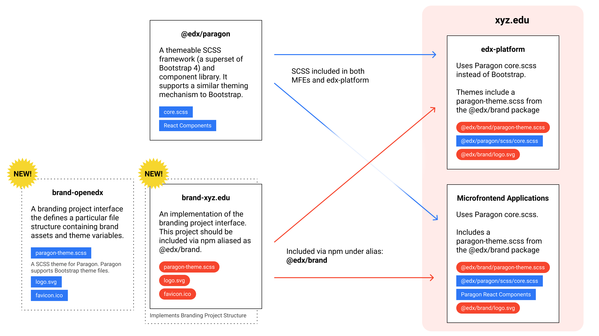

=============================
OEP-0048: Brand Customization
=============================

.. list-table::
   :widths: 25 75

   * - OEP
     - :doc:`OEP-0048 </oeps/oep-0048-arch-brnd>`
   * - Title
     - Brand Customization
   * - Last Modified
     - 2020-10-06
   * - Authors
     - Adam Butterworth <abutterworth@edx.org>, Aura Milena Alba <aura.alba@edunext.co>
   * - Arbiter
     - Kshitij Sobti <kshitij@opencraft.com>
   * - Status
     - Draft
   * - Type
     - Architecture
   * - Created
     - 2020-09-09
   * - Review Period
     - 2020-10-12 - 2020-10-30
   * - Replaces
     - OEP-23 Style Customization

Context
-------

The ability to customize the Open edX platform to reflect a custom brand and visual style is a critically important feature for the Open edX community. The comprehensive theming system built into edx-platform has served theme and branding needs for several years. It is imperfect and unofficially supported, but it has worked.

Meanwhile, the edX organization has invested in a new microfrontend architecture that features many small, independently deployable microfrontend applications (MFEs). Most of the Open edX user interface will be delivered by these MFEs by the end of this technical transition.

The UI in MFEs are primarily built using the Paragon SCSS and React library based on Bootstrap 4. Paragon itself supports themes via SCSS variable definitions in the same way as its parent library, Bootstrap. The edx.org theme lives inside the Paragon project along side a starter theme.

Today, MFEs hardcode the inclusion of the edx.org Paragon theme. Custom themes and branding are difficult to apply. Why is this the case?

A key distinction between the MFEs created for Open edX and server-rendered pages is that MFEs are built, static applications. It may be better to think of MFEs as "web app generators" rather than web applications themselves. They are given a configuration as input and they output static html, javascript, and css that is then deployed to the web.

Whereas a server application can read a configuration file when a user requests a page, an Open edX MFE does not. A pipeline builds and deploys the MFE with a configuration. If the configuration changes, the pipeline must be rerun and the MFE redeployed.

MFEs lack the kind configurability available in Open edX's server applications because edX does not share a common build and deploy system with the community. Work to create an MFE build pipeline for the community is currently underway and outside the scope of this proposal.

This pipeline will unlock the ability to easily configure MFEs, but MFEs don't currently offer a way to configure a custom theme.

As MFEs serve more and more of the platform user interface, a system for branding and theming them must be created. An ideal solution would apply to both MFEs and edx-platform.

Decision
--------

We will create a new project that defines a branding package interface and a default implementation for branding and theming Open edX applications. The brand package will have the capability to customize assets referred to in the SASS theme like main colors, fonts, and particular backgrounds. It will also include specific image assets such as logo and favicon.

A branding package will be a node module that contains a defined set of files and directories. The default implementation will be available on Github at `edx/brand-openedx <https://github.com/edx/openedx>`_ and published to npm as `@edx/brand-openedx`.

Brand packages will be installed in edx-platform and all MFEs via npm, aliased as `@edx/brand`.

Those who wish to customize the branding of their Open edX installation, including edx.org, will create a package that implements this branding package interface. The edx.org branding package will be made public on github at `edx/brand-edx.org <https://github.com/edx/brand-edx.org>`_.

Build and deploy pipelines will be responsible for overriding the default branding in MFEs by installing the custom brand package into applications aliased as `@edx/brand`. An example command to install the edx.org brand under the `@edx/brand` alias:

.. code-block:: bash

  # Format to install from npm: npm install <alias>@npm:<name>
  npm install @edx/brand@npm:@edx/brand-edx.org

  # Format to install from github
  npm install @edx/brand@git+https://git@github.com/edx/brand-edx.org.git

  # Format to install from a directory
  npm install @edx/brand@file:./brand-edx.org

edX.org relies upon the build scripts in the `edx/tubular <https://github.com/edx/tubular>`_ repository to do this for MFEs (`See this function <https://github.com/edx/tubular/blob/master/tubular/scripts/frontend_utils.py#L66>`_ for detail). The build and deploy pipeline for Open edX will be responsible for doing this in a similar way.

Consequences
------------

After this work is completed, all Open edX applications should use brand packages to reference brand or theme assets.

References
----------

See `npm cli documentation <https://docs.npmjs.com/cli-commands/install.html>`_ for further information about npm aliases.
