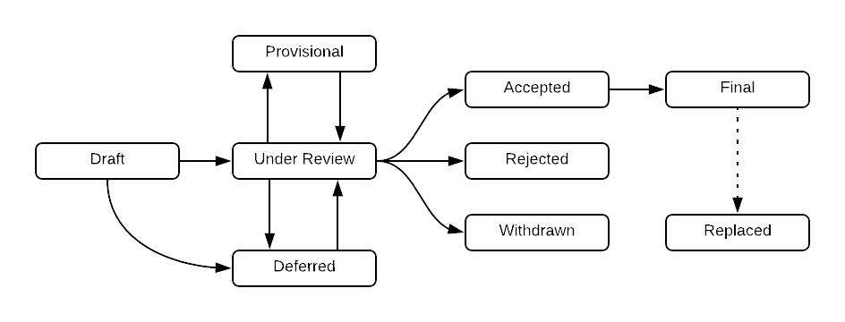

=================================
OEP-1: OEP Purpose and Guidelines
=================================

+---------------+--------------------------------------------------------------+
| OEP           | :doc:`OEP-1 <oep-0001>`                                      |
+---------------+--------------------------------------------------------------+
| Title         | OEP Purpose and Guidelines                                   |
+---------------+--------------------------------------------------------------+
| Last-Modified | 2019-08-27                                                   |
+---------------+--------------------------------------------------------------+
| Authors       | Calen Pennington <cale@edx.org>,                             |
|               | Joel Barciauskas <joel@edx.org>,                             |
|               | Nimisha Asthagiri <nimisha@edx.org>                          |
+---------------+--------------------------------------------------------------+
| Arbiter       | - Eddie Fagin <efagin@edx.org>,                              |
|               | - Calen Pennington <cale@edx.org>                            |
+---------------+--------------------------------------------------------------+
| Status        | Accepted                                                     |
+---------------+--------------------------------------------------------------+
| Type          | Process                                                      |
+---------------+--------------------------------------------------------------+
| Created       | 2016-03-26                                                   |
+---------------+--------------------------------------------------------------+
| Review Period | * 2016-03-26 - 2016-05-19, `open-edx-proposals#1`_           |
|               | * 2018-02-05 - 2018-02-15, `open-edx-proposals#53`_          |
|               | * 2018-05-02 - 2018-05-11, `open-edx-proposals#60`_          |
|               | * 2018-11-06 - 2018-11-16, `open-edx-proposals#85`_          |
+---------------+--------------------------------------------------------------+
| Resolution    | `open-edx-proposals#1 resolution`_                           |
+---------------+--------------------------------------------------------------+
| References    | - Based on the Python community's PEP_ process               |
|               | - Similar in principle to `Architecture Decision Records`_   |
+---------------+--------------------------------------------------------------+

.. _open-edx-proposals#1: https://github.com/edx/open-edx-proposals/pull/1
.. _open-edx-proposals#53: https://github.com/edx/open-edx-proposals/pull/53
.. _open-edx-proposals#60: https://github.com/edx/open-edx-proposals/pull/60
.. _open-edx-proposals#85: https://github.com/edx/open-edx-proposals/pull/85
.. _open-edx-proposals#1 resolution: https://github.com/edx/open-edx-proposals/pull/1#issuecomment-220419055
.. _PEP: https://www.python.org/dev/peps/pep-0001/
.. _Architecture Decision Records: https://cognitect.com/blog/2011/11/15/documenting-architecture-decisions

.. contents::
  :local:
  :depth: 1

What is an OEP?
===============

OEP (pronounced "oh-epp") stands for Open edX (Enhancement) Proposal. An OEP is
a document that details a specific technology decision being made by the Open
edX community, in the form of a best practice, architecture design, or process
adjustment. An OEP should provide the use cases and rationales that surround
that choice. OEPs are not the only way for a change to be made to Open edX,
however. The goal is to create a collection of OEP documents as a repository or
knowledge archive of architectural choices made for the platform.

Small enhancements or patches often don't need an OEP and can be injected into
the Open edX development workflow with a patch submission.

`OEP templates`_ are available to help you provide all of the
necessary information for your proposal.

OEP Types
=========

* A **Process** proposal describes a change to how the Open edX community
  functions.

* A **Best Practice** proposal describes a technology or implementation
  choice that the Open edX community believes all applicable Open edX services
  and/or libraries should use or follow.

* An **Architecture** proposal describes a concrete design problem with several
  potential solutions and the rationale behind the decision. The decision may
  be specific to a significant Open edX feature or a cross-cutting technical
  need.

OEP Roles
=========

Authors
-------

Each OEP must have at least one Author: someone who writes the OEP using the
style and format described here, shepherds the discussions in the appropriate
forums, and attempts to build community consensus around the idea.

Arbiter
-------

Each OEP also has an Arbiter (as described in `Step 1. Request an Arbiter`_).
The Arbiter will be chosen by the `edX Architecture Team`_. An Author of an OEP
cannot concurrently be the Arbiter of that OEP.

The Arbiter will be the person making the final decision on whether the OEP
should be Accepted, and as such, the Arbiter should be knowledgeable about
the contents of the proposal, and willing to listen to arguments both for
and against it by the rest of the community.

The Arbiter is also responsible for helping the Authors move the proposal
through the OEP process, providing technical and process expertise as needed.
The Arbiter also assists the Authors in soliciting feedback from the
community on the OEP and moving it towards a final decision (whether that
decision is Accepted, Rejected, or Deferred). The Arbiter (in discussion with
the Authors) can merge an in-progress OEP (if it has reached a stage of relative
stability) to allow for additional incremental updates.

Finally, the Arbiter is responsible for the decision to transfer an OEP if the
original Authors have become unresponsive (as described in `Transferring OEP
Ownership`_).

Architecture Team
-----------------

The `edX Architecture Team`_ is accountable for assigning Arbiters to incoming
Draft OEPs and revived OEPs that need a new Arbiter (if the original Arbiter is no
longer available). The team can also be a resource to help or advise the Arbiter
with the OEP process.

.. _edX Architecture Team: https://openedx.atlassian.net/wiki/spaces/AC/pages/439353453/Architecture+Team

OEP Workflow
============

.. contents::
  :local:
  :depth: 2

Submitting an OEP
-----------------

Step 1. Request an Arbiter
~~~~~~~~~~~~~~~~~~~~~~~~~~

Request an Arbiter from the `edX Architecture Team`_ by emailing
`arch-team@edx.org`_. This Arbiter will be recorded in the "Arbiter" header on the
OEP.

.. _`arch-team@edx.org`: mailto:arch-team@edx.org

Step 2. Create PR for "Draft" OEP
~~~~~~~~~~~~~~~~~~~~~~~~~~~~~~~~~

Draft an OEP using one of the `OEP templates`_ and submit as a pull request against
the `central OEP repository`_. To identify the draft proposal, the Authors should
check the numbered list of previous OEP pull requests and select the next
available number.

The pull request title should be of the form "OEP-XXXX: <OEP title>", where
*XXXX* is the OEP number claimed for the included proposal.

.. _central OEP repository: https://github.com/edx/open-edx-proposals

Step 3. Review with Arbiter
~~~~~~~~~~~~~~~~~~~~~~~~~~~

Once an Arbiter has been assigned to your OEP, establish begin and end review
dates with your Arbiter, making it officially "Under Review". Once this state
is achieved, announce the OEP to the community in the following channels:

* Create a topic in the `Announcements - Architecture category`_ in Discourse,
  with "OEP", its number and its title in the subject line.
* `#open-edx-proposals Slack channel`_.

The Open edX community is given the opportunity to comment on the OEP.
The Arbiter serves to keep the discussion on track and to bring the review
process to a final resolution.

.. _Announcements - Architecture category: https://discuss.openedx.org/c/announcements/architecture
.. _#open-edx-proposals Slack channel: https://openedx.slack.com/messages/C1L370YTZ/details/

OEP Status
----------

      Accepted, Rejected, or Withdrawn. There are 2 transitional statuses from
      Draft and Under Review: to/from Provisional and to/from Deferred. An
      Accepted OEP can be Replaced.

Draft
~~~~~

The Authors are working on an OEP and then reviewing it with an assigned Arbiter.

Under Review
~~~~~~~~~~~~

The OEP is under discussion and being reviewed by the Open edX community, the
Arbiter, and the Authors.

Accepted
~~~~~~~~

The Arbiter has accepted the OEP after review and discussion within the agreed
upon review period.

Deferred
~~~~~~~~

No further progress is made on the OEP and so it is marked "Deferred". The OEP
Authors can change it back to "Under Review" when it is in progress again.

Provisional
~~~~~~~~~~~

The OEP is reviewed and generally agreed upon, but not yet fully "Accepted"
since it hasn't been vetted and adopted in the platform. Once viable reference
examples and platform adoption occurs, the OEP can transition back to Under
Review and be Accepted.

Rejected
~~~~~~~~

The OEP is "Rejected" by the Arbiter. Perhaps after all is said and
done it was not a good idea. It is still important to have a record of this
fact.

Withdrawn
~~~~~~~~~

Similar to "Rejected", the "Withdrawn" status means that the OEP Authors
themselves have decided that the OEP is undesired or that a competing proposal
is a better alternative.

Replaced
~~~~~~~~~

OEPs can also be superseded by a different OEP, rendering the original
obsolete. In that case, the OEP's status should be changed to "Replaced"
and updated with a link to its superseding OEP.

Status changes
~~~~~~~~~~~~~~

When an OEP is Accepted, Rejected, or Withdrawn, the OEP should be updated
accordingly. In addition to updating the Status field, at the very least the
Resolution header should be added with a link to the appropriate section of
the PR, and the Last-Modified header should be set to the current date.

Please note that OEP statuses do not necessarily coincide with the status of
the pull request that contains the OEP. For example, OEPs that have been
rejected should still be merged, but should be marked with the "Rejected" status.
This preserves the rationale and description of the OEP in the generated
documentation.

Likewise, an OEP that is in Under Review, Provisional, or Deferred statuses can
be merged to capture a set of edits, and to make the proposal more visible to
community comment. From that point, additional pull requests can be opened to
edit the OEP, until it converges to being either "Accepted" or "Rejected".

OEP Maintenance
---------------

Reporting OEP Bugs
~~~~~~~~~~~~~~~~~~

While a pull request that contains a proposal is open,
comments should be made on that pull request, or by submitting a new pull
request that targets the branch from which the OEP pull request was made.

Submitting OEP Updates
~~~~~~~~~~~~~~~~~~~~~~

Once an OEP has merged to the open-edx-proposals repository (which can
happen when the OEP is in any status, including "Under Review"), changes can be
suggested to it via new pull requests. Whether those changes are included is up
to the Authors of the OEP.

Updating Best Practice OEPs
~~~~~~~~~~~~~~~~~~~~~~~~~~~

A Best Practice OEP may be updated even after it is "Accepted" as it evolves
over time. A pull request should be created to update the OEP and have it go
through the `Step 3. Review with Arbiter`_ process. These future edits/updates may
be made by the original Authors of the OEP or by new Authors. The Arbiter may
remain the same as before or may be reassigned by the `edX Architecture Team`_.

Updating Architecture and Process OEPs
~~~~~~~~~~~~~~~~~~~~~~~~~~~~~~~~~~~~~~

Architecture and Process OEPs are generally not modified after they have reached
the "Accepted" or "Final" state. However, they may be replaced by subsequent OEPs.
(OEPs that are replaced are given the status "Replaced".)

The choice of whether an edit to an OEP should be allowed or whether a new OEP
should be published is up to the Arbiter of the original OEP, or the `edX
Architecture Team`_ if that Arbiter is no longer available. However, as a
general guideline, the following updates would not require a replacement OEP.

* Formatting changes.
* Grammatical and spelling corrections.
* Adding links to additional relevant resources and discussions.
* Additional diagrams or clarifying material (as long as the Arbiter agrees
  that the substance of the OEP isn't changed).

The following updates warrant replacement OEPs.

* Changing how a set of services is separated in an Architecture OEP (for
  example, splitting one service into two, or combining two services into one).
* A change in decision that is significantly different from the previous.

Transferring OEP Ownership
--------------------------

It occasionally becomes necessary to transfer ownership of OEPs to new
Authors. In general, it is preferable to retain the original Authors as co-
authors of the transferred OEP, but that is really up to the original Authors.

* A good reason to transfer ownership is because the original Authors no longer
  have the time or interest in updating it or following through with the OEP
  process, or have fallen off the face of the 'net (that is, unreachable or not
  responding to email).

* A bad reason to transfer ownership is because the Authors do not agree with
  the direction of the OEP. A significant aim of the OEP process is to try to
  build consensus around an OEP, but if that is not possible, the Authors can
  always submit a separate OEP with an alternative proposal.

OEP Structure and Content
=========================

.. contents::
  :local:
  :depth: 1

OEP Format
----------

OEPs are UTF-8 encoded text files that use the `reStructuredText`_ format.
ReStructuredText [8] allows for rich markup that is relatively easy to read,
and can also be rendered into good-looking and functional HTML. OEPs are
rendered to HTML using Sphinx.

.. _reStructuredText: http://docutils.sourceforge.net/rst.html

OEP Templates
-------------

Other than requiring that all OEPs have a consistent `OEP Header Preamble`_,
the rest of the OEP document can be customized according to whatever is needed
to capture the decision(s), as deemed appropriate by the Authors and Arbiter.

To help guide Authors, here are a few ready-made templates that are available
for use:

* :ref:`PEP-based template <pep_based_template>` based on Python's PEP_ standard.
* :ref:`ADR-based template <adr_based_template>` based on `Architecture Decision Records`_.
* :ref:`External link template <external_link_template>` for OEPs with mostly external content.

..
  Add a hidden toctree to indicate that these files are referenced from here in the overall
  table of contents.

.. toctree::
    :hidden:

    oep-templates/pep-based-template.rst
    oep-templates/adr-based-template.rst
    oep-templates/external-link-template.rst

OEP Header Preamble
-------------------

Each OEP must begin with a ReST table with metadata about the OEP. The rows
must appear in the following order. Rows in italics are optional and are
described below. All other rows are required.

+-----------------+-------------------------------------------+
| OEP             | OEP-XXXX-YYYY-ZZZZ                        |
+-----------------+-------------------------------------------+
| Title           | <OEP title>                               |
+-----------------+-------------------------------------------+
| Last Modified   | <date string, in YYYY-MM-DD format>       |
+-----------------+-------------------------------------------+
| Authors         | <list of authors' real names and          |
|                 | optionally, email addresses>              |
+-----------------+-------------------------------------------+
| Arbiter         | <Arbiter's real name and email address>   |
+-----------------+-------------------------------------------+
| Status          | <Draft | Under Review | Deferred |        |
|                 | Accepted | Rejected | Withdrawn |         |
|                 | Final | Replaced>                         |
+-----------------+-------------------------------------------+
| Type            | <Architecture | Best Practice | Process>  |
+-----------------+-------------------------------------------+
| Created         | <date created on, in YYYY-MM-DD format>   |
+-----------------+-------------------------------------------+
| `Review Period` | <start - target end dates for review>     |
+-----------------+-------------------------------------------+
| `Resolution`    | <links to any discussions where the final |
|                 | status was decided>                       |
+-----------------+-------------------------------------------+
| `Replaces`      | <OEP number>                              |
+-----------------+-------------------------------------------+
| `Replaced-By`   | <OEP number>                              |
+-----------------+-------------------------------------------+
| `References`    | <links to any other relevant discussions  |
|                 | or relevant related materials>            |
+-----------------+-------------------------------------------+

* The **OEP** header is a unique identifier for the OEP, consisting of

  * *XXXX* - OEP number claimed for the included proposal.
  * *YYYY* - abbreviated type of the OEP (i.e., "proc", "bp" or "arch").
  * *ZZZZ* - hyphenated brief (< 5 words) title of the proposal.

  The filename of the OEP should match the value of this header.

* The **Authors** header lists the names, and optionally the email addresses, of
  all the authors/owners of the OEP. The format of the Authors header value must be
  ``Random J. User <address@dom.ain>`` if the email address is included, or
  ``Random J. User`` if the address is not given. If there are multiple authors,
  their names and addresses should appear in a comma separated list.

* The **Arbiter** field is used to record who has the authority to make the final
  decision to approve or reject the OEP.

* The **Type** header specifies the type of OEP: Architecture, Best Practice, or
  Process.

* The **Created** header records the date that the pull request for the OEP was
  opened. It should be in YYYY-MM-DD format, e.g. 2016-04-21.

* The **Review Period** header specifes the target dates for reviewing the OEP, as
  agreed by the Authors and Arbiter. The recommended duration of the review is
  2 weeks. However, if the review exposes areas of the proposal that need
  further discussion and fleshing out, then the Arbiter may choose to extend
  the review period.

* OEPs can also have a **Replaced-By** header indicating that a OEP has been rendered
  obsolete by a later document; the value is the number of the OEP that replaces
  the current document. The newer OEP must have a **Replaces** header that contains
  the number of the OEP that it rendered obsolete.

* The **References** header is a useful section to provide quick links to relevant
  materials and prior discussions regarding the proposal.

Auxiliary Files
---------------

OEPs may include auxiliary files such as diagrams. Such files must be added to
an oep-XXXX/ directory, where "XXXX" is the OEP number.

Change History
==============

2019-08-27
----------

* Changed announcement process from email to Discourse.
* Minor clarifications to wording.

2016-08-24
----------

* Add a definition of the *Change History* section.
* Add a copyright notice.

2016-10-11
----------

* Add a new "Product Enhancement" proposal type
* Remove references to arch@ email address.
* Create "Initial Submission" section.
* Increase scope of Arbiter role to include helping with GitHub and other
  technical mechanics as needed.
* Add support for Google Docs and other external forums for discussion of
  the proposal.
* Add "References" field to the preamble.

2018-02-05
----------

* Simplify process

  * Favor announcing on Slack over emailing edx-code.
  * For Best Practice OEPs, favor updating rather than replacing.
  * Reiterate option to have multiple authors to share the load.
  * Add an explicit "Review Period" so process is finite and clear.
  * Documentation readability

    * Slight rearranging of sections, with further table of contents.
    * Break down submission process in 5 clear steps.
    * Fix a few typos with State transitions.

* Replace edX Chief Architect with Architecture Team.
* Append type and brief title to an OEP's file name.
* Remove "Product Enhancement" proposal type.
* Remove support for Google Docs for discussion.

2018-05-05
----------

* Further simplify process

  * Reduce steps in submission process

    * Remove the obvious "scope your idea" as an initial step.
    * Remove "vet your idea" before creating a Draft.
    * Move "request an arbiter" as 1st step in place of vetting and scoping.

  * Support alternative simpler templates.

* Refactored description for OEP status and review.

2018-11-06
----------

* Added a new "Provisional" status.

