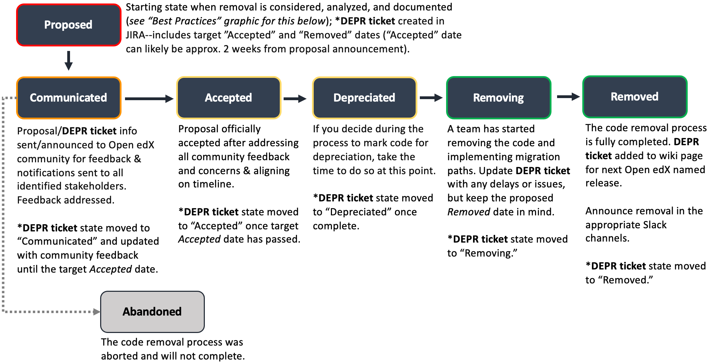
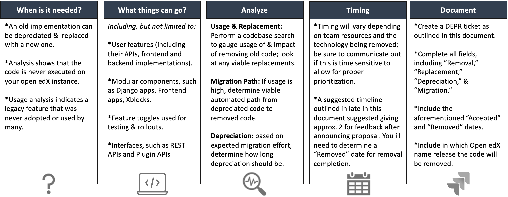

OEP-21: Deprecation and Removal
#################################

+-----------------+--------------------------------------------------------+
| OEP             | :doc:`OEP-21 <oep-0021-proc-deprecation>`              |
+-----------------+--------------------------------------------------------+
| Title           | Deprecation and Removal                                |
+-----------------+--------------------------------------------------------+
| Last Modified   | 2022-07-05                                             |
+-----------------+--------------------------------------------------------+
| Authors         | Greg Sham <gsham@edx.org>,                             |
|                 | Nimisha Asthagiri <nimisha@edx.org>                    |
|                 | Diana Huang <dkh@edx.org>                              |
|                 | Sarina Canelake <sarina@tcril.org>                     |
+-----------------+--------------------------------------------------------+
| Arbiter         | Matt Tuchfarber <mtuchfarber@edx.org>                  |
+-----------------+--------------------------------------------------------+
| Status          | Accepted                                               |
+-----------------+--------------------------------------------------------+
| Type            | Process                                                |
+-----------------+--------------------------------------------------------+
| Created         | 2018-05-18                                             |
+-----------------+--------------------------------------------------------+
| Review Period   | 2018-06-06 - 2018-06-20                                |
+-----------------+--------------------------------------------------------+

TL;DR
*****

* **Removing unneeded or legacy code is crucial to optimizing programs and reducing
  costs:** Having dead or broken code laying around can inadvertently introduce bugs,
  cause the runtime footprint to be larger than necessary, and cost time and money to
  maintain. Additionally, unneeded code may make it more difficult to understand or
  navigate a project.
* **It’s important to know exactly when and what to remove:** Some code may be outdated
  and can be replaced with a new implementation, or some may have very low usage and is
  not worth holding on to. It’s important to analyze to what extent the code is no longer
  needed and what (if any) ripple effects it could have elsewhere. Monitoring can be a useful
  tool for this discovery.
* **Communicating out proposed changes can help guide the path to depreciation/removal:**
  It is crucial to let others know you believe there’s code needing removal and how you plan
  to go about it. Inform individual stakeholders and use Open edX community channels such as
  Slack and Discourse to let others know your proposed plan. Collect and monitor feedback to
  avoid potential disruptions to other code/projects.
* **The formal process outlined in this document can help make deprecation and removal
  projects happen more proactively:** Having a defined process and common language takes
  the guesswork out and allows for easier access to get rid of dead code. The steps outlined
  in this document regarding analysis, communication, and documentation will help guide the
  process, and by using GitHub Issues as tickets to track the DEPR process (see the steps outlined
  in the `Document`_ section), these projects can be clearly tracked providing transparency on progress.

High-Level Overview of Code Removal Process
===========================================
* For further details on each of these steps, please see `Process States`_ and
  `Timeline`_. For DEPR ticket details, please refer to the `Document`_ process.

Best Practices for Proposing Code for Removal
=============================================

* For further details on each of these steps, please see `Proposed`_ section.
  For DEPR ticket details, please refer to the `Document`_ process.

Abstract
********

*"Remove dead code wherever possible. It gets in the way and slows you down."* [OREILLY]_

This document defines a formal process for proposing, communicating, deprecating
and removing legacy and unneeded code in the Open edX platform.

Motivation
**********

Without a clearly defined and agreed upon process for removing legacy code,
Open edX developers will hesitate to do so. As a result, the platform will have
redundant implementations and dormant features that over time will slow down
development and developer onboarding.

This is a problem shared by the software engineering industry and many have
learned the benefits of investing in code removal:

* It is undeniable that unnecessary code, like any other code, requires
  maintenance over time. It costs time and money. [OREILLY]_

* Extra code also makes it harder to learn the project, and requires extra
  understanding and navigating. [OREILLY]_

* It is harder to refactor, simplify, or optimize your program when it is bogged
  down by zombie code. [OREILLY]_

* There is a danger that someone inadvertently involves the 'dormant' code and
  introduces bugs. [SO]_ [SEC]_

* Dead code makes the runtime footprint larger than it needs to be. [INFOQ]_

* Dead code discourages a culture of treating the software as soft, and therefore
  always open to revision and improvement. [INFOQ]_

Given the above, we define a common language and process to remove unneeded
code, that is, code that may be superseded by a new implementation or may be deemed no
longer necessary or supported. Following this process guarantees alignment
across all stakeholders and a path towards complete removal of all unused code.

Specification
**************

This section explains each step in the process to remove a technology from the
Open edX platform.

Process States
==============

Per the `workflow chart`_, the next sections go through the details of each state and transition.

.. _workflow chart: oep-0021/Removal-Workflow.png

Proposed
========

Do you think a piece of the codebase should be removed? If you even asked that
question, chances are likely that it probably should be.

When to remove?
---------------

Here are a few common cases for code removal:

* There is now a new implementation that replaces the old implementation. If so,
  the old implementation should be deprecated and then removed in favor of the
  new.
* Static analysis or runtime analysis shows that the code is never executed on
  your Open edX instance. If so, it should be removed (if no one in the community
  requires it) or should become a pluggable extension since it's not core to all
  instances.
* There is a legacy feature that never really saw the light of the day or was
  adopted by very few users. If so, this should be confirmed by usage analysis
  and then removed.

What to remove?
---------------

Here are a few technologies that are commonly removed:

* User features, including their APIs, frontend, and backend implementations
* Modular components, such as Django apps, Frontend apps, XBlocks
* Technologies, such as CoffeeScript, outdated frameworks
* Feature toggles used for temporary rollout and testing
* Interfaces, such as REST APIs and Plugin APIs

Analyze
-------

When proposing a removal, consider the following analysis:

* Usage - Which users and services are currently using the code proposed for
  removal on your own Open edX instance?  Perform a quick search across the edX
  codebase to gauge the level of impact and identify potential stakeholders.
  https://github.com/search?q=org%3Aopenedx+sample&type=Code. Also read `how to
  monitor deprecation/removal`_ to support this entire process.
* Replacement - What, if any, is a viable replacement for the code being removed?
* Migration path - If there is existing high usage in the community, what is a
  viable automated migration path from the deprecated code to the removed code?
* Deprecation - Based on expected usage and effort to migrate, for how long
  should the deprecation period be?

.. _how to monitor deprecation/removal: https://openedx.atlassian.net/wiki/spaces/COMM/pages/3472654465/Monitoring+and+observability+around+deprecating+old+code

Timeline
--------

When determining target dates to propose for the removal process, consider that
it will vary depending on team resources and the technology being removed.
The importance of removal (as described in Motivation_) should be communicated
with all team members so the removal can be prioritized and completed in a
timely manner. A suggested timeline is shown in the diagram below, which
considers the timing of the next `Open edX named release`_.

    *Proposed* and *Accepted* states, giving the community enough time to provide
    feedback. After which, the *Deprecated*, *Removing*, and *Removed* transition
    periods will vary by the type and scope of the technical change.

* **Proposed** on Day 1
* **Communicated** from Day 2 to Day 13
* **Accepted** on Day 14 *(depending on influx of feedback)*
* **Deprecated/Removing/Removed** - from Day 15 onwards *(depending on resources and technology being removed).*
  Consider when the next Named Release is cut; if it is very soon, you may wish to delay final
  removal until after the cut date.

Consider choosing deprecation and removal dates that allow for a full
release cycle for transition planning. For example, a deprecation
proposal could be accepted while Maple is being finalized, then
implement the removal some time after Maple is released so that the
removal itself will land in Nutmeg. (Removal could even happen as soon as
a named release's branches are cut, but this may interfere with fixes that
need to be backported.) Any deployment following the
named releases would then have a number of months to prepare before
Nutmeg comes out.

This approach would be most appropriate for features that can be left
in place for an extended period before removal and where a transition
to an alternative would require a moderate to large amount of
effort. For more trivial deprecations, it may be appropriate to simply
deprecate and remove within the same release cycle.

.. _Open edX named release: https://open-edx-proposals.readthedocs.io/en/latest/oep-0010-proc-openedx-releases.html

Document
--------

Do the following to document your proposal:

#. Create a GitHub Issue in the repo where the code being deprecated lives, and
   be sure to choose the "Deprecation (DEPR) Ticket" template. If your
   deprecation spans multiple repos, choose the primary/most relevant repo, or
   use the `public-engineering`_ project.

   .. note::
      While it is possible to create Issues with no template, it is strongly
      encouraged that you go to `github.com/openedx/:repo/issues`, click "New
      Issue", and choose the DEPR template so you don't miss any fields and
      automation works properly. The template fields help us more quickly
      address deprecation issues and reduce the amount of back and forth needed
      to make progress on work. If you must create an Issue outside the
      template, please preface your issue title with ``[DEPR]``.

#. When writing the ticket, include the following information:

   #. Title: The title of the ticket should read "[DEPR]: <technology name being
      deprecated>".
   #. Proposal Date: the day the proposal is being put up for consideration.
   #. Target dates for: *Accepted* and *Removed*. See Timeline_ for
      considerations.
   #. Include in which `Open edX named release`_ the code will be removed. Reach
      out to the `#wg-build-test-release` in Slack if you're not sure what to
      put here.
   #. **Rationale**: A few sentences explaining the rationale for removing this
      technology.
   #. **Removal**: A description with links to what is being removed.
   #. **Replacement**: A description with links to what it is being replaced by.
   #. If you plan to mark the code for deprecation, explain how in the
      **Deprecation** section. See Deprecated_ for considerations.
   #. If automated migration will be needed, explain your migration plan in the
      **Migration** section.
   #. If there is any additional publicly shareable information or data from
      your earlier analysis, include that in the **Additional Info** section.

#. Check that your ticket appears on the `DEPR Project Board`_.

Now you are ready to communicate your proposal!

.. _public-engineering: https://github.com/openedx/public-engineering
.. _DEPR Project Board: https://github.com/orgs/openedx/projects/9

Communicated
============

Announce
--------
Announce your proposal to deprecate and remove to the following communication
channels.

To the Open edX Discourse
~~~~~~~~~~~~~~~~~~~~~~~~~

Post a message to `Open edX Discourse Deprecation Announcements`_, using the following template:

    Subject: Deprecation/Removal: <*Technology Name*> <*repo*>#<*issue-number*>

    Body:
        Hi there,

        We plan to deprecate and remove <*Short description of the technology*>.

        Please read https://github.com/openedx/<*repo*>/issues/<*issue-number*> for
        more information and to post any questions/comments. The proposed
        deadline for comments before acceptance is <*Target Accepted Date*>.

        Once the ticket is accepted, removal can happen at any time.

        Thanks,
        <*Your name*>

Once the message is posted, include a link to the Discourse thread in the GitHub issue.

.. _Open edX Discourse Deprecation Announcements: https://discuss.openedx.org/c/announcements/deprecation

To openedx.slack.com
~~~~~~~~~~~~~~~~~~~~

Post the following in the #open-edx-proposals and #general `Open edX slack`_ channels:

    *Removal of <*Technology Name*>:*
    We plan to deprecate and remove <*Short description of the technology*>.

    Please read https://github.com/openedx/<*repo*>/issues/<*issue-number*> for
    more information and to post any questions/comments. The proposed
    deadline for comments before acceptance is <*Target Accepted Date*>.
    Once the ticket is accepted, removal can happen at any time.

.. _`Open edX slack`: http://openedx.org/slack

Monitor Feedback
----------------

Once announcements are made, update the GitHub Issue to the `Communicated`
state.

Allocate time to be responsive to any and all feedback and input on your
**DEPR** ticket. Update the ticket and the proposal, if neccessary, with any
information that should be captured from the ongoing feedback. Continue to
iterate and do this until the announced target *Accepted* date.

If during this time, there is a large amount of churn or concern, be open to
adjusting the target dates and revisiting the proposal. If community alignment
seems difficult, reach out to the `Deprecation Working Group`_ for directional
guidance. In some cases, the proposal may need to be *Abandoned* entirely.

.. _Deprecation Working Group: https://openedx.atlassian.net/wiki/spaces/AC/pages/825983190/Deprecation+Working+Group

Accepted
========

Once enough time is allotted for community feedback, all concerns on the
**DEPR** ticket are responded to, and the target *Accepted* date has passed,
update the state of the **DEPR** ticket to *Accepted*.

For larger changes, it may be important to mention the upcoming deprecation
in the release notes of the next named release.

.. note::

    If there's a new use of a feature once its deprecation ticket is accepted,
    then the contributor must provide an ADR justifying its usage. This is because
    using the deprecated feature obviously adds new technical debt to the system.

Deprecated
==========

If you decided to mark the code for deprecation during your Analyze_ or
`Monitor Feedback`_ phases, invest time in doing so and update the state of the
**DEPR** ticket to *Deprecated* once that is completed.

Here are some common ways to mark a technology as deprecated:

* REST API - Specify in the 1st line of the API's docstring::

    "Deprecated <link-to-gh-issue>"

* Javascript code - Add a log statement that executes once without being noisy::

    console.log("<Technology name> is deprecated. See <link-to-gh-issue>.")

* Python code - Add a warnings.warn_ statement so it executes once without being noisy::

    warnings.warn("<Technology name> is deprecated. See <link-to-gh-issue>.", DeprecationWarning)

* Feature toggles - Set the “Expiration Date” as described in OEP-17_.

* GitHub repo - See `OEP-14 Archiving Open edX GitHub Repositories`_.

.. _warnings.warn: https://docs.python.org/2/library/warnings.html#warnings.warn
.. _OEP-17: https://open-edx-proposals.readthedocs.io/en/latest/oep-0017-bp-feature-toggles.html
.. _OEP-14 Archiving Open edX GitHub Repositories: https://open-edx-proposals.readthedocs.io/en/latest/oep-0014-proc-archive-repos.html

Removing
========

When a team begins development work to remove the code, the **DEPR** ticket's
state should be updated to *Removing*.

During this phase, remember the following:

* Implement the proposed and agreed upon migration path.
* Remove related code from all places, including the frontend, APIs, and
  the backend, perhaps even in that order.
* Remove any related documentation on docs.edx.org_ and elsewhere.
* Continue to update the ticket with any delays or issues that may arise.

.. _docs.edx.org: http://docs.edx.org/

Removed
=======

When removal is complete:

#. Add the **DEPR** ticket to the `wiki page for the next Open edX named
   release`_ to keep track of which removals occurred in which named release.
   Note: Eventually, this should be included in a .rst file bundled with the
   codebase.
#. Update the **DEPR** ticket's state to *Removed*.
#. Announce the removal in the #open-edx-proposals and #general `Open edX slack`_
   channels.
#. Optionally, celebrate with your team by banging and breaking a piñata_!

.. _wiki page for the next Open edX named release: https://openedx.atlassian.net/wiki/spaces/COMM/pages/13205845/Open+edX+Release+Planning
.. _piñata: https://en.wikipedia.org/wiki/Pi%C3%B1ata

References
**********

.. [OREILLY] https://www.oreilly.com/library/view/becoming-a-better/9781491905562/ch04.html
.. [SO] https://stackoverflow.com/a/15700228
.. [SEC] https://www.sec.gov/litigation/admin/2013/34-70694.pdf
.. [INFOQ] https://www.infoq.com/news/2017/02/dead-code

Change History
**************

2022-07-05
==========

* Add suggestion for monitoring.

2022-06-03
==========

* Suggest alignment with release cycle
* `Pull reqest #252 <https://github.com/openedx/open-edx-proposals/pull/252>`_

2022-02-08
==========

* Migrate from Jira to GitHub Issues/Projects
* `Pull request #280 <https://github.com/openedx/open-edx-proposals/pull/280>`_

2021-04-26
==========

* "Removal dates" has become synonymous with "Accepted dates", so we are
  eliminating them to clarify the process.
* `Pull request #207 <https://github.com/openedx/open-edx-proposals/pull/207>`_

2021-02-05
==========

* Added TL;DR section and workflow visuals
* `Pull request #176 <https://github.com/openedx/open-edx-proposals/pull/176>`_

2019-01-02
==========

* Recommend codebase impact review as part of DEPR process
* `Pull request #95 <https://github.com/openedx/open-edx-proposals/pull/95>`_

2018-11-02
==========

* Describes the process in specific ordered steps for one to follow.
* Adds references to external docs.
* Updates information on the JIRA ticketing process.
* `Pull request #83 <https://github.com/openedx/open-edx-proposals/pull/83>`_

2018-06-21
==========

* Document created
* `Pull request #63 <https://github.com/openedx/open-edx-proposals/pull/63>`_
