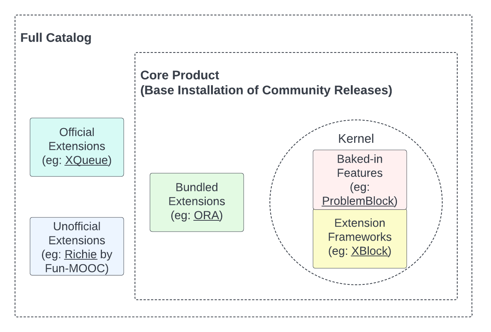

.. _pep_based_template:

.. Below is the display in the left sidebar on RTD. Please omit leading 0's

OEP-57: Core Product
####################

.. This OEP template is based on Python's PEP standard.

.. list-table::
   :widths: 25 75

   * - OEP
     - :doc:`OEP-0057 <oep-0057-proc-core-product>`
   * - Title
     - Core Product
   * - Last Modified
     - 2022-11-07
   * - Authors
     - | Sarina Canelake <sarina@tcril.org>
       | Kyle McCormick <kyle@tcril.org>
       | Jenna Makowski <jmakowski@tcril.org>
   * - Arbiter
     - Ali Hugo <ali@opencraft.com>
   * - Status
     - Accepted
   * - Type
     - Process
   * - Created
     - 2022-09-30
   * - Review Period
     - 2022-10-11 - 2022-11-07
   * - References
     - | * `Earlier draft of OEP-57 <https://github.com/openedx/open-edx-proposals/pull/312>`_
       | * `Earlier discussions on the Core Product and Kernel <https://openedx.atlassian.net/wiki/spaces/OEPM/pages/3499786241>`_
       | * `Follow-up Work: Definition of Product Narrative <https://openedx.atlassian.net/wiki/spaces/OEPM/pages/3499655173>`_
       | * `Follow-up Work: Definition of the Core Product <https://openedx.atlassian.net/wiki/spaces/OEPM/pages/3499589638/Core+Product+Offering>`_
       | * Follow-up Work: Full Catalog listing (Link TBD)

.. contents::
   :local:
   :depth: 3

Abstract
********

This OEP defines a set of product guidelines for the Open edX platform,
including a Product Narrative, Product Offerings, and Component Tiers, and
describes how these principles impact the community.

Motivation
**********

Since the Open edX project began in 2012, the number of features and ways to use
the platform has proliferated. It has become increasingly difficult to build
releases, get up and running with a new Open edX instance, and simply approach
the platform as a new user. Recent efforts have thought about the platform
holistically, defining different community use cases and how the platform might
best serve those communities' needs. This work has identified that the Open edX
project needs to be focused on defining, developing, and supporting a core set
of functionality and associated extensions, which will be explored further in
the next section.

Specification
*************

Aligning the Open edX community on principles of product management, product
development, and product vision is crucial to the adoption and success of the
platform. So, in this OEP, we establish a set of terms:

* the Product Narrative;

* the Product Offerings: Core Product, Extended Product(s), and Full Catalog; and

* four Component Tiers: Kernel, Bundled Extensions, Official Extensions, and Unofficial Extensions.

The community will use this common language to understand and classify the
components of the Open edX product. These terms will provide a decision-making
framework for product prioritization, feature support, and the contents of the
community release. Below, we describe the meanings of each term.

Product Narrative
=================

The *Product Narrative* is defined as the high-level vision statement for the
Open edX project. It succinctly articulates the value proposition and impact of
the project, the features which differentiate it, and the values and
characteristics that position it as a market-leading solution. 

Ongoing work to define the Product Narrative and subsequent deliverables can be
tracked on the `Product Narrative wiki space`_.

Product Offerings
=================

Core Product
------------

The *Core Product* is defined as a clear articulation of which features,
experiences and use cases come fully supported by the default configuration of
the community-maintained Open edX installation. The Core Product should be the
community's first priority when it comes to maintenance, security patches, and
feature investment.

The Core Product is defined by a set of people across the community, driven by
the `Product Working Group`_. It is based on user and market input. It answers key
questions such as:

* How do current and future features in the default Open edX installation align
  with the Product Narrative and the needs of users?

* What current and future features and experiences are available in the Core
  Product, and why?

* What is the spectrum of alternatives if a developed feature doesn't align with
  the Core Product? 

Ongoing work to define the Core Product and subsequent deliverables can be
tracked on the `Core Product Offering wiki space`_.

Extended Product(s)
-------------------

There has been interest in the community to define one or more *Extended
Product(s)*. These hypothetical Product Offerings would enhance the Core Product
with a set of extensions. An Extended Product might be created to, for example,
support a specialized Open edX use case for which the Core Product alone is not
suited.

Although this OEP acknowledges the interest in such Product Offerings, there is
currently no plan to fully define, implement, or offer any Extended Product. If
such a Product Offering is codified in the future, this OEP will be updated.

Full Catalog
------------

The *Full Catalog* is defined as the Core Product plus all known Open edX
extensions.

An actual catalog of components will be created and maintained to be as
comprehensive as possible. Community members will be encouraged to submit their
extensions to be listed in the Full Catalog.

Component Tiers
===============

A diagram of the Product Offerings and what they contain (`LucidChart source`_)

The Product Offerings defined above provide for the organization of components
into four *Component Tiers*, described below. Each component's Tier will be
listed in the Full Catalog and can be updated over time to reflect changes in
its technical implementation, its maintenance status, and its relationship to
the Product Offerings.

Kernel
------

The *Kernel* [#more_on_kernel]_ is a technical term for components that cannot be
separated from an Open edX installation. They include:

* frameworks, such as XBlock, which support extensions; and

* “baked-in” features, such as the `Problem Block`_ or the `Course Home`_, whose
  implementations are tightly coupled to the core Open edX installation.

Bundled Extensions
------------------

*Bundled Extensions* are components of the Core Product that are built upon the
frameworks provided by the Kernel. Their technical implementations are decoupled
from the Kernel, but they are purposely “bundled” (included) into the Core
Product due to their broad utility. Like any Core Product component, this means
they are available to end users in the default configuration of the
community-maintained Open edX installation method.

An example of a Bundled Extension is the `Open Response Assessment (ORA)`_ tool,
which is built using the Kernel's XBlock framework.

Official Extensions
-------------------

*Official Extensions* are components outside of the Core Product that the Open edX
community believes:

* fulfill a need that is consistently expressed by multiple community members, and

* can be effectively maintained by the community.

An example of an Official Extension is `XQueue`_, an independently deployed
interface between the Open edX LMS and external grading systems.

Unofficial Extensions
---------------------

*Unofficial Extensions* describe any and all components outside of the Core
Product and Official Extensions that add functionality to the Open edX platform
or integrate with it. These are authored by various members of the community.
Authors of such components are encouraged to submit them to be listed as
Unofficial Extensions in the Full Catalog.

An example of an Unofficial Extension is `Richie`_, a CMS maintained by `FUN MOOC`_
that integrates with the Open edX platform.

Impact
******

Open edX Releases
=================

Defining the Core Product will enable the community to focus on the core
products and services that enable the platform to be well understood and
optimally poised to deliver powerful and wonderful learning experiences that
meet our mission to democratize education. The Open edX named releases will,
with adoption of the Product Offerings, be more focused. It will be easier for
the technical team in charge of the release to both decide which repositories to
include and which features to enable by default. Further, testing the release
will be more focused. Test cases will cover the most common use-cases over the
most commonly and most important components within the Open edX ecosystem.

The process of creating a release will be largely unchanged from today. As
happens currently, only one release needs to be made. It includes:

* The components of the Core Product, toggled *on* by default.

* Additional components, togged *off* by default. These components may include,
  for example: Official Extensions, experimental components, and features that
  are outside of the Core Product yet are technically coupled to it (i.e.,
  “Baked-In Features”) [#release_impact]_.

There will be little to no additional testing burden for components that are
toggled off, as there is no promise of full community support for them. The
testing team will work closely with the product team to determine precise
testing plans and determine which of these additional components warrant
testing.

Open edX Component Support
==========================

With the adoption of Product Offerings, the community will be more focused on
the highest impact parts of the project, as determined by a broad cross-section
of the community itself. It will be clearer to the community which portions of
the release they can expect support on, and which portions will have little to
no support. Those components residing outside of the Core Product's Bundled
Extensions will not be a priority of the project's product strategy. 

The Core Product will be the focus of the project's product strategy; the
project's various working groups are expected to prioritize support of the Core
Product's components ahead of any other components. Stated directly, support
priorities are as follows:

* **Core Product**: The community will support the Core Product as its top priority.

* **Official Extensions**: The community will try to support Official
  Extensions, and it will do so largely by delegating responsibility via the
  `Maintainers Program`_. If the community cannot consistently support or
  maintain an Official Extension, then it may be reclassified as Unofficial.

* **Unofficial Extensions**: The Open edX community will not directly support
  Unofficial Extensions, and they will not be the focus of the Open edX project
  or its working groups. Of course, this does not preclude individual community
  members or teams from working on or supporting these components themselves.
  If the community demonstrates both consistent demand and consistent support
  for an Unofficial Extension, then it may be reclassified as Official.

Product Investments
===================

A clearly defined Core Product will assist product managers conducting market
research to more easily identify feature gaps and parity analyses. They can ask
questions such as: Do the highest impact features of the project adequately meet
user needs? Where are they weak? How can we best invest to address those
weaknesses? 

Marketing and Growth Efforts
============================

Both the Product Narrative and Core Product will guide marketing efforts across
the community, enabling marketing managers to more easily articulate the central
value proposition of the project, differentiate it from competitors, and focus
communications on specific target audiences with particular needs.

Notes
*****

.. [#more_on_kernel] From a technical perspective, the Kernel contains the Ideal
    Kernel, what engineers would like the Kernel to be: a small,
    easy-to-understand, and easy-to-maintain collection of extension frameworks
    (such as the XBlock framework). However, the Kernel currently contains more
    than just the Ideal Kernel; it contains a roughly-understood Ideal Kernel,
    plus a bunch of features that are so tightly tied to the code in the Kernel
    that it can't run without them (such as the Problem Block and Course Home).
    There is desire in the Open edX community to refactor some or all of these
    features to be Bundled Extensions, which would reduce the size of the Kernel
    and bring it closer to our conceptions of an Ideal Kernel.
    
    The diagram of the Product Offerings and what they contain in the text
    represents a simplified version of what the Product Offerings are, and how
    they interact. A more full version of this visual can be seen below
    (`LucidChart source`_). Note the distinction of the “Ideal Kernel”.
    Another technical difference obscured in the
    simplified diagram is the fact that some baked-in Kernel features are
    actually outside the Core Product; although present in the Kernel, they are
    disabled by default in the Core Product. Finally, the diagram below shows,
    via arrows, how extensions might make use of other extensions or frameworks.

    .. image:: oep-0057/oep-57-complex-visual.png
       :align: center

.. [#release_impact] In the future, there may be more specific guidance around
    which additional components are to be included, but toggled off, in
    releases. If created, that guidance will be linked here. Until then, it will
    remain up to the discretion of the community and the release manager as
    specified in `OEP-10`_.

.. _Product Narrative wiki space: https://openedx.atlassian.net/wiki/spaces/OEPM/pages/3499655173/Product+Narrative

.. _Product Working Group: https://openedx.atlassian.net/wiki/spaces/COMM/pages/3449028609/Product+Working+Group

.. _Core Product Offering wiki space: https://openedx.atlassian.net/wiki/spaces/OEPM/pages/3499589638/Core+Product+Offering

.. _LucidChart source: https://lucid.app/documents/view/45a5cd3f-60c8-4d40-8bb4-3aee2eae66d2

..
   The editable LucidChart source file is here:
   https://lucid.app/lucidchart/45a5cd3f-60c8-4d40-8bb4-3aee2eae66d2/edit?invitationId=inv_e152fc16-d759-4cdc-bdf3-d987f11a6612&page=MHqY~t-BcHS8#
   As of publish time, the OEP authors, arbiter, and Axim Engineering Team have edit access
   (which can be requested for those looking to edit in the future)

.. _Problem Block: https://github.com/openedx/edx-platform/blob/open-release/olive.master/xmodule/capa_module.py

.. _Course Home: https://github.com/openedx/frontend-app-learning/tree/open-release/olive.master/src/course-home

.. _Open Response Assessment (ORA): https://github.com/openedx/edx-ora2/

.. _XQueue: https://github.com/openedx/xqueue

.. _Richie: https://richie.education/

.. _FUN MOOC: https://www.fun-mooc.fr/en/ 

.. _OEP-10: https://open-edx-proposals.readthedocs.io/en/latest/processes/oep-0010-proc-openedx-releases.html

.. _Maintainers Program: https://open-edx-proposals.readthedocs.io/en/latest/processes/oep-0055-proc-project-maintainers.html

Change History
**************

2022-11-07
==========

* Document created
* Review on `OEP-57 wiki page <https://openedx.atlassian.net/wiki/spaces/COMM/pages/3540713547/Open+edX+Proposal+57+Product+Offering>`_
* Slight changes to the wiki review include: Combining the previous 1st and 2nd
  footnotes into one because the text was reordered, and the 2nd footnote
  depended on the first; using the "Open edX" trademark appropriately (it may
  only be used as an adjective); removing forward references as discussed.
* `Pull request #398 <https://github.com/openedx/open-edx-proposals/pull/398>`_
